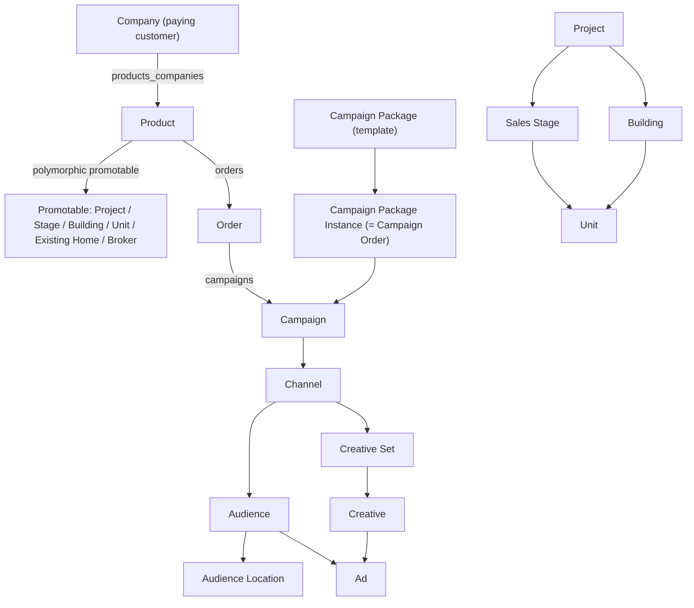

# 📖 Domain Glossary

Source: https://app.notion.com/p/39614549bf5f81cab399cee317278b03?pvs=204
Path: Engineering / Product Knowledge
Last edited: 2026-09-01T14:00:40.041Z

---

<callout icon="✅" color="green_bg">
	**Status: 🔵 Populated** · Last verified: <mention-date start="2026-07-07"/> · Jira re-verified <mention-date start="2026-07-08"/> · Owner: coordinator
	Every entry below was verified on 2026-07-07 against the M2/M360 **codebase** (authoritative for data-model terms), triangulated with the July 2026 Jira/Confluence reference export (**ref §3**) and fresh 2026 Notion product pages. Entries marked **⚠️** correct a stale claim in ref §3. 53 terms — the seed list plus additions from code enums, models, and product docs (incl. the 2026-07-14 failed-campaigns pair).
	**Live-Jira verification pass 2026-07-08:** all 63 cited Jira keys (MT3/PRODM/PT/TA) were pulled from Jira Cloud and re-checked — **0 inaccessible, 0 contradictions of code-grounded facts.** Several entries were refined with live detail and two mis-citations were flagged; see the affected entries and *Gaps & uncertainties*.
	**Docs cross-check pass 2026-07-08** (M2 `docs/` @ `72c2b598ef`, source of truth): every term was re-checked against the backend `docs/` folder. 3 doc-vs-code tensions resolved in the code's favor (Engager, Estate Type, Channel `channelable`); the core diagram, Insights, Live Report, Ad, Campaign Bundle triggers and Lead were refined; and 4 doc-only terms were added (Billing / Invoice, Buyer, Campaign Specification, Lead Form).
	**Failed-campaigns addition 2026-07-14 (coordinator):** +2 terms — *Failed Campaign / Requires Manual Repair* and *Campaign Repair Actions* — for the new Failed Campaigns Admin Dashboard feature page; grounded in code @ `6d643aaa` + HK-196/MT3 + the 2026-07-08 demo. Count 51→53. Not yet re-gated by the operator.
	**Backend release v1.368.0 sync 2026-07-23 (pending operator gate):** additive cited notes on 3 existing entries — *Campaign Bundle* (rental triggers, [HK-298](https://linear.app/newbuilds/issue/HK-298)), *Lead* (broker lead-notification recipients, [HK-320](https://linear.app/newbuilds/issue/HK-320)), *Existing Home* (commercial GraphQL fields, [HK-299](https://linear.app/newbuilds/issue/HK-299)). Each cited to its Linear ticket + merged PR (verified against the diffs). One code-vs-ticket divergence flagged (HK-320) in *Gaps & uncertainties*. No terms deleted; nothing re-marked "✅ Verified". **Update 2026-07-23:** the HK-320 divergence is now **resolved** — the PO confirmed the behavior is intended (operator-relayed); the ⚠️ flag has been cleared, the *Gaps & uncertainties* note marked ✅ Resolved, and the *Lead* entry records it as settled, PO-verified intent.
	**Backend release v1.369.0 sync 2026-07-28 (pending operator gate):** additive cited notes on 2 existing entries — *Campaign Package Instance* (commercial fields added to the instance snapshot, [HK-286](https://linear.app/newbuilds/issue/HK-286)) and *Creative Set* (commercial Liquid template variables in `InterpolateContent`, [HK-285](https://linear.app/newbuilds/issue/HK-285)) — both cited to PR [#14137](https://github.com/marketertechnologies/marketer/pull/14137). One code-vs-ticket scope divergence flagged (HK-285 `property_sale_or_rent` label not shipped) in *Gaps & uncertainties*. [HK-316](https://linear.app/newbuilds/issue/HK-316) (Vitec status-update deferred to a Sidekiq job, PR [#14139](https://github.com/marketertechnologies/marketer/pull/14139)) had no product-behavior impact. No terms deleted; nothing re-marked "✅ Verified".
	**Backend partial backfill 2026-07-23 (Group A — Glossary, pending operator gate):** additive cited notes for the un-swept BE band v1.361–v1.367 landing on this page — *Live Report* (per-package email + SMS delivery enums, [HK-188](https://linear.app/newbuilds/issue/HK-188)/[HK-207](https://linear.app/newbuilds/issue/HK-207)), *Showing* (`campaign_viewing_end_point` first→last default flip, [HK-203](https://linear.app/newbuilds/issue/HK-203)), *Estate Type* (`commercial` value + derivation, [HK-297](https://linear.app/newbuilds/issue/HK-297)), *Campaign Package Instance* + *Promotable* (existing-homes package analytics filter + main-vs-additional promotable, [HK-208](https://linear.app/newbuilds/issue/HK-208)), new term *Vitec Expense Posting* ([HK-221](https://linear.app/newbuilds/issue/HK-221)), and new term *Schedule Drift / Published Schedule* plus additions to *Publication / Publish* and *Feature Flag* ([HK-251](https://linear.app/newbuilds/issue/HK-251)). Each cited to its Linear ticket + merged PR (verified against the diffs; HK-221 semantics confirmed against the live `PostVitecExpense` service). One code-vs-ticket divergence flagged (HK-208) in *Gaps & uncertainties*. Nothing deleted; nothing re-marked "✅ Verified".
	**Frontend release v1.151.0 sync 2026-07-28 (pending operator gate):** additive cited note on the *Existing Home* entry — the M360 frontend now displays commercial-specific property fields and hides irrelevant residential ones across the Broker-Experience property surfaces, keyed off `estate_type` ([HK-300](https://linear.app/newbuilds/issue/HK-300) · PR [#4334](https://github.com/marketertechnologies/marketer-frontend/pull/4334)); this is the frontend counterpart to the backend field-exposure already noted under HK-299. The release's other ticket ([HK-319](https://linear.app/newbuilds/issue/HK-319) — a Cypress flaky-test fix) has no product-behaviour impact. No terms deleted; nothing re-marked "✅ Verified".
	**Backend release v1.370.0 sync 2026-07-30 (pending operator gate):** additive cited notes on *Estate Type* (Webtop `industry` → `:commercial`, [HK-296](https://linear.app/newbuilds/issue/HK-296) · PR [#14148](https://github.com/marketertechnologies/marketer/pull/14148)), *Existing Home* (three new landing-page-publish columns, [HK-385](https://linear.app/newbuilds/issue/HK-385) · PR [#14142](https://github.com/marketertechnologies/marketer/pull/14142)) and *Lead Form* (default privacy-policy URL now env-var-driven / HomeKey domain, [HK-345](https://linear.app/newbuilds/issue/HK-345) · PR [#14140](https://github.com/marketertechnologies/marketer/pull/14140)). The CFS order-gate *behaviour* ([HK-385](https://linear.app/newbuilds/issue/HK-385) + [HK-389](https://linear.app/newbuilds/issue/HK-389)) is documented on the Broker-Experience flow deep-dive. [HK-296](https://linear.app/newbuilds/issue/HK-296) is still *In Review* (its merged marketer slice shipped); one code-vs-ticket backfill gap flagged (HK-385). No terms deleted; nothing re-marked "✅ Verified".
	**Backend release v1.371.0 sync 2026-08-04 (pending operator gate):** additive cited notes on the *Existing Home* entry — rental listings now derive `for_rent` / `rented` state in the CRM-gateway Vitec + Webtop adapters ([HK-296](https://linear.app/newbuilds/issue/HK-296) · PR [#14157](https://github.com/marketertechnologies/marketer/pull/14157)), and \~15 additional Webtop `UnitType` values now classify to a concrete `property_type` instead of `other` ([HK-296](https://linear.app/newbuilds/issue/HK-296) · hotfix PR [#14151](https://github.com/marketertechnologies/marketer/pull/14151)) — plus a note on the *User / Role* entry: the M360 backend now accepts multiple M360 origins via an `M360_URL_BASES` allowlist (SSO grant redirect, JWT consumer claim, CORS/ActionCable) for the `marketer.tech`→`homekey.ai` dual-origin migration window ([HK-378](https://linear.app/newbuilds/issue/HK-378) · PR [#14149](https://github.com/marketertechnologies/marketer/pull/14149)). HK-296's earlier Webtop `industry`→`commercial` slice (#14148) was already recorded in the v1.370.0 sync; its EM1 backfill (crm-gateway rakes, PR #1031) is still open/operational. No code-vs-ticket divergences this release. No terms deleted; nothing re-marked "✅ Verified".
	**Backend release v1.372.0 sync 2026-08-07 (pending operator gate):** additive cited notes on 4 existing entries — *User / Role* (admin-console SSO now honours the requesting admin origin via an `ADMIN_APP_URLS` allowlist, the admin-path analogue of HK-378 — [HK-421](https://linear.app/newbuilds/issue/HK-421) · PR [#14161](https://github.com/marketertechnologies/marketer/pull/14161)), *Estate Type* (`estate_type` now also derived from `assignment_category` at the M360 GraphQL create/update boundary via `ExistingHomes::AttributesAdapter` — [HK-395](https://linear.app/newbuilds/issue/HK-395) · PR [#14158](https://github.com/marketertechnologies/marketer/pull/14158)), *Existing Home* (GraphQL mutations now **write** `gross_area`/`area_from`/`area_to`, and the properties-list service whitelists `gross_area` as sortable — [HK-395](https://linear.app/newbuilds/issue/HK-395)/[HK-400](https://linear.app/newbuilds/issue/HK-400) · PR [#14158](https://github.com/marketertechnologies/marketer/pull/14158)) and *Live Report* (commercial-sale/rent email targets + copy, a `rented?` email guard, and `property_state`/`estate_type` in the report summary API — [HK-301](https://linear.app/newbuilds/issue/HK-301) · PR [#14150](https://github.com/marketertechnologies/marketer/pull/14150)). The CFS-order-validator narrowing ([HK-420](https://linear.app/newbuilds/issue/HK-420)) is on the Broker-Experience flow deep-dive. Email brand-copy sweep ([HK-424](https://linear.app/newbuilds/issue/HK-424)) and recipient-email env extraction ([HK-425](https://linear.app/newbuilds/issue/HK-425)) had no product-behaviour impact; [HK-394](https://linear.app/newbuilds/issue/HK-394) (commercial area-range display) is frontend-only (PR [#4348](https://github.com/marketertechnologies/marketer-frontend/pull/4348)), tracked under the FE pipeline. No code-vs-ticket divergences; no new bug drafts. No terms deleted; nothing re-marked "✅ Verified".
	**Backend release v1.373.0 sync 2026-08-11 (pending operator gate):** additive cited notes on 2 existing entries — *Existing Home* (Webtop `Combination` now classifies to its own `combination` property type, plus the FINN-URL gating that stops regular listings resolving `destination_url` to a FINN link — [HK-401](https://linear.app/newbuilds/issue/HK-401) · PR [#14171](https://github.com/marketertechnologies/marketer/pull/14171); [HK-434](https://linear.app/newbuilds/issue/HK-434) · PR [#14174](https://github.com/marketertechnologies/marketer/pull/14174)) and *Insights* (analytics sync now upserts on the natural key instead of failing, and resurrects soft-deleted rows — [HK-411](https://linear.app/newbuilds/issue/HK-411) · PR [#14152](https://github.com/marketertechnologies/marketer/pull/14152)). The FINN-URL mechanism in full is on the [CRM Gateway deep-dive](https://app.notion.com/p/3a614549bf5f81139695d139b299b350); the admin failed-publication visibility work ([HK-422](https://linear.app/newbuilds/issue/HK-422)) is on the Failed Campaigns Admin Dashboard page; the Storefront API `api.homekey.ai` rebrand ([HK-357](https://linear.app/newbuilds/issue/HK-357)) is on the Product & App Map. [HK-427](https://linear.app/newbuilds/issue/HK-427) (deletion of the dead `CampaignMailer#campaign_failed`) had no product-behaviour impact, and [HK-301](https://linear.app/newbuilds/issue/HK-301) was already covered by the v1.372.0 sync above (same PR [#14150](https://github.com/marketertechnologies/marketer/pull/14150), cross-listed in both releases). Two open questions flagged on *Existing Home* rather than filed. No terms deleted; nothing re-marked "✅ Verified".
	**Frontend release v1.154.0 sync 2026-08-11 (pending operator gate):** one **new term** — *Brand (app brand / host-aware branding)* — for the host-aware branding the M360 SPA gained in this release ([HK-408](https://linear.app/newbuilds/issue/HK-408) · PR [#4354](https://github.com/marketertechnologies/marketer-frontend/pull/4354)): one bundle now serves `m360.marketer.tech` and `m360.homekey.ai` and resolves Marketer-vs-HomeKey branding at runtime from the hostname, defaulting to HomeKey on unknown hosts. Two open items flagged in *Gaps & uncertainties* (pre-boot brand default; the locale-catalog sweep the ticket scoped but the PR did not ship) — both raised to the operator as drafts. The release's other ticket, [HK-334](https://linear.app/newbuilds/issue/HK-334) (SPA build config repointed from `m2.dev` to `core.m360.homekey.ai` · PR [#4352](https://github.com/marketertechnologies/marketer-frontend/pull/4352)), had **no product-behaviour impact** — CI deploy env vars and `package.json` dev scripts only — same call as [HK-335](https://linear.app/newbuilds/issue/HK-335) in v1.153.0. Term count: **54→55** term headings on the page — note the "53 terms" figure in the 2026-07-07 status line above was already an undercount before this sync (54 headings were present); left as-is rather than rewritten, per additive-only. No terms deleted; nothing re-marked "✅ Verified".
	**Frontend v1.154.0 corrective sync 2026-08-11 (pending operator gate):** two corrections arising from the independent audit of the sync above. **(1) Audit finding F2** — the *Brand* entry and its pre-boot gap bullet framed the hardcoded-HomeKey static shells as a transient pre-boot window that the app corrects once it mounts; that is true of `index.html` **only**. Re-verified at tag `v1.154.0`: the standalone **Orders** app (`orders.html` → `src/orders/index.tsx`) never mounts `BrandProvider`, so it is HomeKey-branded **permanently on every host**, including `m360.marketer.tech`. Corrected additively — a scope bullet on *Brand* plus a new *Gaps & uncertainties* bullet; the original wording is retained with a scope-correction clause ([HK-408](https://linear.app/newbuilds/issue/HK-408) · PR [#4354](https://github.com/marketertechnologies/marketer-frontend/pull/4354)). **(2) Coverage hole** — v1.154.0 shipped **7 merged PRs but only 2 Linear tickets**, and PR [#4343](https://github.com/marketertechnologies/marketer-frontend/pull/4343) (Jira [MT3-9315](https://marketer.atlassian.net/browse/MT3-9315), **no Linear issue**) was therefore invisible to both the sync and the audit, leaving the KB with zero coverage of CSV lead import. New term *CSV Lead Import (bulk lead upload)* added, spanning [MT3-9314](https://marketer.atlassian.net/browse/MT3-9314) (v1.153.0, PR [#4342](https://github.com/marketertechnologies/marketer-frontend/pull/4342)) and [MT3-9315](https://marketer.atlassian.net/browse/MT3-9315) (v1.154.0, PR [#4343](https://github.com/marketertechnologies/marketer-frontend/pull/4343)), plus a cited clause on *Lead*. Its unfinishable-preview boundary is recorded as **staged delivery per the tickets**, not as a code-contradicts-ticket divergence. Term count: **55→56** term headings. No terms deleted; nothing re-marked "✅ Verified".
	**Backend release v1.374.0 sync 2026-08-13 (pending operator gate):** six tickets. Additive cited notes on 3 existing entries — *Order Management* (cancelling a CRM-sourced order now propagates `CANCELLED` to Vitec/Webtop for **fresh** orders too, via a new retriable notification job — [HK-429](https://linear.app/newbuilds/issue/HK-429) · PR [#14172](https://github.com/marketertechnologies/marketer/pull/14172)), *Brand* (M2 transactional email is a **separate, not host-aware** brand surface, hard-swapped to the HomeKey logo assets on every host — [HK-409](https://linear.app/newbuilds/issue/HK-409) · PR [#14170](https://github.com/marketertechnologies/marketer/pull/14170)) and *Creative Set* (the ad-**video** render pipeline was rebuilt on virtual-time frame stepping, so output smoothness no longer depends on render-dyno paint speed — [HK-57](https://linear.app/newbuilds/issue/HK-57) · PR [#14167](https://github.com/marketertechnologies/marketer/pull/14167)). The cancellation **flow** in full is on the [Broker-Experience flow deep-dive](https://app.notion.com/p/39714549bf5f81b2a269f5238817ae64). No product-behaviour impact (no KB write): [HK-304](https://linear.app/newbuilds/issue/HK-304) (Sidekiq `retry: 0` on five scheduler-fed jobs · PR [#14173](https://github.com/marketertechnologies/marketer/pull/14173)) and [HK-303](https://linear.app/newbuilds/issue/HK-303) (Sidekiq Redis isolated behind `SIDEKIQ_REDIS_URL` · PR [#14177](https://github.com/marketertechnologies/marketer/pull/14177)) — both 2026-07-14 Redis-OOM follow-ups that change job-retry / infrastructure posture only, with no user-visible surface, term, role or flow change. [HK-300](https://linear.app/newbuilds/issue/HK-300) is **cross-listed** here but its only marketer-repo change this release is e2e seed files (PR [#14144](https://github.com/marketertechnologies/marketer/pull/14144)); the product behaviour was already synced from the frontend side under FE v1.151.0 / v1.153.0 on *Existing Home* — re-verified present, not rewritten. Two open questions flagged in *Gaps & uncertainties* rather than filed (HK-409 wordmark-vs-sender sequencing; HK-57 spike-scope + missing wall-clock watchdog) and one code-observed boundary recorded on the flow deep-dive (HK-429 does not notify the CRM when every member campaign has already finished). No terms deleted; nothing re-marked "✅ Verified".
	**Frontend release v1.155.0 sync 2026-08-13 (pending operator gate):** one Linear ticket, and **no product code shipped** — the GitHub compare `v1.154.0...v1.155.0` is 19 commits over 19 files with **zero** under `src/` — so **no behaviour claim was added**. Additive cited content on *Existing Home* only: what the new Playwright commercial suite (PR [#4340](https://github.com/marketertechnologies/marketer-frontend/pull/4340)) now regression-guards, two code-derived display rules (a one-sided area range renders its single present bound; `isCommercialProperty` is a strict `estateType === 'commercial'` test), and four open product gaps in *Gaps & uncertainties* — [HK-399](https://linear.app/newbuilds/issue/HK-399) and [HK-396](https://linear.app/newbuilds/issue/HK-396) (both marked *Done*, both raised to the operator as drafts), plus [HK-394](https://linear.app/newbuilds/issue/HK-394) re-verified still open and [HK-432](https://linear.app/newbuilds/issue/HK-432) already ticketed. [HK-300](https://linear.app/newbuilds/issue/HK-300) · PR [#4340](https://github.com/marketertechnologies/marketer-frontend/pull/4340) · code @ tag `v1.155.0`. **Post-audit corrections 2026-08-13:** the independent audit of this sync returned PASS-WITH-CORRECTIONS, and four of its findings were applied in place on this page — the HK-399 bullet's claim that the sibling `Commercial sale` / `Commercial rent` labels *are* translated (refuted: their `msgstr` is empty in `no`/`de`/`fr`/`nl`/`sv` too, so the real distinction is **extraction**, not translation), the `sqf` `test.fixme`'s recorded blocker (stale, not live — the test is simply unrun), the HK-396 bullet's `isDisabled` wording, and the HK-432 bullet's missing *Gross area* mirror case. No terms added or deleted (count stays **56**); nothing re-marked "✅ Verified".
	**Frontend release v1.156.0 sync 2026-08-25 (pending operator gate):** the release's only product change is the **CSV lead import commit phase** — [MT3-9316](https://marketer.atlassian.net/browse/MT3-9316) *FE: Import & Finalization* · PR [#4344](https://github.com/marketertechnologies/marketer-frontend/pull/4344), which accounts for all 23 `src/` files in `v1.155.0..v1.156.0` and is **tracked only in Jira, with no Linear issue**. Additive cited content on *CSV Lead Import (bulk lead upload)* — finalization shipped, refresh-resume, duplicate-header rejection, the M2 commit-phase contract and four ⚠️ limitations — plus a superseding clause on *Lead* and one code-vs-intent gap (the progress poll that never starts after *Confirm import*) flagged in *Gaps & uncertainties*. No terms added or deleted (count stays **56**); nothing re-marked "✅ Verified". **Post-audit repairs 2026-08-25 (pending operator gate):** the independent audit of this sync returned **FAIL** on its premise. The sync recorded that [MT3-9246](https://marketer.atlassian.net/browse/MT3-9246) and its three children carry *empty descriptions and no acceptance criteria*, and that claim is **false** — the epic carries a **12-bullet Acceptance Criteria block** (present since it was created 2026-04-20) and each child carries a *Scope* description. It is retracted additively at every site on this page: see the correction bullets on *CSV Lead Import (bulk lead upload)*, its *Sources* footer, and *Gaps & uncertainties*. Two of the four recorded "limitations" are consequently re-filed as **code-vs-ticket divergences** against the epic's written ACs, and the flagged progress-poll gap is re-cited to MT3-9316's own scope line. Nothing deleted; every superseded wording is retained in place.
	**Backend release v1.375.0 sync 2026-08-25 (pending operator gate):** 18 Linear tickets plus 2 ticket-less hotfix PRs; scope enumerated from the `v1.374.0..v1.375.0` git diff (157 files / 90 commits), not from the Linear release object. Additive cited notes on 3 existing entries — *Brand* (the **sender / support-address** half of the HomeKey mailer rebrand shipped, closing the sequencing question this page raised under HK-409: [HK-346](https://linear.app/newbuilds/issue/HK-346) / [HK-347](https://linear.app/newbuilds/issue/HK-347) / [HK-348](https://linear.app/newbuilds/issue/HK-348) / [HK-353](https://linear.app/newbuilds/issue/HK-353) · PR [#14182](https://github.com/marketertechnologies/marketer/pull/14182)); *Channel* (the archived-campaign external-deletion sweep's minimum age cut from 3 to 2 months to free the Snapchat per-account campaign cap · PR [#14190](https://github.com/marketertechnologies/marketer/pull/14190), **no ticket** — intent taken from the PR description); and *Publication / Publish* (a new front-door guard refuses to publish a campaign that has **zero creative sets** — [HK-471](https://linear.app/newbuilds/issue/HK-471) · PR [#14192](https://github.com/marketertechnologies/marketer/pull/14192) — while its Part-2 hardening [HK-481](https://linear.app/newbuilds/issue/HK-481) shipped and was **reverted inside this same release**, PR [#14202](https://github.com/marketertechnologies/marketer/pull/14202) then PR [#14211](https://github.com/marketertechnologies/marketer/pull/14211), so its net code contribution at tag `v1.375.0` is nil). One HK-409 gap marked **✅ Resolved** and one new code-vs-ticket divergence flagged (the shipped From-address fallback is the un-hyphenated `noreply@homekey.ai`, while HK-346's ticket text specifies `no-reply@homekey.ai`) in *Gaps & uncertainties*. No terms added or deleted (count stays **56**); nothing re-marked "✅ Verified".
	**Backend release v1.376.0 sync 2026-08-26 (pending operator gate):** 12 Linear tickets plus one **Jira-only, ticket-less** PR; scope enumerated from the `v1.375.0..v1.376.0` git diff (66 files / 90 commits), then cross-checked against the release note's PR list. Ten of the twelve are one admin-panel cluster ([HK-473](https://linear.app/newbuilds/issue/HK-473) → [HK-508](https://linear.app/newbuilds/issue/HK-508)) documented on a new Product & App Map feature deep-dive, <mention-page url="https://app.notion.com/p/3c814549bf5f8199bc52e533b2512611"/>, not here. **One additive cited note on this page**, on *Creative Set*: M360 now emits per-creative Meta placement positions from the `SingleAsset` presenter, and the `FacebookCustomized` placement-inference path this entry already described is confirmed **dead code that never fired in production** ([MT3-9345](https://marketer.atlassian.net/browse/MT3-9345) · PR [#14224](https://github.com/marketertechnologies/marketer/pull/14224) — no Linear ticket). Two new bullets in *Gaps & uncertainties* (the change has **no end-to-end effect yet**, and it lands on the path the ticket declared out of scope). No terms added or deleted (count stays **56**); nothing re-marked "✅ Verified".
	**Frontend release v1.157.0 sync 2026-08-26 (pending operator gate):** a small release — 9 commits / 5 merges, scope enumerated from the `v1.156.0..v1.157.0` git diff, not from the Linear release object. **One** KB-relevant item: [HK-436](https://linear.app/newbuilds/issue/HK-436) retires the dual-brand support that [HK-408](https://linear.app/newbuilds/issue/HK-408) introduced in v1.154.0 and hardcodes HomeKey (PR [#4373](https://github.com/marketertechnologies/marketer-frontend/pull/4373)) — recorded as a *Retired* bullet on *Brand* plus three cited clauses in *Gaps & uncertainties* (two of the three HK-408 gaps are closed by construction; the locale-catalog one is **re-confirmed and widened**, and is this release's code-vs-ticket divergence). **No product-behaviour impact (no KB write):** [HK-496](https://linear.app/newbuilds/issue/HK-496) (Sentry DSN swap to `sentry.homekey.ai` — two GitHub Actions workflow env values, PR [#4380](https://github.com/marketertechnologies/marketer-frontend/pull/4380); note the PR is titled "Staging" but flipped **both** staging and production. ⚠️ **Corrected 2026-08-31 (independent FE v1.157.0 audit finding F3):** HK-496 contributes **zero net change** to v1.157.0 — `git diff v1.156.0 v1.157.0 -- .github/` is **empty**, because both workflow DSNs already read `sentry.homekey.ai` at `v1.156.0`. PR [#4379](https://github.com/marketertechnologies/marketer-frontend/pull/4379) (titled "Production", base `master`) carried the byte-identical change and its merge commit `62e02ea11` **is** the `v1.156.0` tag; #4380 (titled "Staging", base `development`) is its branch twin. The pair is split by deploy lane / branch — `development` vs `master` — **not** by environment, and each flips both env values. So the "titled Staging but flipped both" note describes the diff correctly but must not be read as an accidental production flip, and the Sentry cutover is **not** something this release shipped), PR [#4377](https://github.com/marketertechnologies/marketer-frontend/pull/4377) (`package.json` version bump) and PR [#4382](https://github.com/marketertechnologies/marketer-frontend/pull/4382) (a `master` back-merge whose diff against its first parent is **empty**). No new term added (count stays **56**); no terms deleted; nothing re-marked "✅ Verified".
	**Frontend release v1.158.0 sync 2026-09-01 (pending operator gate):** 18 commits / 6 merged PRs / 37 files, tag `ea0bdc5`, released 2026-09-01; scope enumerated from the `v1.157.0..v1.158.0` git diff, then reconciled against both PR lists — necessarily, because the Linear release object reports `issueCount: 2` while the release contains **four** substantive tickets (two of them, [HK-537](https://linear.app/homekeytechnologies/issue/HK-537) and [HK-549](https://linear.app/homekeytechnologies/issue/HK-549), live in a **new ****`homekeytechnologies`**** Linear organisation** the pipeline's API key cannot read — flagged in *Gaps & uncertainties*). **Two KB-relevant items, three additive notes on this page.** [HK-450](https://linear.app/newbuilds/issue/HK-450) (PR [#4374](https://github.com/marketertechnologies/marketer-frontend/pull/4374)) surfaces estate type in the M360 broker UI for the first time and generalises the commercial layout branch to newbuild aggregates — written up on *Estate Type* (the new tag vocabulary: "Newbuild project / stage / unit" + "Commercial", no tag for second-hand) and on *Existing Home* (per-surface layout rules, plus a **deprecation** of the HK-397 sentence about the list's *Gross area* and *Bathrooms* columns, neither of which exists any more). [HK-549](https://linear.app/homekeytechnologies/issue/HK-549) (PR [#4388](https://github.com/marketertechnologies/marketer-frontend/pull/4388)) makes the Showings block's interpolated resource noun translatable — written up on *Showing*, with an explicit caveat that its intent comes from the PR because the ticket is unreadable. **No product-behaviour impact (no KB write):** [HK-513](https://linear.app/newbuilds/issue/HK-513) — whose *product* change (republish creatives-only into an existing DV360 campaign) is a **backend** change shipped via [#14222](https://github.com/marketertechnologies/marketer/pull/14222), ⚠️ **see the BE-side correction to this HK-513 attribution at the end of this callout** — while its FE slice, PR [#4389](https://github.com/marketertechnologies/marketer-frontend/pull/4389), is a Playwright page-object locator scoping fix with no `src/` change; [HK-537](https://linear.app/homekeytechnologies/issue/HK-537) (PR [#4384](https://github.com/marketertechnologies/marketer-frontend/pull/4384), CI-only — Slack subteam ID moved to a GitHub secret, release-notice Linear links repointed to the new org); PR [#4381](https://github.com/marketertechnologies/marketer-frontend/pull/4381) (`package.json` version bump); PR [#4387](https://github.com/marketertechnologies/marketer-frontend/pull/4387) (the release PR itself). **Five new bullets in \*Gaps & uncertainties***, one of which ✅ closes the extraction half of the twice-unshipped HK-408/HK-436 locale-catalogue sweep — v1.158.0 is the release that finally flushed it, as a side effect of HK-549's translation commit rather than via a locale ticket. No new term added (count stays 56*\*); no terms deleted; nothing re-marked "✅ Verified".
	**Backend release v1.377.0 sync 2026-09-01 (commit ****`ac0c0f1`****, pending operator gate):** additive cited notes on 4 existing entries — *Failed Campaign / Requires Manual Repair* (the new `content_incomplete_at` classification, the universal park flag and the 5-failure publish circuit breaker, plus one flagged gap), *Publication / Publish* (the [HK-509](https://linear.app/newbuilds/issue/HK-509) re-land shipped **narrower than its own ticket scope** — `ContentReadiness` / `EmptyOrUnrenderedContent` / the six finalize guards deliberately not re-landed, so [HK-481](https://linear.app/newbuilds/issue/HK-481)'s vacuous-finalize holes stay open — and the [HK-503](https://linear.app/newbuilds/issue/HK-503) loop bound), *Campaign Repair Actions* (the new **Unpark** staff action) and *Broker* ([HK-538](https://linear.app/homekeytechnologies/issue/HK-538) broker profile-image fan-out). Detail on <mention-page url="https://app.notion.com/p/39d14549bf5f81729a9cec46b68a699a"/> (new section + 3 new *Known gaps*) and <mention-page url="https://app.notion.com/p/3a614549bf5f81139695d139b299b350"/>. **Access gaps named, not guessed:** [HK-537](https://linear.app/homekeytechnologies/issue/HK-537) and [HK-538](https://linear.app/homekeytechnologies/issue/HK-538) both live in the **`homekeytechnologies`** Linear organisation and return `Entity not found: Issue` to this KB's API key, so their intent is cited to their PR descriptions with that caveat stated in place. No new term added (count stays 56); no terms deleted; nothing re-marked "✅ Verified".
	**⚠️ Correction to the HK-513 attribution recorded in the v1.158.0 note above (BE v1.377.0 sync, 2026-09-01 — additive; the original sentence is left standing).** Checked from the backend side, that sentence is wrong on its stated reason. **PR **[**#14222**](https://github.com/marketertechnologies/marketer/pull/14222)** contains no DV360 code at all.** Its body's own `Linear:` line names [**HK-509**](https://linear.app/newbuilds/issue/HK-509), its branch is `HK-509-content-incomplete-marker`, and its six commits split three prefixed `HK-509:` (the `content_incomplete_at` marker column, the zero-content classification split, the GraphQL field) and three prefixed `HK-513:` (the admin Failed-Campaigns roster broadening — the `content_incomplete_campaigns` scope, its surfacing in the admin list, and the row Status badge). None of the six touches `RegenerateAndRepublish` or any DV360/GMP path, and the whole `v1.376.0..v1.377.0` diff contains no `dv360` / `display_video` reference. [**HK-513**](https://linear.app/newbuilds/issue/HK-513)**'s actual product change — republish creatives-only into the *existing* DV360 campaign / creative-set, to dodge the "Campaign name already exists for advertiser" collision — therefore did not ship in BE v1.377.0**, despite the ticket reading *Done* and being attached to the release. It is attached only because PR #14222's **title** carries an `HK-513:` prefix while its content is HK-509's; the same wrong prefix propagated into the GitHub release note's "What's Changed" line and into the Cypress seed comment. The FE sync's *decision* (no KB write for HK-513) was right; its *reason* was not. Recorded as a tracker/labelling defect — nothing filed, nothing edited on either ticket.
</callout>
## Scope
Product vocabulary in plain user language. Leads with M360 / Broker Experience, New Builds, and M2-core terms; supporting-service terms (Publishing Service, Targeter, CRM Gateway) are defined by their **role** in the system, not their internals.
## How to read an entry
**Term** — a 1–3 sentence plain-language definition (what it means to a user), followed by:
- *Enum/values* in code where a term has a fixed set of states.
- *Appears in* — where a user/CSM encounters it · *Related* — linked terms.
- *Sources* — code `path:line` (**M2** = `marketer` Rails backend · **M360** = `marketer-frontend`), **ref §3** = `marketer-platform-product-reference.txt` Section 3 (July 2026 export) with its Jira keys, and Notion product pages. Each ends with the verify date.
*Legend: 🔵 Populated · ✅ Verified · ⚠️ corrects ref §3.*
## Core object model
How the central objects connect (grounded in M2 associations):

- An **Ad** is a Creative shown to an Audience (a Creative × Audience join) within a Creative Set.
- A **Campaign Order** / **Campaign Package Instance** is one activated copy of a **Campaign Package** for one property/broker, and holds the sequence of Campaigns it generated.
---
## Terms
<table_of_contents/>
### Ad
An individual advertisement shown to one audience within a creative set — a specific creative (image/video + copy + CTA + link) paired with targeting. Technically an Ad joins a `creative` and a `creative_set_audience`, carries the external platform ad id, and is toggled via `enabled`; it is separately soft-deletable via `deleted_at`.
- *Appears in:* individual ad rows/toggles under a creative set; ad-level insights. *Related:* Creative Set, Creative, Audience, Insights, CTA.
- *Sources:* M2 `app/models/ad.rb:18-30,86-92`; ref §3 (MT3-8309). Verified 2026-07-07.
### Asset
A media file (image, video, logo, floorplan, document/prospectus, etc.) stored via ActiveStorage/S3 and polymorphically attached to a parent (Project, Stage, Unit, Agent, Snapshot…) through an AssetAssignment, which orders assets per parent and media type.
- *media types:* `image, logo, video, prospect, banner, agent, developer_logo, project_logo, floorplan, sales_prospectus, scene_asset, map_image, assembled_card_image, preview_image, preview_banner, generation_error, template_logo, broker_live_report_email_image`; *asset_source:* `data_collection, user_upload, scraping`.
- *Appears in:* media galleries, floorplans, logos, prospectuses across M360. *Related:* Asset Assignment, Project, Unit, Creative, Property Explorer.
- *Sources:* M2 `app/models/asset.rb:82-107`, `app/models/asset_assignment.rb:3-36`; M360 `src/entities/assets.ts`; ref §3 (MT3-6234). Verified 2026-07-07.
### Audience
The targeting configuration for one channel on a campaign — geography, demographics, and detailed/custom targeting. Platform-specific detail lives on sub-records (e.g. `Audiences::Facebook`); an audience owns a set of Audience Locations.
- *Appears in:* targeting/audience editor per channel. *Related:* Audience Location, Channel, Custom Audience, Auto-Targeting.
- *Sources:* M2 `app/models/audience.rb:21,35,54-107`; ref §3 (MT3-3869, TA-40). Verified 2026-07-07.
### Audience Location
A single geo-targeting area for an audience: coordinates + radius + include/exclude operator, validated against a per-channel minimum radius (`radius_min_km`, from channel restrictions).
- *operator enum:* `include, exclude`.
- *Appears in:* map-based location targeting in the audience editor. *Related:* Audience, Channel, Auto-Targeting.
- *Sources:* M2 `app/models/audience_location.rb:10-18`, `app/models/concerns/targeting_location.rb:13`, `app/models/concerns/audiences/restrictable.rb:14`; ref §3 (MT3-5798, MT3-8929). Verified 2026-07-07; Jira re-checked 2026-07-08 — **REFINED**: MT3-5798 gives the concrete Facebook minimum (raised from 15 km → **17 km**); MT3-8929 confirms the "changing radius in UI does not update non-generic audience locations" bug.
### Auto-Targeting (Targeter)
Automatic generation of audiences by the external **Targeter** engine, based on the promotable's location and characteristics. Auto-generated audiences carry a `targeter` flag that is cleared the moment a user manually edits targeting.
- *Appears in:* implicit — audiences appear pre-filled; a manual edit "takes over". *Related:* Audience, Audience Location, Publishing Service.
- *Sources:* M2 `app/models/audience.rb:107`, `app/services/remote/engines/targeter.rb:5-9`, `app/services/audiences/update.rb:8`; ref §3 (PRODM-548). Verified 2026-07-07. ⚠️ ref §3's "auto_target" is the `targeter` flag; no method named `auto_target`.
### Billing / Invoice
The invoicing data model for billable Campaign Package Instances. Each billable instance produces an `InvoiceBaseItem` (unit price, currency, quantity, invoice date) that rolls up into a per-company `InvoiceBase`, which is exported to the xledger accounting system (`xledger_customer_code`, `exported_at`). Multi-currency amounts are converted using dated `ExchangeRate` records.
- *key models:* `InvoiceBase` (per-company: `xledger_customer_code`, `invoice_date`, `exported_at`) → has-many `InvoiceBaseItem` (one per Campaign Package Instance: `unit_price`, `currency`, `quantity`, credit-note fields); `ExchangeRate` (`from_iso_code`/`to_iso_code`/`rate`/`date`).
- *Appears in:* not user-facing; billing/finance export. *Related:* Campaign Package Instance, Company.
- *Sources:* M2 `app/models/invoice_base.rb:3-8`, `app/models/invoice_base_item.rb:3-24`, `app/models/exchange_rate.rb:3`; `db/schema.rb:1710,1878,1896`; docs `docs/billing.md`. Verified 2026-07-08.
### BlikkFang / EM1 (EiendomsMegler 1)
The EiendomsMegler 1 (EM1) branded variant of the campaign-package / Broker Experience system, with EM1-specific property-report statistics. Package/campaign types use Norwegian labels: "Meglerfokus" (broker promotion), "Kommer for salg" (coming for sale), "Til salgs" (for sale).
- *Appears in:* EM1 broker property reports; EM1 campaign packages. *Related:* Campaign Package, Broker, Live Report, Broker Experience.
- *Sources:* ref §3 (MT3-9437); M2 `app/services/storefront_api/property_report/eiendomsmegler_statistics.rb:5-23`, `config/locales/nb.yml:168-173`, `app/services/crm_gateway/adapters/vitec/product.rb` (`em1vest.no`). Verified 2026-07-07. ⚠️ The literal string "BlikkFang" is **not** in M2/M360 code — it is a marketing/brand name; EM1 itself is code-grounded. **Live Jira corroborates it (2026-07-08):** MT3-9437 explicitly calls the EM1 packages "BlikkFang campaigns (Meglerfokus broker-promotion and Kommer for salg coming-for-sale)", confirming the brand and its campaign types beyond ref §3.
### Brand (app brand / host-aware branding) ⚠️ host-aware resolution retired in FE v1.157.0 (HK-436)
Which of the two customer-facing brands the M360 app presents itself as — **Marketer** or **HomeKey**. One single SPA bundle serves both `m360.marketer.tech` and `m360.homekey.ai`, so the brand is resolved **at runtime from the browser hostname** (build-time env vars can't work) and drives the tab title, favicon / PWA icons / manifest, the sidebar and login logo, the copyright holder, the support email, and the support / contact / privacy-policy links ([HK-408](https://linear.app/newbuilds/issue/HK-408) · PR [#4354](https://github.com/marketertechnologies/marketer-frontend/pull/4354)). **⚠️ Superseded by FE v1.157.0 (**[**HK-436**](https://linear.app/newbuilds/issue/HK-436)** · PR **[**#4373**](https://github.com/marketertechnologies/marketer-frontend/pull/4373)**) — hostname-based brand resolution no longer exists: the app is single-brand HomeKey on every host it is served from. See the *Retired* bullet below.** Marked in place 2026-08-31 (independent FE v1.157.0 audit finding F5), following the *Lead* entry's precedent from the v1.156.0 sync; the original definition above is retained, not deleted. Verified at tag `v1.157.0`: `resolveBrandId` / `BrandId` / `useBrand` / `BrandProvider` / `applyBrandToDocument` / `DEFAULT_BRAND_ID` return **zero** hits repo-wide, `location.hostname` / `window.location.host` return zero hits under `src/`, and `src/constants/brand.ts` is a single frozen `BRAND` `as const` object with no alternative.
- *Enum/values:* `BrandId` is `marketer` or `homekey`. Resolution: host `marketer.tech` or any `*.marketer.tech` → `marketer`; `homekey.ai` or any `*.homekey.ai` → `homekey`; **every other host (staging, previews, ****`localhost`****) falls back to ****`homekey`** — the deliberate default so new environments don't freeze Marketer branding into them. Matching is case-insensitive (M360 `src/brand/resolveBrand.ts`, `src/brand/brands.ts` `DEFAULT_BRAND_ID`, `src/brand/resolveBrand.test.ts`).
- *Per-brand values shipped:* `marketer` → name "Marketer", copyright holder "Marketer Technologies", support `support@marketer.tech`, tab title "M360", links `www.marketer.tech/contact` and `/privacy-policy`. `homekey` → name "HomeKey", copyright holder "HomeKey AS", support `support@homekey.ai`, tab title "HomeKey", links `www.homekey.ai/contact` and `/privacy` (M360 `src/brand/brands.ts`).
- *Appears in:* the browser tab title and favicon; the login / registration page (logo, copyright line, Support and Privacy Policy links, and the "Welcome to …" heading); the app sidebar logo; the campaign publication-status drawer's failed-publication notice ("Please contact …"); the Facebook and Snapchat ad-account error notices ("contact your … Customer Success Manager"); the analytics tracking-script modal; and the in-app privacy-policy page's data-controller rows. *Related:* Company, User / Role, Broker Experience.
- *Which app the runtime brand actually reaches — the main SPA only (corrective sync 2026-08-11, audit finding F2):* `BrandProvider` is mounted in exactly **one** place (M360 `src/components/App/App.tsx:174`) and `applyBrandToDocument` is called only from inside it (`src/brand/BrandContext.tsx`), so runtime brand resolution covers the **main** app bundle only. The standalone **Orders** app is a second Vite entry (`orders.html` → `src/orders/index.tsx`) that mounts `I18nProvider` + `QueryClientProvider` and no brand provider — and nothing under `src/orders/**` or `src/pages/Orders/**` references `useBrand` / `BrandLogo` — so it never applies a brand on **any** host. Its tab title, favicon, apple-touch-icon and PWA manifest stay the hardcoded **HomeKey** shell values **permanently**, including on `m360.marketer.tech`. The difference is confined to the browser-tab / PWA chrome: the Orders page's own visible logo is the **customer's company** logo (`src/pages/Orders/components/OrderHeader.tsx:36`), not an app-brand logo. Re-verified at tag `v1.154.0` ([HK-408](https://linear.app/newbuilds/issue/HK-408) · PR [#4354](https://github.com/marketertechnologies/marketer-frontend/pull/4354)); recorded as a gap in *Gaps & uncertainties* — **pending operator gate**.
- *Not this:* the logos rendered in the company selector, project select and creative-set logo field are **customer-owned company** logos, unrelated to the app brand (explicit [HK-408](https://linear.app/newbuilds/issue/HK-408) scope note).
- *Transactional email is a separate brand surface and is not host-aware (BE v1.374.0, pending operator gate):* the runtime hostname resolution above is an M360-frontend mechanism only. M2's outgoing transactional emails were **hard-swapped** to the HomeKey assets in this release: every logo slot now renders `homekey_logo_black.png` (wordmark — the `m360` mailer layout, the eight Devise confirmation / reset-password partials across `en`/`nb`/`sv`/`fr`, `lead_mailer#lead_generated`, and the broker + existing-home `live_report_created` fallbacks) or `homekey_mark_black.png` (mark — the shared `layouts/mailer.mjml` header and the three `_footer.*.html.erb` partials), each filename centralised behind `MailerHelper#email_logo_url` / `#email_mark_url` / `#email_mark_asset`. There is **no** per-host or per-recipient brand switch: mailers run in Sidekiq, where `Current.request_origin` does not survive the enqueue→perform boundary, so the ticket's host-aware option was deliberately not taken — **every** recipient gets HomeKey branding regardless of which hostname the customer uses. Per-company `@logo_url` overrides are untouched, and the superseded Marketer asset files stay in the repo on purpose because already-sent emails reference their fingerprinted URLs. The **copy** half of the same rebrand shipped earlier as [HK-424](https://linear.app/newbuilds/issue/HK-424) (BE v1.372.0), which is why the footer already reads "© HomeKey" / "About HomeKey" at this tag. [HK-409](https://linear.app/newbuilds/issue/HK-409) · PR [#14170](https://github.com/marketertechnologies/marketer/pull/14170); shipped scope confirmed against the ticket's own closing comments (2026-08-06 / 2026-08-12) and the official HomeKey design SVGs attached to it, code re-read at tag `v1.374.0`. ⚠️ See *Gaps & uncertainties* for the wordmark-vs-sender-address sequencing this leaves open.
- *The sender and support addresses caught up with the wordmark — but as fallbacks, not as the live values (BE v1.375.0, pending operator gate):* the sequencing question raised on the bullet above is now closed **in code**. `ApplicationMailer.default_from` falls back to `noreply@homekey.ai` (was `no-reply@marketer.tech`) and `bounce_to` — the SES feedback-forwarding / return-path address — to `mess@homekey.ai` (was `mess@marketer.tech`) ([HK-346](https://linear.app/newbuilds/issue/HK-346) / [HK-353](https://linear.app/newbuilds/issue/HK-353)); a new `ApplicationMailer.support_email` (env `SUPPORT_EMAIL`, fallback `support@homekey.ai`) plus a matching `MailerHelper#support_email` became the single definition of the support address, and the ten mailer partials that hardcoded `support@marketer.tech` — six `_footer.*` and four `_support.*`, spanning `en` / `nb` / `sv` / `fr` — now read it from there ([HK-347](https://linear.app/newbuilds/issue/HK-347)). The same helper reaches **outside** mail: the three customer-visible Vitec-SSO login-error strings (`invalid_parameters`, `company_not_found`, `user_not_found`) that told the user to "contact [support@marketer.tech](mailto:support@marketer.tech)" were converted from a frozen `ERROR_MESSAGES` constant to a private `error_messages` method that interpolates `ApplicationMailer.support_email` at call time ([HK-348](https://linear.app/newbuilds/issue/HK-348)). ⚠️ **These are fallbacks only.** All four addresses are `ENV.fetch` defaults; the actual Heroku config-var flip for `MAILER_DEFAULT_FROM` / `MAILER_BOUNCE_TO` is a separate ticket, [HK-403](https://linear.app/newbuilds/issue/HK-403) (marked *Done*, but it is out-of-repo config this diff can neither contain nor confirm) — so what a recipient actually sees depends on the deployed env, not on this code. Unlike the frontend's host-aware `BrandId`, there is still **no** per-brand branching here: one address set for every recipient on every host. [HK-346](https://linear.app/newbuilds/issue/HK-346) / [HK-347](https://linear.app/newbuilds/issue/HK-347) / [HK-348](https://linear.app/newbuilds/issue/HK-348) / [HK-353](https://linear.app/newbuilds/issue/HK-353) · PR [#14182](https://github.com/marketertechnologies/marketer/pull/14182); code re-read at tag `v1.375.0` (`app/mailers/application_mailer.rb:10-20`, `app/helpers/mailer_helper.rb:4-16`, `app/services/sso/vitec/find_user.rb:29-37`). ⚠️ One divergence from HK-346's written text is recorded in *Gaps & uncertainties*. ⚠️ **CORRECTION (independent audit of the BE v1.375.0 sync, 2026-08-25; pending operator gate):** [HK-403](https://linear.app/newbuilds/issue/HK-403) does not merely *exist* — it specifies the value. Its *Scope* section reads, verbatim, `MAILER_DEFAULT_FROM=no-reply@homekey.ai`, the **hyphenated** form. So if HK-403 was executed as written, the From address a recipient actually sees is `no-reply@homekey.ai`, and the `noreply@homekey.ai` literal named above is a fallback production never reaches. The un-hyphenated literal is the live **From** only where `MAILER_DEFAULT_FROM` is unset — local dev, review apps, staging before its flip — and it is separately the default of `CustomAudienceMailer::ACCEPT_TERMS_EMAIL` (`app/mailers/custom_audience_mailer.rb:4`), which is a notification **recipient** rather than a From address and is overridable by its own `ACCEPT_TERMS_EMAIL` var. Which of the three strings production currently sends from, and whether any of these mailboxes is provisioned and SES-verified, is out-of-repo and was **not** determined by this audit. HK-403 read live from Linear, read-only, 2026-08-25.
- *Retired — the app is single-brand HomeKey by construction (FE v1.157.0, pending operator gate):* **Deprecated (v1.157.0, **[**HK-436**](https://linear.app/newbuilds/issue/HK-436)**):** the host-aware mechanism described above no longer exists. With the domain migration complete and `m360.homekey.ai` established as the sole customer-facing host, the dual-brand indirection was removed and HomeKey hardcoded. `src/brand/` is deleted in full (`BrandContext.tsx` with `BrandProvider` / `useBrand`, `resolveBrand.ts`, `brands.ts`, `types.ts` and its `BrandId` union, `applyBrandToDocument.ts`, and both unit-test files), `BrandProvider` no longer wraps the app (`src/components/App/App.tsx`), and every surviving value lives in one frozen constant — `BRAND` in M360 `src/constants/brand.ts`: name "HomeKey", copyright holder "HomeKey AS", support `support@homekey.ai`, links `www.homekey.ai/contact` and `www.homekey.ai/privacy`. `BrandLogo` now renders the HomeKey SVG unconditionally (the ui-library `<Logo>` fallback and the `color` prop are gone), the tab title is `<page> - HomeKey` on every host, and the boot-time link injection disappears because the static shells point straight at root-level `/favicon.svg`, `/apple-touch-icon.png` and `/manifest.json`. All `public/brands/**` assets are deleted: the `marketer` set outright, the `homekey` set after moving `favicon.svg` and `apple-touch-icon.png` to the public root. The root `logo192.png` / `logo512.png` that `public/manifest.json` references, together with the conventional root `favicon.ico` — which **no file references at this tag** (`git grep favicon.ico v1.157.0` → zero hits; the two shells point at `/favicon.svg` and `/apple-touch-icon.png`, and `public/manifest.json` lists `/favicon.svg`, `/logo192.png`, `/logo512.png`) — were **already byte-identical to the homekey set** at `v1.156.0` (blobs `d467b15`, `499ae8a`, `cc57c10`), so the PWA icon set is unchanged HomeKey artwork, not a reversion to the older M360 art. *(Referencing attribution corrected 2026-08-31, independent FE v1.157.0 audit finding F4 — the blob evidence itself is exact; the original clause had **`public/manifest.json`** and the shells referencing all three, which over-states both.)* **There is no host left on which the app renders Marketer branding** — including `m360.marketer.tech` for as long as that alias is still served, because retiring its DNS / CloudFront record is explicitly *out of scope* for [HK-436](https://linear.app/newbuilds/issue/HK-436) and left to a separate infra ticket. The ticket's own *Deliverable* is that `m360.homekey.ai` "renders identically to today", so on the live customer-facing host this is a **no-visible-change cleanup**; the only visible delta is on the retired Marketer host. [HK-436](https://linear.app/newbuilds/issue/HK-436) · PR [#4373](https://github.com/marketertechnologies/marketer-frontend/pull/4373); code read at tag `v1.157.0` (`963b6c3`).
- *Sources:* M360 `src/brand/` (`resolveBrand.ts`, `brands.ts`, `types.ts`, `BrandContext.tsx`, `applyBrandToDocument.ts`), `src/components/BrandLogo/BrandLogo.tsx`, `src/components/AuthLayout/AuthLayout.tsx`, `src/components/AppSidebar/Header.tsx`, `src/contexts/PageContext.tsx`, `src/pages/PrivacyPolicy/PrivacyPolicyPage.tsx` @ tag `v1.154.0` (`bb4294a`); [HK-408](https://linear.app/newbuilds/issue/HK-408) · PR [#4354](https://github.com/marketertechnologies/marketer-frontend/pull/4354). Verified <mention-date start="2026-08-11"/>. **Added by the FE v1.154.0 release sync — pending operator gate** (not covered by the 2026-07-08 section verification). See *Gaps & uncertainties* for **three** open items on this entry — the third (the permanently HomeKey-branded Orders app) was added by the corrective sync on 2026-08-11 per audit finding F2. **FE v1.157.0 amendment (pending operator gate):** add M360 `src/constants/brand.ts`, `src/components/BrandLogo/BrandLogo.tsx`, `src/components/AuthLayout/AuthLayout.tsx`, `src/components/App/App.tsx`, `src/contexts/PageContext.tsx`, `src/pages/Login/LoginPage.tsx`, `src/pages/PrivacyPolicy/PrivacyPolicyPage.tsx`, `src/pages/Project/Analytics/components/TrackingScriptModal/TrackingScriptModal.tsx`, `index.html`, `orders.html`, `public/manifest.json` @ tag `v1.157.0` (`963b6c3`); [HK-436](https://linear.app/newbuilds/issue/HK-436) · PR [#4373](https://github.com/marketertechnologies/marketer-frontend/pull/4373). Verified 2026-08-26. Of the three open items above, the **first two are closed by that release** and the **third is re-confirmed and widened** — see *Gaps & uncertainties*.
### Broker
A real-estate agent — both a promotable marketing entity (Agent Promotion / "Meglerfokus" campaigns) and, separately, a platform login (a User with a broker-type role). Brokers are synced from a CRM, taggable by "qualities", and assigned to Existing Homes with role priorities.
- **A broker's profile image now attaches to *every* one of that broker's records, not just one (BE v1.377.0, pending operator gate):** when the CRM gateway delivers an employee image, M2 used to resolve the target Brokers by walking the **estate** the payload happened to reference — the ExistingHomes behind the payload's products, then their `Broker::Assignment` rows — so an employee managing N estates had the image attached to only one Broker product. `CrmGateway::Receivers::EmployeeImage#find_brokers` now resolves brokers **globally within the CRM configuration**, by `(crm_configuration, employee external_id)` via `Product.for_crm_configuration(…).of_type('Broker').where(external_id:)`, returning no brokers when either key is blank. The agent lookup and its retry path are unchanged — the fan-out fix was deliberately narrowed to brokers. Customer-visible effect: a broker's photo appears on all of their agent-promotion surfaces after one CRM sync instead of one arbitrary estate's. [HK-538](https://linear.app/homekeytechnologies/issue/HK-538) · PR [#14226](https://github.com/marketertechnologies/marketer/pull/14226) (merge `3a15d99b`); code read at tag `v1.377.0`. ⚠️ **Source caveat:** HK-538 lives in the **`homekeytechnologies`** Linear organisation, which this KB's API key cannot read (`Entity not found: Issue`). Intent above is taken from the **PR description**, which states the defect and the chosen resolution, rather than from the ticket body — an access gap, not an inference.
- *Appears in:* Broker Experience; broker Live Report; agent-promotion packages. *Related:* Company, Product, Existing Home, Campaign Package, Live Report, Stakeholder, User / Role.
- *Sources:* M2 `app/models/broker.rb:7-68`; ref §3 (MT3-7107, MT3-8926). Verified 2026-07-07. Note: the Broker record ≠ the broker login role (roles like "EmVest Agent"/"ERA Agent" live on User).
### Broker Experience
The M360 product area for the brokerage / existing-home resale use case: campaign packages, order management, auto-publishing, and CRM integration for individual property transactions (as opposed to new-build projects).
- *Appears in:* M360 "Broker Experience" section. *Related:* Existing Home, Campaign Package, Campaign Order, Order Management, Broker.
- *Sources:* M360 `src/pages/BrokerExperience/`; ref §3 (MT3-8320). Verified 2026-07-07.
### Building
A physical structure within a Project that groups Units and provides floor-plan scenes in the Property Explorer. A Building is itself a Promotable but is **not** a campaign-package promotable type.
- *state enum:* `draft, complete, archived`.
- *Appears in:* Property Explorer building navigation; building settings. *Related:* Project, Sales Stage, Unit, Property Explorer, Promotable.
- *Sources:* M2 `app/models/building.rb:12-55`; ref §3 (PRODM-369). Verified 2026-07-07.
### Buyer
A confirmed purchaser of a new-build Unit — a person or company recorded when a sale completes, sourced from Checkout or the CRM. Ties to the Stage Unit it bought and, through `buyer_leads`, to the Leads that converted into the purchase.
- *enums:* `buyer_type: person, company`; `source: checkout, crm`.
- *Appears in:* sold-unit / offer buyer details. *Related:* Unit, Offer, Lead, Checkout, Sales Stage.
- *Sources:* M2 `app/models/buyer.rb:3-40`, `app/models/buyer_lead.rb:3-8`; `db/schema.rb:626` (buyers), `db/schema.rb:617` (buyer_leads); docs `docs/subsystems/projects.md`. Verified 2026-07-08.
### Campaign
The core work unit: one advertising campaign promoting a promotable (sales stage, existing home, or broker) across one or more channels, with audiences, creative sets, landing pages, a budget, and a schedule. Its lifecycle is a `phase` enum with eight states.
- *phase enum (exact):* `assembly, review, scheduled, live, paused, finished, cancelled, archived` (inactive: finished, archived, cancelled).
- *Appears in:* campaign list/detail; status badges (CampaignPhase). *Related:* Promotable, Channel, Audience, Creative Set, Publication, Campaign Package Instance, Insights.
- *Sources:* M2 `app/models/campaign.rb:107-159`, `app/models/concerns/campaigns/phase_concern.rb:7-9`; M360 `src/entities/campaign.ts:59-67`; ref §3 (MT3-9018, MT3-9028); Notion [Campaigns](https://app.notion.com/p/5b5f111999ff4b0582a8c718269c83e6). Verified 2026-07-07. ⚠️ Corrects ref §3 ("Draft → Assembly → …"): the real initial state is `assembly` and there is a `review` state; no separate "Draft".
### Campaign Bundle
**Product concept:** a package that generates multiple related campaigns for one property that run in sequence — typically Coming-for-sale → For-sale → Broker-promotion — with optional budget rollover between them. It is the productized name for multi-campaign packages; in code it is realized by the Campaign Package `campaign_sequence` strategy and `CampaignPackages::Campaign` member records, not a `CampaignBundle` model.
- *member campaign types:* `coming_for_sale, sale, broker_promotion`; *sequence triggers:* `first_creation, property_on_sale, property_sold, data_changed, end_date_update, images_changed, time_to_archive`.
- **Rental workflow triggers (pending operator gate):** the member-campaign start/end trigger enum (`CampaignPackages::Campaign::TRIGGERS` in `app/models/campaign_packages/campaign.rb` — distinct from the sequence-transition triggers above) gained `property_for_rent` and `property_rented` for commercial rental packages: a campaign starts on `property_for_rent` and transitions/ends on `property_rented`. The package workflow maps each trigger to Existing Home states (`property_for_rent`→`for_rent?`/`rented?`, `property_rented`→`rented?`; a terminal `rented` implies the active state was reached), a `rented` property is now unpromotable (like `sold`/`archived`), and the admin package dashboard's enum-derived trigger dropdown surfaces the new options automatically. [HK-298](https://linear.app/newbuilds/issue/HK-298) · PR [#14132](https://github.com/marketertechnologies/marketer/pull/14132).
- *Appears in:* enterprise/existing-home package configuration; Broker Experience. *Related:* Campaign Package, Campaign Package Instance, Campaign Order, Campaign.
- *Sources:* Notion [Campaign bundles](https://app.notion.com/p/27014549bf5f807187c3e82a5b001852), [Extend campaign packages](https://app.notion.com/p/26414549bf5f809babe3d52c5821bac2); M2 `app/models/campaign_package.rb:36-38`, `app/models/campaign_packages/campaign.rb:8-16`, `app/models/campaign_packages/sequence_transition.rb:19` (full trigger vocabulary). Verified 2026-07-07; docs cross-check 2026-07-08 (`docs/architecture/PackageCampaignsWorkflow.md`). ⚠️ No literal `CampaignBundle`/`campaign_bundle` in code — a product/design term mapped onto the campaign-sequence implementation.
### Campaign Order
The instruction to launch marketing for a property: selecting a campaign package for a specific property/broker creates a Campaign Order, which holds the whole sequence of campaigns (budgets, scheduling, config). It maps internally to a **Campaign Package Instance**. Created via CRM webhook (Vitec/Webtop) or manually via the M360 portal.
- *Appears in:* originates in CRM or M360 package-order UI; managed via Order Management. *Related:* Campaign Package, Campaign Package Instance, Campaign Bundle, Order Management, CRM Gateway.
- *Sources:* Notion [Campaign Orders](https://app.notion.com/p/34814549bf5f80968bc6cae6751f4916); M2 `app/controllers/api/v1/webhooks/campaign_orders_controller.rb:8-33`, `app/services/campaign_orders/process/base.rb:11-24` (+ `vitec.rb`/`webtop.rb`); ref §3 (MT3-8440, MT3-9472). Verified 2026-07-07. Note: no `CampaignOrder` model — it is the `CampaignOrders::Process::{Vitec,Webtop}` service family. A separate minimal `Order` model (`order_type: auto/premium`) is a different thing.
### Campaign Package
A reusable, company-scoped template defining how campaigns are generated: channels, budget distribution, strategy, creative/ad rules, and (for sequences) an ordered set of member campaigns. Instantiated per property/broker as a Campaign Package Instance.
- *strategies:* `none, campaign_sequence`; *budget types:* `top_down, bottom_up`; *promotable types:* `ExistingHome, Broker`.
- *Appears in:* package admin/config; CSM/broker package selection. *Related:* Campaign Package Instance, Campaign Order, Campaign Bundle, Channel.
- *Sources:* M2 `app/models/campaign_package.rb:7-48`, `app/models/campaign_packages/campaign.rb:8-16`; ref §3 (MT3-8320); Notion [Extend campaign packages](https://app.notion.com/p/26414549bf5f809babe3d52c5821bac2). Verified 2026-07-07.
### Campaign Package Instance
A concrete instantiation of a Campaign Package for a specific promotable (Existing Home or Broker), grouping the generated campaigns. It is "activated" via an `activated_at` timestamp and shows a computed aggregate status. This is the same object a Campaign Order maps to.
- *computed status:* `Scheduled, Live, Paused, Finished, Cancelled, Canceling, Changing`.
- **Existing-homes analytics campaign-package filter (pending operator gate):** the broker / `broker_agency` analytics dashboard can filter by campaign package via two `FilterType` GraphQL args — `campaign_package_uuids: [ID]` and `no_campaign_package: Boolean` (the new-build analytics path is unaffected). `campaign_package_uuids` → campaigns whose package **instance** belongs to a selected package; `no_campaign_package: true` → campaigns with no package instance; the two are mutually exclusive with **no-package taking precedence**; neither arg = "All packages" (no filtering). Matching is on the instance's **main promotable** (the ExistingHome); `additional_promotables` are intentionally excluded (see *Promotable*). [HK-208](https://linear.app/newbuilds/issue/HK-208) · PR [#14049](https://github.com/marketertechnologies/marketer/pull/14049). ⚠️ The shipped **mechanism** is code-derived and diverges from the ticket AC — see *Gaps & uncertainties*.
- **Instance snapshot — commercial fields (pending operator gate):** `BuildInstanceSnapshotData` freezes property state into the instance's `snapshot_data` JSON at creation time (used for ad-template rendering across the campaign's lifetime). It now also captures the commercial fields `gross_area_m2`/`gross_area_sqf`, `area_from_m2`/`area_from_sqf`, `area_to_m2`/`area_to_sqf` and `assignment_category` (added to the `SENSIBLE_PROPERTY_ATTRIBUTES` allow-list). Additive — existing snapshots are unaffected; the fields mirror the *Existing Home* commercial data and feed the commercial Liquid variables (see *Creative Set*, HK-285). [HK-286](https://linear.app/newbuilds/issue/HK-286) · PR [#14137](https://github.com/marketertechnologies/marketer/pull/14137).
- *Appears in:* package-level status badge in Broker Experience. *Related:* Campaign Package, Campaign Order, Campaign.
- *Sources:* M2 `app/models/campaign_packages/instance.rb:7-13,79-149`; ref §3 (MT3-8964, MT3-8967). Verified 2026-07-07; Jira re-checked 2026-07-08. ⚠️ Corrects ref §3: activation is a timestamp (not a `pending → activated` enum); status is computed at runtime, not stored. MT3-8964 confirms `activated_at` (+ `activated_by`), gating of campaign creation/autopublish until activation, and duplicate-active-instance detection per assignment/case.
### Campaign Repair Actions (Regenerate · Try Repair · Republish)
The staff actions for recovering a failed campaign, exposed in the admin panel (dashboard-wide bulk actions and per-campaign on the campaign show page). **Try Repair** runs the auto-repair logic on demand (per-campaign, or bulk with a countdown to the next scheduled run). **Regenerate** rebuilds the campaign's channels/creatives (heavy; shows a "pending batch" state while running). **Republish** re-sends publications: *Republish Failed Channels / Publications* (only the failed ones — preferred), *Republish by Channel* (e.g. all failed Facebook, for provider incidents), or *Republish All* (every channel incl. successful — discouraged, confirmation-gated). Bulk republish/repair jobs act only on campaigns that failed in the **last 24 hours**.
**Unpark** (added BE v1.377.0, pending operator gate) is a fourth action, and the only one that *undoes* a state rather than retrying work: on a row marked *Requires Manual Repair* it clears `requires_manual_repair_at` **and** writes a synthetic successful sequence transition (`autopublish_complete` for an assembly campaign, `republish_complete` otherwise, carrying `context_data: { manual_unpark: true }`) so the publish-failure streak restarts at zero. Without that second step the new circuit breaker would re-park the campaign on its next 5-minute tick, since the historical failures are still the most recent publish transitions on record. [HK-503](https://linear.app/newbuilds/issue/HK-503) · PR [#14219](https://github.com/marketertechnologies/marketer/pull/14219); code read at tag `v1.377.0` (`app/services/admin_panel/failed_campaigns/unpark.rb`). ⚠️ **Scope trap, flagged:** *Try Repair* was **not** broadened when the dashboard gained content-incomplete rows, so clicking it on such a row reports success and does nothing — see <mention-page url="https://app.notion.com/p/39d14549bf5f81729a9cec46b68a699a"/> *Known gaps* #8.
- *Appears in:* Admin Panel → Failed Campaigns (global actions + per-row) and the admin campaign show page. *Related:* Failed Campaign / Requires Manual Repair, Publication / Publish, Channel.
- *Sources:* M2 `app/views/admin_panel/failed_campaigns/_global_actions.html.erb`, `app/services/campaigns/repair_failed_campaign.rb`, `app/services/campaigns/republish_channel.rb`; Jira MT3-9417 (per-channel republish; PR #13815); the 2026-07-08 demo. See <mention-page url="https://app.notion.com/p/39d14549bf5f81729a9cec46b68a699a"/>. Verified 2026-07-14 (code @ `6d643aaa`; read-only).
### Campaign Specification
The template/spec object driving how a campaign's channels, features, goals and budget forecasts are configured — stored as jsonb blocks on `campaign_specifications`. A spec can be a reusable, company-scoped `blueprint_template` that instances reference via `template_id`, and carries a parallel `agent_promotion_*` configuration for broker/agent promotion.
- *jsonb config blocks:* `channels, features, goals, forecasts` (+ `agent_promotion_channels/features/goals/forecasts/settings`); *flags:* `blueprint_template`, `agent_promotion_enabled`, `active`.
- *Appears in:* campaign builder/config (internal); package blueprint templates. *Related:* Campaign, Campaign Package, Channel, Landing Page.
- *Sources:* M2 `app/models/campaigns/specification.rb:4-40` (table `campaign_specifications`); `db/schema.rb:1083`; docs `docs/subsystems/campaign_core.md`. Verified 2026-07-08.
### Channel
An advertising platform enabled on a campaign (and on creative sets/audiences). Modeled as a polymorphic STI record on a `channelable` (Campaign or Creative Set), holding the external ad-account link and publishing mechanism.
- *concrete types:* `Facebook, Instagram, Snapchat, Gmp (= Google Marketing Platform / DV360), GoogleSearch, Portal, FacebookLeadAd, Predefined, Generic`; *publishing_mechanism:* `internal, publishing_service, manual`.
- *Appears in:* channel toggles/tabs in campaign editing; per-channel budget & ads. *Related:* Campaign, Audience, Creative Set, Publication.
- *Sources:* M2 `app/models/channel.rb:16,67`, `app/models/concerns/channels/typeable.rb:40-46`, `app/models/channels/gmp.rb:6`; ref §3 (PRODM-325, MT3-9374, PRODM-151). Verified 2026-07-07. ⚠️ Corrects ref §3: Google Search **is** implemented (`Channels::GoogleSearch`), not merely planned; "DV360" = `Channels::Gmp`. Note: `channel.insertion_order_id` is a DV360 string id, not a foreign key to the `Order` model.
- **Archived channels are deleted from the ad platform 2 months after the campaign ends, not 3 (BE v1.375.0, pending operator gate):** `Channel::ARCHIVED_DELETION_MIN_AGE` was cut from `3.months` to `2.months`, which is the age threshold in the `pending_external_deletion` scope that feeds `Campaigns::Publication::ExternalDeleteArchivedSweep`. The rest of the eligibility rule is unchanged: the channel must be `Channels::Gmp` or `Channels::Snapchat`, already sent (an `external_id` exists), attached to a **Campaign** (not a creative set), not already externally deleted or delete-failed, and its campaign must be `archived`, previously published, part of a campaign-package instance owned by a company that opted in via `clean_up_external_campaigns`, and have an `end_date` at least the minimum age in the past. **Why:** Snapchat's campaigns-per-ad-account limit had been reached and archived-but-not-yet-deleted campaigns still count against it, blocking new publications — so the sweep was allowed to reclaim capacity a month sooner. **⚠️ No ticket:** this shipped as an un-ticketed hotfix; the intent above is the merged PR's own description, the only written source, and no Linear/Jira issue was found for it. PR [#14190](https://github.com/marketertechnologies/marketer/pull/14190); code re-read at tag `v1.375.0` (`app/models/channel.rb:41,49-68`). **⚠️ But the eligibility *rule* does have a ticketed origin, even though neither threshold cut does (added by the independent audit of the BE v1.375.0 sync, 2026-08-25; pending operator gate):** the per-channel sweeps were built under Jira [MT3-9374](https://marketer.atlassian.net/browse/MT3-9374) ("\[M360\] Archive and delete DV360 campaigns at end of life", *Released*) and [MT3-9412](https://marketer.atlassian.net/browse/MT3-9412) ("\[M360\] Daily sweep to delete archived Snapchat campaigns", *Released*), then consolidated into the single channel-agnostic `Campaigns::Publication::ExternalDeleteArchivedSweep` by commit `1ca7e52c7a` (2026-05-29) via PR [#13809](https://github.com/marketertechnologies/marketer/pull/13809) (branch `feat/MT3-9412-snapchat-archived-sweep`) — which is where `ARCHIVED_DELETION_MIN_AGE` was introduced, **at ****`4.months`**. Both later cuts are un-ticketed hotfixes: 4 → 3 months in commit `7f17225f6e` (2026-07-01) via PR [#14068](https://github.com/marketertechnologies/marketer/pull/14068), whose body is the only written rationale ("the 4-month buffer was pure defensive padding", the insights-harvest window in `insights/process_campaigns.rb` "tops out at `end_date > now - 6h` on non-archived phases"); then 3 → 2 months in commit `2410c22f20` (2026-08-17) via PR #14190 above. So the rule has a ticket-level intent source; the **threshold** has never had one. Verified by read-only git history at `/home/spore/marketer` and by read-only Jira reads of MT3-9374 / MT3-9412, 2026-08-25.
### Checkout
The digital purchase/reservation flow for new-build units, where buyers submit Offers. In M2, Checkout is mainly an integration surface: it receives offers and notifies the CRM (Vitec); the buyer-facing UI lives in the external Storefront.
- *Appears in:* buyer-facing purchase flow (external); surfaces to staff as Offers in a project. *Related:* Offer, Unit, Company, CRM Configuration.
- *Sources:* M2 `app/models/checkout/offer.rb`, `app/services/checkout/offers/{receive,notify_vitec}.rb`, `app/models/company.rb:13`; ref §3 (PRODM-457, MT3-7551, MT3-3340). Verified 2026-07-07.
### Company
The organizational entity for a paying customer: settings, CRM credentials, products, users-with-roles, feature-flag actor status, spending limits, and parent/child hierarchy.
- *experience types:* `new_build_developer, broker_agency`.
- *Appears in:* admin panel; company settings; Live Report branding. *Related:* User / Role, Product, CRM Configuration, Feature Flag, Campaign Package.
- *Sources:* M2 `app/models/company.rb:37-43,91-92,178-185,320-395`; ref §3 (MT3-8228). Verified 2026-07-07. See also the *Personas, Roles & Account Structure* sibling page.
### Creative Set (incl. Creative, Format, Customized Creative)
A per-channel collection of creatives and their configuration on a campaign, implemented as an STI hierarchy (type = subclass). A **Creative** is one asset-backed unit (image/video/banner + landing page + optional format); a **Format** is a width×height ad size; a **Customized Creative** (`FacebookCustomized`) allows per-ad Meta customization/placement inference.
- *key types:* Dynamic (`FacebookDynamicCreative, InstagramDynamic`), MetaStandard (`Facebook, Instagram, FacebookCustomized`), `Gmp, GoogleSearch, SnapchatSingle, Portal, FacebookLeadAd, Template`. **Facebook Static Carousel (FBSC)** = the `carousel` flag on a Meta creative set; **Single Asset** = non-dynamic, non-carousel Meta.
- **Commercial Liquid template variables (pending operator gate):** the `Template` creative type renders HTML5 creatives by interpolating Liquid variables through `CampaignPackages::InterpolateContent`, whose allow-list `ALLOWED_VARS` gained eight commercial variables populated from the promotable ExistingHome: `property_gross_area` (formatted BTA, e.g. `225.5 m²`) + `property_gross_area_raw`, `property_area_from` + `property_area_from_raw`, `property_area_to` + `property_area_to_raw`, `property_area_range` (formatted `from–to unit`, via a new `format_area_range` helper) and `property_assignment_category` (raw enum, e.g. `commercial_sale`/`commercial_rent`). Nil-safe (missing values render as empty strings); additive — existing templates unaffected. Reads the same commercial data frozen into the *Campaign Package Instance* snapshot (HK-286) and exposed on *Existing Home*. [HK-285](https://linear.app/newbuilds/issue/HK-285) · PR [#14137](https://github.com/marketertechnologies/marketer/pull/14137). ⚠️ The ticket also specified a human-readable `property_sale_or_rent` label variable that was **not** shipped — see *Gaps & uncertainties*.
- **Ad-video render pipeline rebuilt on virtual-time frame stepping (BE v1.374.0, pending operator gate):** a `Template` creative whose ad uses video is produced by rendering the interpolated HTML5 ad page in a headless browser and encoding the result (`CampaignPackages::GenerateCreative::Video` → `PackageAdTemplates::RecordHtmlZipAdVideo` → `RecordPageVideo` → `bin/node/build_puppeteer_video.js`; see M2 `docs/architecture/TemplatesForCampaignPackages.md` §6.2). Until this release the recorder was the unmaintained `puppeteer-screen-recorder` plugin, which recorded in **wall-clock** time — Chrome emitted a frame only when the compositor actually painted, so on a CPU-starved dyno the capture dropped or duplicated frames and the animation clock drifted out of sync. That is the likely cause of the ad-smoothness complaints raised on the ticket (2026-07-21, with a customer-facing screen recording attached) — the mechanism, and real-time coupling as the bound on fidelity, is the ticket's own root-cause analysis (comment 2026-08-05); the attribution of those specific reports is not separately established (the reporter's same-day reply suspected the render dyno). The plugin is gone: the renderer now drives Chrome's own virtual clock via CDP `Emulation.setVirtualTimePolicy`, stepping it one output frame at a time at `OUTPUT_FPS = 25`, screenshotting each fully-rendered frozen frame, then encoding the PNG sequence with ffmpeg to H.264 / yuv420p (`-crf 23 -preset veryfast`) plus the optional AAC soundtrack — so **output timing and fidelity no longer depend on how fast the render dyno paints**: a slow dyno yields a *slower render job*, not a worse video (frame-exact, drift-free, no dropped frames). Creatives needed **no** change to get this; a per-ad `seek(t)` timeline contract was considered and explicitly rejected because it would force designers off their normal GSAP / GWD authoring workflow. Toolchain moved with it (`puppeteer` 18.2.1 → 25.1.0, Node 20 → 24, the hand-delivered pinned Chromium 107 retired for Chrome-for-Testing installed at build time, engine `headless: 'shell'`). [HK-57](https://linear.app/newbuilds/issue/HK-57) · PR [#14167](https://github.com/marketertechnologies/marketer/pull/14167); code + docs re-read at tag `v1.374.0`. ⚠️ Two open items in *Gaps & uncertainties* (the ticket is titled a timeboxed spike but a full migration shipped under it; and `max_duration` now bounds virtual, not wall-clock, time).
- **Per-creative Meta placement positions — M360 now emits them, the publisher does not yet read them (BE v1.376.0, pending operator gate):** Facebook and Instagram support several placement types with different optimal shapes — feed wants square (1:1) or portrait (4:5), stories / reels want tall (9:16) — and the intent is that **each creative is restricted to the placements its own aspect ratio suits**, with M360 owning the inference and the publisher owning nothing but the wire contract ([MT3-9345](https://marketer.atlassian.net/browse/MT3-9345)). ⚠️ **This corrects the sentence at the top of this entry**: the *Customized Creative* (`FacebookCustomized`) placement-inference pipeline it describes — built earlier by PR [#13796](https://github.com/marketertechnologies/marketer/pull/13796) under the same Jira ticket — was **gated on an STI type nothing ever assigns**, so *“the placement inference it added never fired in production”*, confirmed by the PR author against two named production campaigns; every `CreativeSets::Facebook` / `CreativeSets::Instagram` set that is not a static carousel, single- or mixed-shape, went through the **`SingleAsset`** presenter instead, whose payload carried no placement hints at all — *(scope corrected 2026-08-31, independent BE v1.376.0 audit finding F3: this clause originally read "every Facebook / Instagram creative set", which over-generalises. At **`v1.376.0`** **`PublishingService::Presenters::Facebook::Task#present_creatives_for_creative_set`** routes **`CreativeSets::Facebook`** / **`CreativeSets::Instagram`** to **`SingleAsset`** only when **`facebook_static_carousel?`** is false — static carousels go to the static-carousel presenter, while **`CreativeSets::FacebookDynamicCreative`** / **`InstagramDynamic`** and **`CreativeSets::FacebookCustomized`** each route to their own presenter. PR #14224's own body is narrower in exactly this way. The later clause in this bullet — "uniformly for single- and multi-asset non-carousel Meta sets" — was already correct; this reconciles the two.)* ([MT3-9345](https://marketer.atlassian.net/browse/MT3-9345) · PR [#14224](https://github.com/marketertechnologies/marketer/pull/14224)). The original wording is retained above; treat it as describing an intended path that is inert. **What shipped:** `SingleAsset#asset_params` now merges each creative's `Creative#placement_positions` — already aspect-ratio-aware, cutting at ratio `< 0.7` → story / reels (`story`, `facebook_reels` on Facebook; `story`, `reels` on Instagram) and `>= 0.7` → feed family (`feed` / `stream`) — into the per-asset payload, uniformly for single- and multi-asset non-carousel Meta sets ([MT3-9345](https://marketer.atlassian.net/browse/MT3-9345) · PR [#14224](https://github.com/marketertechnologies/marketer/pull/14224)). **⚠️ No end-to-end effect at this release:** the Publishing Service's `Facebook::SingleAssetCreativeContract` does not accept `facebook_positions` / `instagram_positions`, and unknown fields are currently ignored, so the arrays are sent and dropped; the PR states plainly that *“paired publisher-side change is required for end-to-end effect… Filed separately.”* Until that lands, mismatched-shape ads on Meta are **unchanged**. Tracked **only in Jira** — no Linear ticket exists for the `hk-536` branch that carried it. See *Gaps & uncertainties*.
- *Appears in:* creative/ad editing grouped per channel; format/size pickers. *Related:* Ad, Creative, Channel, Audience, CTA, Asset.
- *Sources:* M2 `app/models/creative_set.rb:3`, `app/models/creative_sets/{dynamic,meta_standard,facebook_customized}.rb`, `app/models/creative.rb:10-30`, `app/models/format.rb:3-14`; M360 `src/entities/campaign.ts:104-116`; ref §3 (MT3-5582, MT3-8865, MT3-9345). Verified 2026-07-07.
### CRM Configuration
Per-company settings linking M360 to an external CRM: source type + credentials (installation/client id, department id), stored in jsonb.
- *sources:* `vitec, webtop, webmegler, jm_norge, odd_hansen, mgc, hubspot, scorimmo, obos`. *(The CRM Gateway client itself allows a 10th origin, **`bsp_vision`**, absent from this M2 enum — see the *[*CRM Gateway deep-dive*](https://app.notion.com/p/3a614549bf5f81139695d139b299b350)*.)*
- *Appears in:* company CRM settings; admin panel. *Related:* Company, CRM Gateway, Broker, Lead, Product.
- *Sources:* M2 `app/models/crm_configuration.rb:6-54`; ref §3 (MT3-5492). Verified 2026-07-07. ⚠️ Corrects ref §3: nine CRM sources, not three.
### CRM Gateway
A supporting **external microservice** (accessed via a `crm_gateway_client` gem over a message broker) that syncs CRM data — estates and brokers — into M2. M2 subscribes to its notifications and processes them on a background queue; per-company sync is feature-flag-gated and logged in `CrmSyncHistory`.
- *Appears in:* not user-facing; powers auto-import and project "Sync" actions. *Related:* CRM Configuration, Estate / Assignment, Broker, Product, Company.
- *Sources:* M2 `config/initializers/crm_gateway_client.rb:3-8`, `app/lib/crm_gateway/subscribe.rb`, `app/jobs/crm_gateway/receive_job.rb`, `app/models/company.rb:350-352`, `app/models/crm_sync_history.rb:15-24`. Verified 2026-07-07. (Supporting service — documented by role per KB scope.) *See also:* the Product & App Map child page <mention-page url="https://app.notion.com/p/3a614549bf5f81139695d139b299b350"/> (multi-source deep-dive: Jira MT3, the 10 origins, the order/permission flow, EM1).
### CSV Lead Import (bulk lead upload)
The manual, spreadsheet-driven way to get leads into a project: a user uploads a `.csv` of leads on a project's **Leads** page, M360 matches its columns onto lead fields, the backend validates every row, and a preview is shown before anything is created. It exists so a customer **without** an active integration (Vitec, CRM Gateway, lead forms) can still load a list of leads in bulk; imported leads carry the `csv_import` lead *source* (Jira epic [MT3-9246](https://marketer.atlassian.net/browse/MT3-9246) *CSV Lead Import*).
- *Where it is:* the **Import leads (CSV)** button on a project's Leads page — in the leads command bar and in the empty-state (“No leads found”) panel. It is **project-scoped**: `LeadsList` renders the button only when the route carries a project `:uuid`, so it appears on `/projects/:uuid/leads` and **not** on the top-level `/leads` page or under Broker Experience (both render the same `LeadsList` without that param). **No feature flag gates it** — it is live for every project (M360 `src/components/Leads/LeadsList/LeadsList.tsx:133`, `components/EmptyLeads.tsx:25`, `ImportLeadsCsvButton.tsx` @ tag `v1.154.0`).
- *The steps as shipped:* **upload** — download a template CSV (canonical headers `email, phone, first_name, last_name, full_name, address, message, phone_code`), choose the duplicate behaviour, pick a file (`.csv` only, max **10 MB**, both enforced client-side); **mapping** — known headers are matched automatically, anything unrecognised is remapped or skipped by hand; **validating** — a spinner while the backend validates (status polled every 2.5 s, abandoned with an error toast after 60 s, returning the user to mapping); **preview** — a summary line “X valid · Y invalid · Z total” plus a table of up to **50** rows — invalid rows first, in red, each with its reason, then valid rows to fill the remainder (M360 `src/components/Leads/LeadsList/ImportLeadsCsvDrawer.tsx`, `importLeadsCsv/MappingStep.tsx`, `importLeadsCsv/PreviewStep.tsx`, `importLeadsCsv/DuplicateStrategyField.tsx`, `src/utils/leadCsvImportMapping.ts`, `src/utils/leadCsvImportPreview.ts`, `src/utils/leadCsvImportTemplate.ts`, `src/hooks/leadCsvImportPoll.ts`).
- *Enum/values:* *duplicate strategy* `always_create`, `skip_existing`, `update_existing` — chosen **before** upload, with the UI stating duplicates are matched by email or phone **within this project**; *import status* `pending` → `validating` → `awaiting_confirmation` → `importing` → `completed` / `failed` (M360 `src/entities/leadCsvImport.ts`).
- *Auto-matched headers:* `email` / `e-mail` → email; `phone` / `phone_number` → phone; `phone_code`; `first_name`; `last_name`; `full_name` / `name` → full name; `address`; `message`. Matching is case-insensitive after trimming and collapsing whitespace to underscores; an unmatched column is left as *Skip column* until the user maps it (M360 `src/utils/leadCsvImportMapping.ts`).
- *Mapping rules the UI enforces before it will validate:* at least one **Email or Phone** column must be mapped, and no lead field may be mapped twice — otherwise *Validate & preview* stays disabled and the reason is shown inline. Neither rule is specified by the tickets; recorded as shipped implementer behaviour (`src/utils/leadCsvImportMapping.ts` `getLeadCsvImportMappingIssues`, `isLeadCsvImportMappingReady`).
- **⚠️ The import cannot be finished yet — staged delivery, not a defect (pending operator gate):** at tag `v1.154.0` the flow **stops at the preview**. The only action offered there is **Close** (the drawer's `Drawer.Actions`), `PreviewStep` renders a summary + table and no confirm control, and `useConfirmLeadCsvImport` exists with **zero consumers** — so `confirmLeadCsvImport` is never called and no lead is ever created. The commit phase (confirmation, import progress, created / skipped / failed summary, error-report CSV download, optional CRM export) is a separate ticket, [MT3-9316](https://marketer.atlassian.net/browse/MT3-9316) *FE: Import & Finalization*, still **Ready For Review** and not in this release. Because the entry point is live and ungated, a customer can start and validate an import they cannot complete. Per the epic's own slicing this is **staged rollout**, not code contradicting the tickets — recorded as a limitation, **not** a bug verdict.
- **✅ Finalization shipped — the limitation above is resolved (FE v1.156.0, pending operator gate):** at tag `v1.156.0` the flow runs end to end. **Preview** gains a **Confirm import** primary action (disabled while the valid count is `0`), a **Back** control returning to mapping, and an **Export imported leads to CRM** checkbox — default **off**, captioned *“If no CRM is connected, this option has no effect.”* Confirming calls `confirmLeadCsvImport(uuid, exportToCrm)` and advances the drawer to **importing** (spinner *“Importing leads…”*, polled every 2.5 s), then to **completed** — *“Import finished.”*, a counts line ***“\{created\} created · \{skipped\} skipped · \{updated\} updated · \{failed\} failed”***, an optional **Download error report (CSV)** link (a relative backend path is resolved against the M2 host) and a **Done** button — or to **failed**, which shows the backend's `errorMessage` (fallback *“Import failed. Please try again.”*) and a Close button. Reaching *completed* or *failed* invalidates the `['leads']` query, so the leads list behind the drawer refreshes. [MT3-9316](https://marketer.atlassian.net/browse/MT3-9316) *FE: Import & Finalization* · PR [#4344](https://github.com/marketertechnologies/marketer-frontend/pull/4344) (merge `11929111`); M360 `src/components/Leads/LeadsList/ImportLeadsCsvDrawer.tsx`, `importLeadsCsv/PreviewStep.tsx`, `importLeadsCsv/CompletionStep.tsx`, `importLeadsCsv/FailedStep.tsx`, `src/hooks/useConfirmLeadCsvImport.ts`, `src/utils/leadCsvImportCompletion.ts` @ tag `v1.156.0`.
- **An unfinished import is resumed, not lost (FE v1.156.0, pending operator gate):** the drawer records the in-flight import in `localStorage` under `lead-csv-import-flow:<projectUuid>` (one slot per project) from the moment the file is created, and the *Import leads (CSV)* button resolves that slot **on mount** — so simply landing on the project's Leads page **re-opens the drawer automatically** at the step the import had reached, without the button being clicked. Resumable statuses are `validating`, `awaiting_confirmation`, `importing`, `completed` and `failed`; anything else (or an import the backend no longer returns) clears the slot and the drawer starts at *upload*. The slot is cleared when the user finishes (**Done**), closes from *completed* / *failed* / *upload*, or when validation fails or times out. Consequence worth stating plainly: an import confirmed and then abandoned still **runs to completion server-side**, and its summary is shown the next time the page is opened. [MT3-9316](https://marketer.atlassian.net/browse/MT3-9316) · PR [#4344](https://github.com/marketertechnologies/marketer-frontend/pull/4344); M360 `src/utils/leadCsvImportFlowState.ts`, `src/components/Leads/LeadsList/ImportLeadsCsvButton.tsx` @ tag `v1.156.0`.
- **Duplicate CSV headers are now rejected before upload (FE v1.156.0, pending operator gate):** a file whose header row repeats a column name is refused client-side with the toast *“CSV columns must have unique headers.”*, before the blob is uploaded — previously such a file reached the mapping step, where one header silently shadowed the other. [MT3-9316](https://marketer.atlassian.net/browse/MT3-9316) · PR [#4344](https://github.com/marketertechnologies/marketer-frontend/pull/4344); M360 `src/utils/leadCsvImportMapping.ts` `hasDuplicateCsvHeaders`, `ImportLeadsCsvDrawer.tsx` @ tag `v1.156.0`.
- ***What the commit phase actually does*** *(M2 backend context — not shipped by this FE release; the FE release is what first makes it reachable from the UI. M2 **`app/graphql/mutations/campaigns/leads/csv_imports/confirm.rb`**, **`app/services/campaigns/leads/csv_imports/import.rb`** @ **`39478929`**):* the mutation authorises against `CsvImportPolicy#create?`, refuses anything not in `awaiting_confirmation` (*“Import is not ready for confirmation”*), and enqueues `ImportJob`; the job flips the record to `importing`, imports **only the rows that passed validation**, tallies `created / skipped / updated / failed`, builds the error-report CSV **only if** rows failed during the import itself, optionally enqueues the CRM export, then flips to `completed` — or to `failed` if the whole job raises. **Duplicate matching is email-first:** a row with an email is matched on email alone, and only a row **without** an email falls through to matching on phone number **plus** phone code. `update_existing` writes only the CSV cells that are non-blank, so columns left empty leave the existing lead's values untouched. A created lead defaults `phone_code` to `47`. **Export to CRM** enqueues a notify job per affected lead that has no `external_id` yet — covering created **and** updated leads, but not skipped ones.
- **⚠️ Limitations of the completion summary that only become visible now that the import can be run (pending operator gate).** Each was derived from code, not taken from the e2e spec's word; all four are recorded as **limitations / open questions**, not bug verdicts, because [MT3-9316](https://marketer.atlassian.net/browse/MT3-9316) and its epic carry **no written acceptance criteria** to test them against (see the *Sources* note below). (i) **Rows rejected during validation are absent from both the counts and the error report** — `load_valid_rows` filters them out by row number before importing, and the report is built only from import-stage failures, so a file with 2 valid and 2 invalid rows completes as *“2 created · 0 skipped · 0 updated · 0 failed”* and the two rejected rows appear nowhere in the downloadable report; the preview is the only place the user ever sees them (M2 `app/services/campaigns/leads/csv_imports/import.rb`, `build_error_report.rb` @ `39478929`). (ii) **A row carrying a new email but a known phone number is not treated as a duplicate**, because the email branch short-circuits the phone branch — under `skip_existing` it creates a second lead for the same person. (iii) **Phone matching requires the phone code to match too**, while a lead created by the importer defaults its code to `47`; a CSV with a phone column but no `phone_code` column therefore looks up `phone_code = nil` and matches nothing, so the same number re-imports as a new lead. (iv) **The preview hoists invalid rows to the top from anywhere in the file** rather than showing the file's first 50 rows, so on a long file the previewed rows are not the rows the user would see in a spreadsheet (M360 `src/utils/leadCsvImportPreview.ts` `buildLeadCsvImportPreviewRows`). Which of (iv)'s two behaviours is intended is **unresolved** — the shipped code hoists, the e2e suite added this release asserts the opposite and is marked `test.fixme` (PR [#4370](https://github.com/marketertechnologies/marketer-frontend/pull/4370), [HK-458](https://linear.app/newbuilds/issue/HK-458)); no ticket states a rule either way. All four are marked `test.fixme` in `playwright/tests/leads/importLeadsCsv.spec.ts` @ tag `v1.156.0`.
- **✅ CORRECTION to the bullet above — the tickets DO carry written acceptance criteria, and (i) and (iv) are code-vs-ticket divergences rather than open questions (post-audit repair 2026-08-25, pending operator gate).** The bullet above states that [MT3-9316](https://marketer.atlassian.net/browse/MT3-9316) "and its epic carry **no written acceptance criteria** to test them against". **That is incorrect and is retracted here**; the wording above is retained for history. Epic [MT3-9246](https://marketer.atlassian.net/browse/MT3-9246) *CSV Lead Import* carries a Description, Background, User Story, a **12-bullet Acceptance Criteria block** and Technical Notes — present since the epic was created on 2026-04-20, with zero description-change events in its changelog — and each child carries a *Scope* description ([MT3-9314](https://marketer.atlassian.net/browse/MT3-9314), [MT3-9315](https://marketer.atlassian.net/browse/MT3-9315), [MT3-9316](https://marketer.atlassian.net/browse/MT3-9316)). *(The AC block is an unnumbered bullet list; the ordinals used below are positional, counted from the top of that block, and each criterion is quoted verbatim.)* **(i) is a divergence from AC bullet 10** — *"Invalid and failed rows are downloadable as an error report CSV (columns: row number, email, phone, reason)"*. The report is required to carry **invalid** rows and does not: M2 `build_error_report.rb` declares `HEADERS = %w[row_number email phone reason]`, the AC's four columns verbatim, while `Import#call` feeds it only `failed_rows` — rows that raised during the import stage — because `load_valid_rows` has already dropped validation-invalid rows by row number. Two details make this sharper than "half the rows are missing": `build_error_report(...) if failed_rows.any?` means a file whose bad rows were **all** caught by validation gets **no error report attached at all**, and the data the AC asks for is already persisted — `Validate#build_invalid_entry` writes `{'row_number', 'email', 'phone', 'reason'}` into `results['invalid_rows']`, the AC's exact four keys (M2 `app/services/campaigns/leads/csv_imports/validate.rb`, `import.rb`, `build_error_report.rb` @ `39478929`). **(iv) is a divergence from AC bullet 7** — *"Preview screen shows first 50 rows, highlights invalid rows with error reason, and displays a summary: X valid · Y invalid · Z total"* — and from [MT3-9315](https://marketer.atlassian.net/browse/MT3-9315)'s scope line *"Validation preview: first 50 rows with invalid-row reasons"*. Two independent ticket sources state the rule, so this is **not** the unresolved product question the bullet above calls it. One correction to the shape of that divergence: it is **not fixable in the frontend alone**. M2 `Validate#store_results` sets `preview_rows: valid_rows.first(PREVIEW_LIMIT)` — **valid rows only, carrying no row number** — and `fromPreviewRow` in M360 `src/utils/leadCsvImportPreview.ts` accordingly emits `rowNumber: null`, so M360 is never given the file order it would need to render "the first 50 rows". ⚠️ **CORRECTION 2026-08-25 (independent re-verification of the post-audit repair; pending operator gate) — the "not fixable in the frontend alone" conclusion immediately above is retracted. The two facts stated before it stand; only the inference drawn from them was wrong.** `preview_rows` really is valid-rows-only and really does carry no row number, and `fromPreviewRow` really does emit `rowNumber: null` — but M360 is nonetheless sent enough to place those rows in file order. `Types::Campaigns::Leads::CsvImportType` exposes both `preview_rows` and `results` as raw `GraphQL::Types::JSON` with no resolver override, and the M360 fragment `src/hooks/fragments/leadCsvImport.ts` requests both wholesale, so the client receives (a) `results.total` = `rows.size`, i.e. data-row numbers run `2..total+1`; (b) `results.invalid_rows` — the **complete, uncapped** invalid list, every entry carrying `row_number` = `index + 2` written by `Validate#build_invalid_entry`; and (c) `preview_rows` = `valid_rows.first(PREVIEW_LIMIT)` **in file order**, because `classify_rows` appends in `rows.each_with_index` order. Each valid row's number is therefore the ascending complement of the invalid `row_number` set over `2..total+1`, and the payload is always *sufficient* for the rendering AC bullet 7 asks for, because the file's first 50 rows contain at most 50 valid rows and those are the earliest valid rows in file order, hence inside `valid_rows.first(50)`. **A frontend-only fix is therefore implementable on the payload as it stands.** What remains true is narrower than what was written: the payload does not hand M360 a row number for valid rows, so a frontend fix must *derive* them arithmetically rather than read them. **Which repo should carry the fix is an open routing question that the payload shape does not settle, and this entry does not rule on it.** *Hypothesis, labelled:* this is derived from source read at `v1.156.0` (`62e02ea`) for M360 and `39478929` for M2, not from an observed live payload — no runtime or GraphQL-layer truncation of `results.invalid_rows` has been ruled out by observation, though M360's own `(results.invalid_rows ?? []).slice(0, limit)` only makes sense against an unbounded list. (M2 `app/graphql/types/campaigns/leads/csv_import_type.rb` + `app/services/campaigns/leads/csv_imports/validate.rb` @ `39478929`; M360 `src/hooks/fragments/leadCsvImport.ts` + `src/utils/leadCsvImportPreview.ts` @ `v1.156.0`.) The release's own e2e already asserts the AC and is parked: *"Preview shows the first rows of the file, not every invalid row first"* (`playwright/tests/leads/importLeadsCsv.spec.ts` @ tag `v1.156.0`). **(ii) and (iii) remain limitations, and only their stated *reason* is retracted** — epic AC bullet 5 says duplicates are *"matched by email or phone within the same project"*, which is in tension with `find_existing_lead`'s email-`elsif`-phone short-circuit, but an "or" in an acceptance criterion does not specify fallback ordering, and the epic does not rule on `phone_code` defaulting at all. Both (i) and (iv) were raised to the operator as **bug drafts**; nothing filed. Jira descriptions re-read live 2026-08-25, read-only.
- *Appears in:* a project's Leads page (command bar + empty state) → the *Import leads (CSV)* drawer. *Related:* Lead, Lead Form, CRM Configuration, CRM Gateway, Project.
- *Sources:* Jira epic [MT3-9246](https://marketer.atlassian.net/browse/MT3-9246) (*In Progress*) → [MT3-9314](https://marketer.atlassian.net/browse/MT3-9314) *FE: Foundation & Upload* (*Verified*; PR [#4342](https://github.com/marketertechnologies/marketer-frontend/pull/4342), merge `4acea99a`, shipped in FE **v1.153.0**) and [MT3-9315](https://marketer.atlassian.net/browse/MT3-9315) *FE: Mapping & Validation* (*Verified*; PR [#4343](https://github.com/marketertechnologies/marketer-frontend/pull/4343), merge `3fd1bf5a`, shipped in FE **v1.154.0**); all code read at tag `v1.154.0` (`bb4294a`) at the paths cited above. ⚠️ **Neither ticket has a Linear issue** — this work is tracked only in Jira, so it was invisible to the Linear-driven release syncs of both v1.153.0 and v1.154.0 and the KB had **zero** coverage of CSV lead import until this corrective sync. **Added by the FE v1.154.0 corrective sync 2026-08-11 — pending operator gate** (not covered by the 2026-07-08 section verification). Verified <mention-date start="2026-08-11"/>. **Brought current by the FE v1.156.0 sync and its post-audit repair 2026-08-25 (pending operator gate)** — the provenance line before this one describes the v1.154.0 state and is retained for history. Finalization shipped as [MT3-9316](https://marketer.atlassian.net/browse/MT3-9316) *FE: Import & Finalization* · PR [#4344](https://github.com/marketertechnologies/marketer-frontend/pull/4344), merge `119291111`, shipped in FE **v1.156.0**; all v1.156.0 behaviour above was read at tag `v1.156.0` (`62e02ea`) for M360 and at `39478929` for M2. All three child tickets are now ***Verified*** in Jira — [MT3-9314](https://marketer.atlassian.net/browse/MT3-9314), [MT3-9315](https://marketer.atlassian.net/browse/MT3-9315) and [MT3-9316](https://marketer.atlassian.net/browse/MT3-9316) (re-checked live 2026-08-25); the epic [MT3-9246](https://marketer.atlassian.net/browse/MT3-9246) remains *In Progress*. ⚠️ **Retraction:** the v1.156.0 sync recorded on this entry that these tickets carry **no descriptions and no acceptance criteria**. That is false — the epic carries a **12-bullet Acceptance Criteria block** and each child a *Scope* description, none of it added recently. The claim is retracted in the correction bullet above, which re-files two of this entry's recorded limitations as code-vs-ticket divergences. Verified <mention-date start="2026-08-25"/>.
### CTA (Call to Action)
The action-button label on an ad (e.g. "Learn More", "Contact Us"). A string on Meta creative sets, validated against goal-type-specific allow-lists and localised to the campaign locale; shown in ads and the Live Report.
- *Appears in:* CTA dropdown in creative editing; ads; Live Report. *Related:* Creative Set, Ad.
- *Sources:* M2 `app/models/concerns/creative_sets/with_meta_ctas.rb:10-31`; ref §3 (MT3-8960). Verified 2026-07-07.
### Custom Audience
A reusable retargeting/lookalike audience configured for a specific channel and referenced by campaign audiences.
- *channel enum:* `facebook, gmp, snapchat`.
- *Appears in:* audience editor (custom/retargeting options). *Related:* Audience, Channel, Auto-Targeting.
- *Sources:* M2 `app/models/custom_audience.rb:10`; ref §3 (TA-40 — *Custom audience selection for project campaigns*). Verified 2026-07-07; Jira re-checked 2026-07-08 — ⚠️ **corrected citation:** the export cited MT3-3869 here, but that ticket is *Targeter's restrictions endpoint* (radius / age / gender compliance) and is silent on custom audiences; the evidential ticket is TA-40 (reuse custom audiences from the DB / move them into the Targeter DB rather than recreating).
### Engager (Project News)
The per-project news/content feature. News data (contacts, communications, sender identities) lives under `Products::News::*`; `Engager::Setting` holds presentation config (theme). News 2.0 adds email/SMS distribution, analytics, and AI-assisted content (partly future).
- *Appears in:* Project → News / Engager settings. *Related:* Project, Company, Lead, Stakeholder.
- *Sources:* M2 `app/models/engager/setting.rb:4-21`, `app/models/company.rb:70-77,163-176`; ref §3 (MT3-8976, PRODM-345). Verified 2026-07-07. Docs note: `docs/subsystems/property_picker.md` mis-groups `engager_settings` under the 3D-viewer, but code confirms it belongs to Project News (`Engager::Setting` exposes `feed_type`/`sms_type`/`welcome_email_input_type`).
### Estate / Assignment
The CRM-side term for a property listing (e.g. Vitec estateId / assignment number). There is no `Estate` model in M2; estate data is fetched via the CRM Gateway / Vitec fetcher and stored on an Existing Home as `estate_id` (aliased to `name`). Assignment number surfaces as `external_assignment_id` on Product (Webtop, region-prefixed).
- *Appears in:* `estateId` on the frontend Property; CRM sync; not a distinct M360 label. *Related:* Existing Home, Product, CRM Configuration, CRM Gateway, Estate Type.
- *Sources:* M2 `app/jobs/crm_gateway/estate_sync_job.rb:8-16`, `app/services/remote/engines/vitec/fetcher.rb:25`, `app/models/existing_home.rb:80,162-166`; M360 `src/entities/properties.ts:70`; ref §3 (MT3-8773, MT3-8240, MT3-8972). Verified 2026-07-07; Jira re-checked 2026-07-08 — **REFINED**: MT3-8773 introduces a dedicated `existing_homes.assignment_number` column (Webtop `CaseReferralKey` / Vitec `assignmentNum`), i.e. the assignment number is stored on the Existing Home too, not only as Product `external_assignment_id`.
### Estate Type
A classification enum on Existing Home indicating whether the listing represents a new-build project, a stage, or a unit — used to separate new-build masters/units from second-hand listings in analytics.
- *values:* `project, stage, unit`; *analytics filter categories:* `project_master [project, stage], newbuild_units [unit], second_hand [none]`.
- **`commercial`**** estate type (pending operator gate):** `commercial` was added to `ESTATE_TYPES` (values are now `project, stage, unit, commercial`) with a matching analytics filter category `commercial [commercial]`. The receive/sync layer derives `estate_type: :commercial` for a **standalone (non-project) property whose ****`assignment_category`**** begins with ****`commercial`** (i.e. `commercial_sale` / `commercial_rent` / `commercial_area`); a project relation takes precedence (a property with a project relation is `:project` and the commercial check is never reached). The `commercial_*` `assignment_category` values it keys off are produced by the Webtop mapping tracked separately under HK-284. [HK-297](https://linear.app/newbuilds/issue/HK-297) · PR [#14129](https://github.com/marketertechnologies/marketer/pull/14129).
- **Webtop ****`industry`**** also mapped to ****`commercial`**** (v1.370.0, pending operator gate):** the receive/sync derivation of `estate_type` now returns `:commercial` for a standalone Webtop property whose `assignment_category` is the literal value `industry`, in addition to the existing `commercial`-prefixed values — so Webtop industrial listings classify as commercial in M360 rather than falling through untyped. A project relation still takes precedence (`:project` wins, the commercial/industry check is never reached). This is the marketer-repo slice of the EM1 commercial-property backfill effort ([HK-296](https://linear.app/newbuilds/issue/HK-296) — itself *In Review*, largely operational / crm-gateway-repo config + backfill work). [HK-296](https://linear.app/newbuilds/issue/HK-296) · PR [#14148](https://github.com/marketertechnologies/marketer/pull/14148).
- **`estate_type`**** also derived at the M360 GraphQL create/update boundary (v1.372.0, pending operator gate):** previously `estate_type` was derived only during CRM sync, so a broker creating or editing a property in M360 could not get it set. A new `ExistingHomes::AttributesAdapter` (called from the `ExistingHomes` create/update GraphQL mutations) derives `estate_type` from the submitted `assignment_category` using the **same rule as CRM sync** — a `commercial`-prefixed value (`commercial_sale`/`commercial_rent`/`commercial_area`) or the literal `industry` → `'commercial'`, otherwise unset — and no-ops when the derived value already equals the stored one. This is the write-path counterpart to the CRM-sync read-path derivation documented above. [HK-395](https://linear.app/newbuilds/issue/HK-395) · PR [#14158](https://github.com/marketertechnologies/marketer/pull/14158).
- **Estate type is now *displayed* in M360, with canonical labels (FE v1.158.0, pending operator gate):** until this release `estate_type` was a backend classification consumed only by the analytics estate-type filter and by the commercial-vs-residential layout branch — it was never shown anywhere, so, in the ticket's words, *"a broker looking at the page has to infer commercial vs. residential from the absence of rooms and the presence of gross area"*. M360 now renders an **estate-type tag** on the broker property page header (beside the company name) and on the property card (beside the state tag), labelled from a new `useCanonicalEstateTypes` hook: `project` → **"Newbuild project"**, `stage` → **"Newbuild stage"**, `unit` → **"Newbuild unit"**, `commercial` → **"Commercial"**. **Second-hand (****`estate_type`**** null) renders no tag at all** — the ticket makes this an explicit requirement (*"brokers of standard residential portfolios see no change"*). Tag themes are `info` for project/stage, `muted` for unit, `warning` for commercial. The frontend type was tightened from `string | null` to the union `'project' | 'stage' | 'unit' | 'commercial' | null`, and four predicates now name the groupings the UI branches on: `isNewbuildAggregate` (`project` **or** `stage`), `isNewbuildUnit`, `isSecondHand` (null) and `hidesResidentialRooms` (`commercial` **or** aggregate). Note this display vocabulary is **frontend-only** — it adds no backend value and no GraphQL field; the enum and its derivation rules above are unchanged. [HK-450](https://linear.app/newbuilds/issue/HK-450) · PR [#4374](https://github.com/marketertechnologies/marketer-frontend/pull/4374); code read at tag `v1.158.0` (`ea0bdc5`) — M360 `src/hooks/useCanonicalEstateTypes.ts`, `src/pages/BrokerExperience/Properties/components/EstateTypeTag.tsx`, `src/entities/properties.ts:38,114-127`. Per-surface layout rules are recorded on *Existing Home*; two localisation gaps this introduced are in *Gaps & uncertainties*.
- *Appears in:* analytics estate-type filter; **M360 broker property page header + property card tag (FE v1.158.0, **[**HK-450**](https://linear.app/newbuilds/issue/HK-450)**)**. *Related:* Existing Home, Unit, Estate / Assignment.
- *Sources:* M2 `app/models/existing_home.rb:38-45,72-75`, `app/graphql/types/marketing_analytics/estate_type_filter_type.rb:8`. Verified 2026-07-07. ⚠️ Corrects ref §3 gap: `estate_type` **does** exist. It is distinct from the property `unit_type`/`property_type` (apartment/detached/etc.) on Units/Homes.
### Existing Home
A resale property listing (typically CRM-imported). A promotable type with address/location, asking price, ownership type, energy/quality tags, broker assignments, and showings — the counterpart to new-build Units.
- **Commercial fields exposed via GraphQL (pending operator gate):** `gross_area` (+ `gross_area_m2`/`gross_area_sqf`), `area_from`/`area_to` (+ `_m2`/`_sqf`; the commercial rental area range) and `estate_type` are now queryable on the `ExistingHome` GraphQL type so M360 can display commercial listings (`assignment_category` was already exposed). A migration made `area_from`/`area_to` unit-convertible — renamed to `area_from_m2`/`area_to_m2` and added `area_from_sqf`/`area_to_sqf` columns. Pre-existing model fields; this is API exposure, not new stored data. [HK-299](https://linear.app/newbuilds/issue/HK-299) · PR [#14136](https://github.com/marketertechnologies/marketer/pull/14136).
- **Commercial fields now displayed in M360 — frontend (pending operator gate):** M360 consumes the exposed fields to render commercial listings differently from residential, keyed off `estateType === 'commercial'` (helper `isCommercialProperty`, M360 `src/entities/properties.ts`). On a commercial property: the **property detail page** shows *Gross area* and an *Area range* (`areaFrom`–`areaTo`) alongside livable area, and hides *Rooms / Bedrooms / Bathrooms* and the balconies section; the **property card** uses gross area (falling back to usable area) for *Size* and hides *Rooms*; the **campaign property summary** shows a Price + Gross-area layout (vs Price/Size/Beds/Baths/Rooms for residential); the campaign **properties table** gained a *Gross area* column; and the **property edit drawer** exposes editable *Gross area / Area from / Area to* fields, widens *Property type* to full width, and hides *Ownership type / Rooms / Bedrooms / Bathrooms / Levels / balconies* (keeping *Floor*). Residential display is unchanged. Also added `for_rent` / `rented` promotable-state colour styling on the Orders change-package view. The `commercial` estate type is defined under *Estate Type*; the GraphQL fields consumed were exposed backend-side under [HK-299](https://linear.app/newbuilds/issue/HK-299) (above). [HK-300](https://linear.app/newbuilds/issue/HK-300) · PR [#4334](https://github.com/marketertechnologies/marketer-frontend/pull/4334).
- **Commercial display & create-drawer follow-up fixes — frontend (v1.153.0, pending operator gate):** three fixes to the HK-300 commercial display, all in PR [#4348](https://github.com/marketertechnologies/marketer-frontend/pull/4348). **(1) Create-drawer commercial fields now reachable** ([HK-395](https://linear.app/newbuilds/issue/HK-395)): the create/edit drawer shows the commercial field set (Gross area + Area from / Area to) as soon as a commercial **assignment category** is chosen — the drawer's `isCommercial` now ORs `isCommercialAssignmentCategory(assignmentCategory)` (categories `commercial_area` / `commercial_sale` / `commercial_rent` / `industry`) with the existing `estateType === 'commercial'` check, so it no longer requires an already-loaded commercial property; `grossArea` / `areaFrom` / `areaTo` were added to the editable field set. Backend PR [#14158](https://github.com/marketertechnologies/marketer/pull/14158) accepts those three fields on the `ExistingHome` create/update GraphQL mutations and derives `estate_type` from `assignment_category` server-side (same `assignment_category.start_with?('commercial')` rule as CRM sync). This **resolves the ticket's open “PO ruling needed”: commercial properties can be hand-created in M360, they are not CRM-sync-only.** **(2) Detail-page zero-value & range handling** ([HK-394](https://linear.app/newbuilds/issue/HK-394)): the property detail page now uses `!isNil()` rather than truthiness for Gross area / Livable area / Area from / Area to, so a genuine **0** renders “0 m²” instead of the row disappearing, and a range with a 0 lower bound shows the full “0 m²–200 m²”; equal bounds collapse to a single value. The create-drawer commercial fields gained `isPositiveNumber` + `isRangeValid` validators (area-from ≤ area-to enforced at entry). ⚠️ reversed / negative ranges are prevented only at *input* — see *Gaps & uncertainties*. **(3) Properties-list table differentiates commercial rows** ([HK-397](https://linear.app/newbuilds/issue/HK-397)): the properties-list GraphQL query now fetches `estateType` + `grossArea`, the list gained a **Gross area** column (not a separate area-range column), and the **Rooms / Bathrooms** cells render empty for commercial rows (via `isCommercialProperty`); the campaign property-selection table gained the same treatment under HK-398 (separately tracked, shipped in the same PR). [HK-395](https://linear.app/newbuilds/issue/HK-395) / [HK-394](https://linear.app/newbuilds/issue/HK-394) / [HK-397](https://linear.app/newbuilds/issue/HK-397) · PR [#4348](https://github.com/marketertechnologies/marketer-frontend/pull/4348) · BE PR [#14158](https://github.com/marketertechnologies/marketer/pull/14158).
- **Commercial display — QA regression suite & verification pass (v1.155.0, pending operator gate):** FE release [v1.155.0](https://github.com/marketertechnologies/marketer-frontend/releases/tag/v1.155.0) (commit `3b7ab68`) shipped **no product code at all** — the tag's full diff against `v1.154.0` touches only `playwright/`, `cypress/common/types/`, `.github/workflows/` and `package.json`, so nothing in this bullet is a behaviour *change*; it records what the release **verified** about the commercial display already documented above. The new Playwright suite (PR [#4340](https://github.com/marketertechnologies/marketer-frontend/pull/4340)) now guards, as active green tests: the commercial **sale** and **rent** detail pages (Gross area + Area range + Livable area shown, Rooms / Bedrooms / Bathrooms hidden, *Home assignment type* rendered as *Commercial sale* / *Commercial rent*); the **`industry`** assignment category rendering the same commercial field set; a **residential regression guard** (a residential property still shows Rooms and never shows Gross area / Area range); the **properties-list** commercial row and the **commercial card**; the **campaign property-selection table** (HK-398 treatment) and the **campaign property summary** (commercial shows gross area, hides beds/baths/rooms; residential unchanged); the **create drawer** revealing the commercial field set on choosing a commercial assignment category (HK-395); the **edit drawer** commercial field set *and* round-trip persistence of edited `grossArea` / `areaFrom` / `areaTo`; and the nil/zero cases (a commercial property with no gross area and no range renders without crashing; `gross_area = 0` renders “0 m²”; `area_from = 0` still shows the upper bound). Two display rules were re-verified directly in code at the tag and are worth stating explicitly because the entries above do not: a **one-sided** range (only `areaFrom` *or* only `areaTo` stored) renders that single bound rather than a half-empty range (`Properties/PropertyDetails.tsx`), and `isCommercialProperty` is a strict `estateType === 'commercial'` test (`src/entities/properties.ts:110`), so a property with **no** `estate_type` falls back to the residential layout. The suite also carries **five standing ****`test.fixme`**** markers** — four of them product gaps still open at this tag ([HK-394](https://linear.app/newbuilds/issue/HK-394) reversed range, [HK-399](https://linear.app/newbuilds/issue/HK-399) untranslated area labels, [HK-396](https://linear.app/newbuilds/issue/HK-396) edit-drawer re-branch, [HK-432](https://linear.app/newbuilds/issue/HK-432) mixed-list Rooms sort; each detailed in *Gaps & uncertainties*) and one — “Commercial stored in sqf shows areas in sqf” — left **unrun with its recorded blocker already stale at the tag** (corrected 2026-08-13, post-audit; this bullet previously recorded the blocker as a live backend-seed dependency). The spec comment defers the test until BE PR [#14144](https://github.com/marketertechnologies/marketer/pull/14144) ships the imperial `sqf` seed variant (“the variant is absent from the development-test backend image #4340 runs”), but #14144 merged **2026-08-12T07:21Z**, \~1.6 h *before* PR [#4340](https://github.com/marketertechnologies/marketer-frontend/pull/4340) itself merged (08:58Z); the `ghcr.io/marketertechnologies/marketer:development-test` image the workflow pulls (`playwright-base.yml:58`) has carried the variant since — the build of #14144's own merge commit (`7499996`) was pushed 07:35Z, and the image on that tag today (`dbfc2e5`, pushed 2026-08-12T14:23Z) contains `when 'sqf'` at `spec/cypress/app_commands/seeds/broker/commercial_property.rb:110`. Whether the imperial rendering is actually correct therefore remains **unverified** — the fixme is worth re-attempting rather than recorded as a seed gap, and **no claim is made about ****`sqf`**** rendering either way**. [HK-300](https://linear.app/newbuilds/issue/HK-300) · PR [#4340](https://github.com/marketertechnologies/marketer-frontend/pull/4340) · code @ tag `v1.155.0` (`3b7ab68`).
- **Landing-page-publish fields (v1.370.0, pending operator gate):** a migration adds three nullable `datetime` columns to `existing_homes` — `landing_page_publish_start_at` and `landing_page_publish_end_at` (parsed from the Vitec estate payload's `landing_page_publish_start` / `landing_page_publish_end` keys by the Vitec adapter) plus `cfs_order_enqueued_at` (a one-shot idempotency marker for the coming-for-sale auto-order trigger). Together these gate whether a coming-for-sale campaign order may proceed for a Vitec home — see the *CFS order gate on landing-page publish* section of the Broker-Experience flow deep-dive. `landing_page_publish_end_at` is stored for future scheduling use, not yet consumed. [HK-385](https://linear.app/newbuilds/issue/HK-385) · PR [#14142](https://github.com/marketertechnologies/marketer/pull/14142).
- **Rental listings now derive ****`for_rent`**** / ****`rented`**** state (v1.371.0, pending operator gate):** the CRM-gateway adapters (Vitec `STATUS_TYPE_MAPPER`, Webtop `PHASE_TYPE_MAPPER`) previously emitted only `for_sale`/`sold`, so every inbound rental landed as `state: 'for_sale'` regardless of category. A shared `Adapters::Base#derive_state(base_state, assignment_category)` now flips `for_sale → for_rent` and `sold → rented` when the `assignment_category` is rental (`rent`, `commercial_rent`, `property_for_rent`); pre-published rentals stay `coming_for_sale` (there is no `coming_for_rent` state). This is the backend state-derivation counterpart to the M360 `for_rent`/`rented` promotable-state styling noted above (HK-300). Part of the EM1 commercial-property backfill effort ([HK-296](https://linear.app/newbuilds/issue/HK-296) — still *In Review*). [HK-296](https://linear.app/newbuilds/issue/HK-296) · PR [#14157](https://github.com/marketertechnologies/marketer/pull/14157).
- **Webtop ****`UnitType`**** → ****`property_type`**** classification expanded (v1.371.0, pending operator gate):** \~15 additional Webtop `UnitType` values (e.g. `Multidwelling`→`duplex`, `ChainedVilla`→`townhouse`, `AgriculturalProperty`→`commercial_farm`, and `Office`/`Hotel`/`Parking`/`Workshop`/`Education`/etc.→`commercial`) now map to a concrete `property_type` in `Dictionary::PROPERTY_TYPE_MAPPER` instead of falling through to `other`; commercial-flavoured values collapse to `PropertyTypes::COMMERCIAL` (coarse by design) with the granular Norwegian label retained in `raw_property_type`. Existing rows do not auto-remap — they correct on the next Webtop update for that estate. Shipped as a hotfix within the EM1 commercial-property backfill effort. [HK-296](https://linear.app/newbuilds/issue/HK-296) · PR [#14151](https://github.com/marketertechnologies/marketer/pull/14151).
- **Webtop ****`Combination`**** now classifies to its own ****`combination`**** property type (v1.373.0, pending operator gate):** a follow-up that tightens the hotfix above. `Combination` (NO *Kombinasjonslokaler*) had been folded into the blanket `PropertyTypes::COMMERCIAL`; it now maps to `PropertyTypes::COMBINATION`, matching how the **Vitec** adapter already classifies `kombinasjonslokale`. The other commercial Webtop values (`Office`, `BusinessFacilities`, `DiningFacilities`, `Education`, `Hotel`, `Parking`, …) **intentionally stay** on `COMMERCIAL` — again mirroring Vitec, where only `kombinasjonslokale` has a granular target and `kontor` / `næringseiendom` / `industri` / `serveringslokale` collapse to `COMMERCIAL`. As with the hotfix, existing rows do **not** auto-remap; an estate re-classifies on its next Webtop sync. [HK-401](https://linear.app/newbuilds/issue/HK-401) · PR [#14171](https://github.com/marketertechnologies/marketer/pull/14171).
- ⚠️ **The ****`combination`**** value did not previously exist as a stored type.** `PropertyTypes::COMBINATION` existed as a constant, but was **absent from ****`Typeable::TYPES`** — the enum backing `existing_homes.property_type` (and `stage_units.unit_type`) — until PR [#14171](https://github.com/marketertechnologies/marketer/pull/14171) added it as value `29`. So the Vitec `kombinasjonslokale` mapping that [HK-401](https://linear.app/newbuilds/issue/HK-401) treats as pre-existing parity could not in fact have been persisted. Verified by comparing `app/models/concerns/typeable.rb` at v1.372.0 (`65b9747` — no `COMBINATION`) against v1.373.0 (`d7422c1` — `COMBINATION => 29`), with the Vitec dictionary carrying `'kombinasjonslokale' => COMBINATION` in both; the same PR adds the first Vitec `kombinasjonslokale` spec. Recorded as a latent gap this release **incidentally closed**, not a new defect.
- ⚠️ **Open taxonomy question (not filed).** [HK-401](https://linear.app/newbuilds/issue/HK-401)'s title enumerates Combination, Office, Production, Mall and Workshop as all collapsing to "Other", but what shipped granularizes **only** Combination. Both halves are traceable: those types no longer land on `other` (the v1.371.0 hotfix above already moved them to `commercial`), and the ticket's own *Expected results* asks for parity with "the coverage the sibling Vitec adapter already provides" — which is Combination-only. The ticket itself notes a product/taxonomy ruling may be warranted for the remaining commercial types; **that ruling is still open** — whether `Office` / `Production` / `Mall` / `Workshop` should get granular unit types is a PO question, not a settled contract.
- **Commercial dimensions now writable via GraphQL + gross-area sorting (v1.372.0, pending operator gate):** `gross_area`, `area_from` and `area_to` were added to `ExistingHomes::InputType`, so M360's create- and update-property mutations can now **write** commercial dimensions (HK-299, above, had exposed them for **query** only). Separately, the properties-list service (`ExistingHomes::List`) added `gross_area` to `ALLOWED_SORT_FIELDS` (sorting maps to the DB `gross_area_m2` column), fixing the campaign property-selection table's *Gross area* column, which was rendered sortable but silently no-op'd because the field was not whitelisted — masked while the column was blank, visibly broken once populated ([HK-400](https://linear.app/newbuilds/issue/HK-400)). [HK-395](https://linear.app/newbuilds/issue/HK-395)/[HK-400](https://linear.app/newbuilds/issue/HK-400) · PR [#14158](https://github.com/marketertechnologies/marketer/pull/14158).
- **FINN URLs no longer resolve as the destination for regular listings (v1.373.0, pending operator gate):** an ExistingHome's `destination_url` (falling back to its `Product#link`) is what a campaign-package instance serves as `existing_home_url` — the CFS landing-page destination. Since 2026-07-23 the CRM gateway had been shipping a **FINN** URL in the estate payload for *every* generic-client estate, and M2's adapter preferred that payload link over the configured `existing_home_link_template` — so regular (non-commercial) listings pointed at FINN instead of the broker's own domain, and unpublished listings pointed at a FINN **preview** URL (`preview.html?finnkode=…&secret=…`) that exposed the property publicly *before* it was officially for sale. M2 now accepts the payload-supplied link **only for commercial estates** (Vitec `raw_assignment_type ∈ {6, 8, 9}`; Webtop `case_category_type` mapping to `industry`); every other listing falls back to the link template, or to **blank** where no template is configured. Rows synced before the fix keep their FINN URL until that estate next syncs — data mitigation was handled separately from the Rails console, and the gateway still emits the field (only M2 filters it). Full mechanism, blast radius and what remains open: the *FINN URL in **`payload[:link]`* section of the [CRM Gateway deep-dive](https://app.notion.com/p/3a614549bf5f81139695d139b299b350). [HK-434](https://linear.app/newbuilds/issue/HK-434) · PR [#14174](https://github.com/marketertechnologies/marketer/pull/14174).
- **Newbuild aggregates now get the commercial layout treatment, and the properties list was slimmed — frontend (FE v1.158.0, pending operator gate):** the HK-300/HK-394/HK-397 work above branched the broker property surfaces on `commercial` only; the other three non-null estate types (`project`, `stage`, `unit`) got no treatment, so a `project`/`stage` row still rendered the residential Rooms/Bedrooms/Bathrooms lines as blanks. This release generalises the branch from "is commercial" to **`hidesResidentialRooms`**** = commercial *or* newbuild aggregate (****`project`****/****`stage`****)**, and makes the displayed size estate-type-derived. Per surface, at tag `v1.158.0` (`ea0bdc5`):
	- **Property detail page** — for `project`/`stage`: the *Unit type* row, the *Rooms* / *Bedrooms* / *Bathrooms* rows and the balconies block are hidden, and *Area range* (`areaFrom`–`areaTo`, collapsed to one value when the bounds are equal) is shown when populated, followed by *Livable area* when present. The commercial layout (Gross area + Livable area + Area range) and the residential layout are both unchanged. `PropertyDetails.tsx`.
	- **Property card** — the *Rooms* line is hidden for aggregates as well as commercial, and the *Size* value now comes from one shared `formatPropertySize` helper: gross area (falling back to usable) for commercial, the collapsed area range for aggregates when populated (else usable area), plain usable area for `unit` and second-hand. `Properties/utils.ts:13,34`, `components/Card/PropertyCard.tsx`.
	- **Properties list table** — slimmed to **Address · City · Company · Status · Asking price · Size · Rooms · actions**. The *Zip code*, *Country*, *Property type* and *Bathrooms* columns were **removed**; *Livable area* and *Gross area* were **replaced by a single estate-type-aware *Size* column** (sorting disabled on it, because the value is computed client-side from a different field per estate type); *Address* now truncates with the full value as a hover title; *Rooms* is blanked for commercial **and** aggregate rows. `hooks/usePropertiesTableColumns.tsx`. **Deprecated (v1.158.0, **[**HK-450**](https://linear.app/newbuilds/issue/HK-450)**):** the HK-397 sentence above — *"the list gained a Gross area column … and the Rooms / Bathrooms cells render empty for commercial rows"* — no longer describes the shipped table: **neither a *Gross area* column nor a *Bathrooms* column exists on the properties list any more**, so half of the HK-397 "blank the cell, keep the column" rule now applies only to *Rooms*. The v1.155.0 Playwright guarantee recorded below was retargeted in the same PR (`validateCommercialTableRow` now asserts gross area inside *Size* and an empty *Rooms* cell only). The old wording is retained above per additive-only.
	- **Campaign property summary accordion** — aggregates now get the slim two-column *Price* + *Size* pair that commercial already had, instead of the five-column residential set. `Campaigns/components/details/Summary/PropertySummary.tsx`.
	- **Campaign property-selection table** — the *Rooms* / *Bathrooms* cells are blanked for aggregates too, extending the HK-398 commercial treatment. `Campaigns/hooks/useCampaignPropertiesTableColumns.tsx`.
	⚠️ **Two places where the shipped change exceeds or contradicts the ticket** (both flagged, neither is a defect): (a) the **table slimming is not in **[**HK-450**](https://linear.app/newbuilds/issue/HK-450)** at all** — its file list asks only that Rooms/Bathrooms be blanked for aggregates "the same way commercial rows already do". Dropping four columns and folding two into *Size* is the PR author's own addition, its rationale stated only in the PR: *"when i checked table view for properties i decided to match projects table view for better columns visibility"*, with before/after screenshots. Intent for that slice therefore rests on the PR, not the ticket. (b) the ticket asserts *"No new GraphQL fields required. Everything is already on the wire."*, but the properties **list** query had to add `areaFrom` / `areaTo` (`hooks/useProperties.ts`) for the aggregate range to render — that claim held for the single-property query only. [HK-450](https://linear.app/newbuilds/issue/HK-450) · PR [#4374](https://github.com/marketertechnologies/marketer-frontend/pull/4374). The tag vocabulary itself is on *Estate Type*.
- *Appears in:* M360 "Existing homes"; Broker Experience. *Related:* Promotable, Product, Broker, Estate / Assignment, Estate Type, Showing, Campaign Package.
- *Sources:* M2 `app/models/existing_home.rb:3-80`, `app/models/broker.rb:20`; M360 `src/entities/properties.ts:45-84`; ref §3 (MT3-8771, MT3-8766). Verified 2026-07-07; Jira re-checked 2026-07-08 — MT3-8771 adds `existing_homes.heading` (marketing headline from Webtop/Vitec); MT3-8766 adds a computed/stored `total_price` = asking price + common debt − **fortune (subtracted)** + buyer costs + document cost (exact formula per MT3-8766).
### Failed Campaign / Requires Manual Repair
A campaign whose ad-platform **publication failed** (`publish_failed_at` set). A periodic auto-repair job retries known-recoverable failures every \~30 min; once retries are exhausted the campaign is marked **Requires Manual Repair** (`requires_manual_repair_at`) — the terminal "a human must fix it" state that also excludes it from further auto-repair. Surfaced to Marketer staff in the Failed Campaigns Admin Dashboard.
- *key columns:* `publish_failed_at` (the failure); `requires_manual_repair_at` (terminal; **write-once** since hotfix #14069 — never cleared, even on a successful force-repair); `content_incomplete_at` (added BE v1.377.0, see below).
- **"Content incomplete" is a second, distinct reason a campaign lands on this dashboard — it is *not* a publish failure (BE v1.377.0, pending operator gate):** a campaign with **nothing to publish** (zero creative sets, caught by the [HK-471](https://linear.app/newbuilds/issue/HK-471) front-door guard) is now stamped with a separate marker column `content_incomplete_at` rather than `publish_failed_at`. The rationale, verbatim from the ticket, is that an incomplete campaign *never attempted* to publish, so stamping the failure column is *"a category error that pollutes the failed-campaigns signal and the repair scope"*; keeping them apart means retry is never gated on a failure marker. `Campaigns::PublicationJob` / `Campaigns::RepairPublicationJob` rescue `NoPublishableContentError` into this marker (breadcrumb only, no re-raise, no error notification); every other `Publish::Error` still stamps `publish_failed_at` and re-raises. A successful publish clears both. The admin dashboard lists both populations (`failed_auto_campaigns.or(content_incomplete_campaigns)`) and distinguishes them with a **Status** column — red *Publish failed* vs amber *Content incomplete*. [HK-509](https://linear.app/newbuilds/issue/HK-509) · PR [#14222](https://github.com/marketertechnologies/marketer/pull/14222); code read at tag `v1.377.0`.
- **Parking is now automatic and bounded, and reversible by an operator (BE v1.377.0, pending operator gate):** `requires_manual_repair_at` used to be written only by the repair job, and only *it* honoured the flag — so the two 5-minute drivers in `ProgressRunningCampaigns` re-attempted publish forever. It is now (a) **honoured universally** — `can_be_autopublished?` and `can_be_republished?` both bail when it is set — and (b) **written by a circuit breaker** that parks a campaign after **5 consecutive failed publish transitions** (`PUBLISH_FAILURE_THRESHOLD`, streak broken by any success or a gap over 24 h) and notifies `RepeatedPublishFailure`. A new admin **Unpark** action clears the flag *and* resets the streak. Note this makes the flag no longer strictly write-once: the manual path clears it, while every automatic path still leaves it in place (see *Known gaps* #3 on the deep-dive). [HK-503](https://linear.app/newbuilds/issue/HK-503) · PR [#14219](https://github.com/marketertechnologies/marketer/pull/14219); code read at tag `v1.377.0`.
- **⚠️ Flagged — the classification is incomplete for the existing backlog (BE v1.377.0):** nothing clears a *pre-existing* `publish_failed_at` when a campaign is re-classified as content-incomplete, so a campaign that already carried the failure marker ends up with **both** set and keeps behaving as a publish failure. Full statement, with why the pre-v1.377.0 backlog is exactly that population, on <mention-page url="https://app.notion.com/p/39d14549bf5f81729a9cec46b68a699a"/> *Known gaps* #11. [HK-509](https://linear.app/newbuilds/issue/HK-509) · PR [#14222](https://github.com/marketertechnologies/marketer/pull/14222).
- *Appears in:* Admin Panel → Failed Campaigns; the campaign show "Requires Manual Repair" danger badge. *Related:* Publication / Publish, Channel, Campaign, Campaign Repair Actions.
- *Sources:* M2 `app/services/campaigns/repair_failed_campaign.rb`, `app/jobs/campaigns/repair_failed_campaigns_job.rb`, `db/migrate/20260618152245_add_repair_columns_to_campaigns.rb`; Jira MT3-9418/9467/9486/9487; PRs #13980 (terminal state) + #14069 (write-once); the 2026-07-08 demo. See <mention-page url="https://app.notion.com/p/39d14549bf5f81729a9cec46b68a699a"/>. Verified 2026-07-14 (code @ `6d643aaa`; read-only).
### Feature Flag
A Flipper-backed boolean that enables functionality globally or per-actor (typically a Company). Called via `FeatureFlag.<name>_enabled?(company)`; gates things like dynamic creatives, snapshots, mailer blocking, and CRM sync.
- **Example flag (pending operator gate):** `republish_on_schedule_drift` — when enabled, channels whose published schedule has drifted from the campaign's dates auto-republish to resync the vendor; when off, drift is only made visible (see *Schedule Drift / Published Schedule*). [HK-251](https://linear.app/newbuilds/issue/HK-251) · PR [#14116](https://github.com/marketertechnologies/marketer/pull/14116).
- *Appears in:* not user-facing; admin/ops controls. *Related:* Company, CRM Gateway.
- *Sources:* M2 `app/services/feature_flag.rb:5-19`, `app/models/company.rb:9,320-352`; ref §3. Verified 2026-07-07. ⚠️ Corrects ref §3: Flipper-based, not a bespoke `feature_flags` table.
### Insights
Ad-platform performance metrics aggregated per day against a polymorphic entity (campaign, ad, …). External insights (e.g. [Finn.no](http://Finn.no)) can be synced. Lead counts come from Leads, not from insight rows. Both the `insights` and `daily_insights` tables carry the same metric columns; `products_insights` (jsonb) stores portal/external (e.g. [Finn.no](http://Finn.no)) analytics.
- *stored metric columns:* `impressions, clicks, reach, spend, cpc, ctr`.
- **Insight rows now upsert on their natural key (v1.373.0, pending operator gate):** the analytics sync (`Insights::Sync::Common#import`) upserted with `conflict_target: [:id]`, which never matched — a new row always draws a fresh `id` from the sequence — so a row whose natural key `(insightable_type, insightable_id, date)` already existed raised a unique-index violation instead of updating. The batch's metrics were lost and Postgres dumped the entire multi-thousand-row INSERT into the logs; this is the confirmed root cause of the [HK-257](https://linear.app/newbuilds/issue/HK-257) Papertrail daily-quota exhaustion. The conflict target is now that **natural key**, so re-syncing a day **updates** the existing insight in place; `import` additionally de-duplicates each batch on the same key (first-wins) so a batch proposing the same `(insightable, date)` twice cannot trip Postgres' "cannot affect row a second time", and the rescue-and-notify backstop is kept. **Product-visible consequence:** because the natural-key unique index is *not* partial on `deleted_at`, re-syncing a day whose insight row was **soft-deleted resurrects that row** — recorded on the ticket as intended for a sync job, since the external ad platform is the source of truth. A sibling `platforms` unique-violation from the same job is explicitly out of scope, to be ticketed separately. Applies to both `insights` and `daily_insights` (same natural key on both). [HK-411](https://linear.app/newbuilds/issue/HK-411) · PR [#14152](https://github.com/marketertechnologies/marketer/pull/14152).
- *Appears in:* dashboards, campaign statistics, Live Report. *Related:* Campaign, Ad, Live Report, Lead.
- *Sources:* M2 `app/models/daily_insight.rb:4`, `app/models/concerns/insight_concern.rb:9`, `db/schema.rb:1649-1664`; ref §3 (MT3-8798, MT3-8393). Verified 2026-07-07.
### Landing Page
The destination a click leads to: a Portal project page, an M360 template-generated page, or an external URL. Two models exist — a thin global `LandingPage` and `Campaigns::LandingPage` (used for lead attribution: custom vs template vs lead-form).
- *Appears in:* campaign setup (landing page selection); lead attribution. *Related:* Campaign, Lead, Portal, Creative Set.
- *Sources:* M2 `app/models/landing_page.rb:3-12`, `app/models/campaigns/lead.rb:59,234-341`; ref §3 (MT3-9437, PT-373). Verified 2026-07-07.
### Lead
A person who expressed interest (form submit, portal event, phone/doc click, CRM import), attributable to a project/campaign/unit/broker/existing-home. Has a source, a won/lost lifecycle status, and a granular progress pipeline. Modeled as `Campaigns::Lead`.
- *status:* `active_lead, won_lead, lost_lead`; *progress:* `registered, contact_attempted, dialogue_established, showing_scheduled, awaiting_decision, no_offer, offer_submitted, buyer, not_interested`; *source:* `marketer, other, portal, crm, publishing_service, csv_import`.
- **Bulk CSV import — where the ****`csv_import`**** source comes from (FE v1.153.0 + v1.154.0, pending operator gate):** the `csv_import` source above is produced by the **CSV Lead Import** flow — a project-scoped *Import leads (CSV)* upload with automatic column matching, manual remapping, a duplicate-handling choice and a validation preview. At tag `v1.154.0` the flow **stops at the preview and cannot yet create leads** (finalization is [MT3-9316](https://marketer.atlassian.net/browse/MT3-9316), still Ready For Review), so no `csv_import` lead can be produced through the M360 UI yet. **Superseded by FE v1.156.0 (pending operator gate):** finalization shipped in PR [#4344](https://github.com/marketertechnologies/marketer-frontend/pull/4344) ([MT3-9316](https://marketer.atlassian.net/browse/MT3-9316)), so the drawer now confirms and commits the import and `csv_import` leads **are** produced through the M360 UI; the sentence before this one describes v1.153.0/v1.154.0 only and is retained for history. Full detail in the *CSV Lead Import (bulk lead upload)* entry. [MT3-9314](https://marketer.atlassian.net/browse/MT3-9314) · PR [#4342](https://github.com/marketertechnologies/marketer-frontend/pull/4342) · [MT3-9315](https://marketer.atlassian.net/browse/MT3-9315) · PR [#4343](https://github.com/marketertechnologies/marketer-frontend/pull/4343).
- **Lead-notification recipients (confirmed intended, PO-verified 2026-07-23):** by default lead-notification emails go to the promotable's product **stakeholders** (assignments with `lead_notification: true`). Behind a per-**company** feature flag `broker_lead_notifications`, the **broker** is added as a recipient **alongside** those stakeholders — not instead of them — for both Broker-promotable and Existing-Home-promotable leads (deduplicated against stakeholders; skipped if the broker's email is blank). The **France & Monaco** targeting is achieved **operationally**, by enabling the flag for the relevant companies, rather than by a country rule in code. This is the **intended** behavior: the PO confirmed (operator-relayed, 2026-07-23) that adding the broker alongside the stakeholders and gating it per company — not replacing the stakeholders, and not a hard-coded country rule — is by design; there is no bug. [HK-320](https://linear.app/newbuilds/issue/HK-320) · PR [#14131](https://github.com/marketertechnologies/marketer/pull/14131) · PO confirmation (operator-relayed, 2026-07-23).
- *Appears in:* Leads list/pipeline; lead detail. *Related:* Buyer, Broker, Campaign, Landing Page, Offer, CRM Configuration.
- *Sources:* M2 `app/models/campaigns/lead.rb:24-34,126-158,274-289`; ref §3 (PRODM-565, MT3-9246, MT3-300). Verified 2026-07-07. Note: ref §3's "Showing Scheduled" = the `showing_scheduled` progress value. Docs note: `docs/subsystems/leads.md` is empty in the M2 docs (@ `72c2b598ef`) — the Lead entity is grounded only in code (`Campaigns::Lead`).
### Lead Form
A Facebook/Meta lead-ad form definition — the questions, privacy-policy link and thank-you page shown to a user who submits interest through a lead ad. Belongs to a campaign; a company-level `Companies::LeadgenForm` holds the reusable form for a company.
- *question groups:* `contact_fields, user_information, work_information, national_id_number, demographic_questions, custom, other`; *default questions:* `FULL_NAME, PHONE, EMAIL`; *thank-you button types:* `VIEW_ON_FACEBOOK, VIEW_WEBSITE`.
- **Default privacy-policy URL → env var / HomeKey domain (v1.370.0, pending operator gate):** the lead-form default privacy-policy link (`Campaigns::LeadForm::DEFAULT_PRIVACY_POLICY_URL`, shown in published lead ads) is now read from env var `LEAD_FORM_DEFAULT_PRIVACY_POLICY_URL`, and its baked-in default changed from `https://realestate.marketer.tech/privacy-policy` (now NXDOMAIN) to `https://homekey.ai/privacy`. This is part of the wider `*.marketer.tech` → `*.homekey.ai` customer-facing domain migration, which also repointed the marketing-site base URL used by the mailer footer/support partials and the Facebook ad-preview placeholder link to a `MARKETING_SITE_URL` default of `https://homekey.ai/`. Executing the Heroku config-var flip is separately tracked (HK-380) and out of this release. [HK-345](https://linear.app/newbuilds/issue/HK-345) · PR [#14140](https://github.com/marketertechnologies/marketer/pull/14140).
- *Appears in:* Facebook lead-ad campaign setup; lead-form editor. *Related:* Campaign, Lead, Landing Page, Channel (FacebookLeadAd).
- *Sources:* M2 `app/models/campaigns/lead_form.rb:4-63` (table `lead_forms`), `app/models/companies/leadgen_form.rb:4` (table `company_leadgen_forms`); `db/schema.rb:1950,1455`; docs `docs/subsystems/campaign_core.md`, `docs/implans/facebook_lead_ads`. Verified 2026-07-08.
### Live Report
A shareable, tokenised, login-free URL showing campaign/marketing performance for a property or broker, delivered by email/SMS with company branding — designed for brokers to share with sellers. Delivered by two mailers — `broker` and `existing_home` — each with independently configurable subject/body/from/sender-name per company (parent-inherited; see `docs/live_report_email_configuration.md`).
- *report id form:* `eh_<uuid>` (ExistingHome/property) or `br_<uuid>` (Broker/Agent Promotion); bare uuid → ExistingHome (back-compat). Two variants share one report; the Broker variant hides marketplace-specific sections (External Statistics, which the SPA also gates to Norwegian properties). The report is login-free but fetches a per-company storefront credential and calls it as a bearer token. *email delivery scope:* `all_stakeholders, broker_only, disabled`.
- **Per-package Live Report delivery (pending operator gate):** delivery of the Live Report email and SMS is configured per **Campaign Package** (admin-editable), independent of `live_report_email_target` (which only selects the copy template — `for_existing_home`/`for_new_builds`). **Email** — the `live_report_email_delivery` enum: `all_stakeholders` (default; email to all stakeholders/sellers), `broker_only` (broker only — sellers/stakeholders excluded; routes to the broker mailer for the highest-role broker), `disabled` (no email sent). [HK-188](https://linear.app/newbuilds/issue/HK-188) · PR [#14036](https://github.com/marketertechnologies/marketer/pull/14036). **SMS** — the `live_report_sms_delivery` enum, only **two** values: `all_stakeholders` (default; SMS sent) and `disabled` (SMS suppressed). There is deliberately **no ****`broker_only`** for SMS because Live Report SMS is sent only to stakeholders/homeowners (no broker SMS recipient), and SMS delivery applies to **existing-home promotables only**. [HK-207](https://linear.app/newbuilds/issue/HK-207) · PR [#14041](https://github.com/marketertechnologies/marketer/pull/14041).
- **Commercial / rental live-report emails + report-app fields (v1.372.0, pending operator gate):** `LIVE_REPORT_EMAIL_TARGETS` gained `for_commercial_sale` and `for_commercial_rent` (alongside `for_existing_home`/`for_new_builds`) with matching EN and NB copy for both the `existing_home` and `broker` mailers, so live-report emails read correctly for commercial and rental listings instead of assuming a sale ("your property has been sold"). The live-report *created* email is now also suppressed for `rented?` existing homes, mirroring the existing `sold?` guard in `SendExistingHomeLiveReportEmail`. And the property-report summary API serializer now exposes `property_state` + `estate_type` so the property-report app can render commercial and rental properties distinctly. [HK-301](https://linear.app/newbuilds/issue/HK-301) · PR [#14150](https://github.com/marketertechnologies/marketer/pull/14150).
- *Appears in:* Live Report link/email; broker & existing-home reports. *Related:* Broker, Existing Home, Company, Stakeholder, Insights.
- *Sources:* M2 `app/models/broker.rb:52-58`, `app/models/concerns/companies/live_report_email_config.rb:29-35`, `app/models/campaign_package.rb:9-27`; ref §3 (MT3-8960, MT3-9011); property-report SPA @`b405fa07` (`routes/$companyUuid.$reportId.tsx:57,96`, `hooks/api/useSummary.ts:26`, `utils/fetchToken.ts`); M2 `app/services/storefront_api/property_report/promotable_resolver.rb:12-53`, `existing_home.rb:179-181`; Jira MT3-8867/8951. Verified 2026-07-07; **extended 2026-07-23**. *See also* the [🧾 Property Report (Live Report)](https://app.notion.com/p/3a614549bf5f81a18425e64e691e7739) child page of the Product & App Map.
### Offer
A purchase bid placed by a buyer on a new-build Unit via Checkout. The record stores raw external data (jsonb); the displayed status is derived from the offer's state plus notification/deadline logic.
- *derived statuses:* `accepted, accepted_unnotified, rejected, rejected_unnotified, urgent, unassigned, pending, new, unknown, expired` (raw states: `accepted, declined, created, pending`).
- *Appears in:* Project → Offers list and detail. *Related:* Checkout, Unit, Buyer, Stakeholder, Project.
- *Sources:* M2 `app/models/checkout/offer.rb:4-6`, `app/serializers/m360/v1/project/base_offer_serializer.rb:11-216`; M360 `src/entities/project.ts:897-910`; ref §3 (PRODM-457, PT-848). Verified 2026-07-07. ⚠️ Corrects ref §3's four statuses.
### Order Management
The M360 (Broker Experience) module for managing campaign-package orders — viewing status, changing package type, cancelling — including a login-less preview-token flow. Backed server-side by the **Campaign Package Instance** (`CampaignPackages::Instance`) via the `campaign_orders` REST namespace (`/api/v1/campaign_orders/campaign_package_instances/:uuid`) and the `generateOrderManagementPreviewToken` GraphQL mutation; **not** the minimal `Order` model (`order_type: auto/premium`), which is a different object (see "Campaign Order"). The "Order Management" naming is frontend.
- **Cancelling now reaches the CRM for every CRM-sourced order (BE v1.374.0, pending operator gate):** cancelling a package order (`DELETE …/campaign_package_instances/:uuid`) propagates a `CANCELLED` state back to Vitec (`status: 5`) or Webtop (`state: 'Cancelled'`) for **all** CRM-sourced instances — previously only orders produced by a package-change flow were reported, because the old sink required a `replaced` predecessor that a directly-created order never has, leaving M360 `Cancelled` while the CRM order stayed `Completed` / `Active`. The local cancel still commits first (so ad delivery stops immediately even if the CRM is down) and the CRM notification is a separate retriable job — transient failures retry with backoff, permanent ones are ops-visible in the Sidekiq dead-set, and internal (non-CRM) instances are a clean no-op. Full flow, decoupling rationale and one uncovered boundary: [Broker-Experience flow deep-dive](https://app.notion.com/p/39714549bf5f81b2a269f5238817ae64). [HK-429](https://linear.app/newbuilds/issue/HK-429) · PR [#14172](https://github.com/marketertechnologies/marketer/pull/14172).
- *Appears in:* Broker Experience → Campaigns; campaign popup menu. *Related:* Campaign Package, Campaign Order, Broker, Company.
- *Sources:* M360 `src/pages/BrokerExperience/Campaigns/hooks/useGenerateOrderManagementPreviewToken.ts:7-38`, `src/components/Campaigns/.../CampaignPopupMenu.tsx`; M2 `app/graphql/mutations/campaign_packages/instances/generate_order_management_preview_token.rb:13-26`, `app/controllers/api/v1/campaign_orders/campaign_package_instances_controller.rb`, `config/routes.rb:188-193`; ref §3 (MT3-8698, MT3-8707). Verified 2026-07-07; **corrected 2026-07-23** (was "`Order` model"). *See also* the Product & App Map §1 "Order Management" subsection.
### Product
An internal polymorphic wrapper linking a promotable (Project/Stage/Building/Unit/Existing Home/Broker) to Companies via the `products_companies` join, carrying CRM configuration, campaigns/orders, agents, stakeholders, and news. The bridge between the company hierarchy and the promotable data model.
- *Appears in:* mostly internal; surfaces via agents, stakeholders, CRM sync. *Related:* Promotable, Company, Campaign, Order, CRM Configuration.
- *Sources:* M2 `app/models/product.rb:16-201`, `app/models/products/company.rb:5-29`; ref §3 (MT3-9447). Verified 2026-07-07. Note: "product" is overloaded — this wrapper vs. "the Marketer product" colloquially.
### Project
A new-build real-estate development aggregating Buildings, Sales Stages, Units, leads, campaigns, News, and a Property Explorer configuration; carries snapshots and a location and publishes to the Storefront API / Portal. (Clients: e.g. Skanska, Selvaag, USBL.)
- *Appears in:* M360 project workspace. *Related:* Sales Stage, Building, Unit, Snapshot, Promotable, Product, Property Explorer.
- *Sources:* M2 `app/models/project.rb:14-92,240-247`; M360 `src/entities/project.ts`; ref §3 (PRODM-417, MT3-1338). Verified 2026-07-07. Note: a Project's campaigns are scoped through its Stage promotables.
### Promotable
The entity a campaign markets. Implemented as a polymorphic `has_one :product`; any model including the `Promotable` concern can be promoted. Which types are "promotable" depends on context.
- *all promotable models:* `Project, Stage, Building, Stages::Unit, ExistingHome, Broker`; *campaign-package promotable types:* `ExistingHome, Broker` only.
- **Main vs additional promotable (pending operator gate):** a Campaign Package Instance has one **main promotable** plus optional `additional_promotables`. The package-scoped existing-homes analytics filter matches only on the **main** promotable; `additional_promotables` are intentionally excluded. [HK-208](https://linear.app/newbuilds/issue/HK-208) · PR [#14049](https://github.com/marketertechnologies/marketer/pull/14049).
- *Appears in:* not a direct label; underlies campaigns, landing pages, packages. *Related:* Product, Campaign, Project, Sales Stage, Building, Unit, Existing Home, Broker.
- *Sources:* M2 `app/models/concerns/promotable.rb:7`, `app/models/product.rb:17`, `app/models/campaign_package.rb:7`; ref §3 (MT3-7107). Verified 2026-07-07. ⚠️ Broader than ref §3's trio (Stage/Existing Home/Broker) at the model level.
### Property Explorer (Property Picker)
The interactive visual navigator (polygons over floor plans/site maps) letting buyers browse Buildings → Stages → Units, coloured by unit sale-state; supports 3D and shareable unit/building links. The backend/domain name is "PropertyPicker"; the M360 UI calls it "Property Explorer".
- *Appears in:* M360 "Property Explorer"; portal-facing via the property-picker library. *Related:* Project, Building, Sales Stage, Unit, Asset, Snapshot.
- *Sources:* M360 `src/components/PropertyExplorer/`, `src/entities/propertyExplorer.ts:1-8`; M2 `app/models/project.rb:86-92`, `app/models/building.rb:78-83`; ref §3 (PRODM-361, PRODM-388, MT3-9206, MT3-9251). Verified 2026-07-07.
### Publication / Publish
The act (and record) of sending a channel's audiences, creatives, and budget to an external ad platform via the Publishing Service. One active publication per channel; async lifecycle tracked by a status enum.
- *publication status:* `scheduled, in_progress, succeeded, failed`; *external platform statuses:* `active, paused, archived`.
- **Sent-task snapshot & honest date stamping (pending operator gate):** each publication stores a `task_snapshot` (jsonb) of the intent `start_date`/`end_date`/`budget` its publish task was built from; on finalize the campaign's `start_date_published`/`end_date_published` are stamped from the earliest sent snapshot across succeeded channels, enabling schedule-drift detection (see *Schedule Drift / Published Schedule*). [HK-251](https://linear.app/newbuilds/issue/HK-251) · PR [#14116](https://github.com/marketertechnologies/marketer/pull/14116).
- **A campaign with no creative sets can no longer be published (BE v1.375.0, pending operator gate):** `Campaigns::Publish` gained a `validate_publishable_content!` front-door guard that raises the new domain error `NoPublishableContentError` when `campaign.creative_sets` is empty. It runs after the existing setup-in-progress and active-publication validations and **before** `prepare_campaign`, so no `Channels::Publication` rows are created and the campaign surfaces as a visible publish failure (`publish_failed_at` set by the existing `PublicationJob` rescue) instead of finalizing green. **The behaviour it closes:** a content-less campaign previously ran the whole flow to `phase=live` with every channel `published` — some with a `succeeded` publication, some with no publication row at all — and never spent, because `publish?(channel)` is only `enabled? || sent?`, `Finalize#last_successful_publication?` drops publication-less channels via `filter_map` (so "all succeeded" is vacuously true), and `MarkAsPublished` then flips **every** channel with `update_all(phase: 'published')`. Confirmed on campaign 60877; \~20 campaigns were in this state, all BlikkFang programmatic listings. [HK-471](https://linear.app/newbuilds/issue/HK-471) · PR [#14192](https://github.com/marketertechnologies/marketer/pull/14192); code re-read at tag `v1.375.0` (`app/services/campaigns/publish.rb:16,37,65-69`).
- **⚠️ The Part-2 hardening shipped and was reverted inside this same release — the vacuous-finalize holes are still open (BE v1.375.0, pending operator gate):** [HK-481](https://linear.app/newbuilds/issue/HK-481) ("HK-471 Part 2") added a `Channel#requires_creative_set?` predicate, a `Campaigns::ContentReadiness` service, a `publish_failed_at` stamp on creative-wait timeout and an `EmptyOrUnrenderedContent` repair matcher, closing the `filter_map` drop, the vacuous `.all?` checks and the blind `update_all` described above (PR [#14202](https://github.com/marketertechnologies/marketer/pull/14202), merged 2026-08-20). It was **reverted three days later as an incident hotfix** (PR [#14211](https://github.com/marketertechnologies/marketer/pull/14211), merged 2026-08-21): `requires_creative_set?` defaults to `true`, but the pipeline never generates `instagram` or `google_search` creative sets (Instagram rides the Facebook set, GoogleSearch the GMP/`Predefined` one) and the override map lacked those two entries, so every campaign with an Instagram or GoogleSearch channel became structurally unsatisfiable and looped `WaitForCreativesJob` timeout → repair → regenerate → timeout forever; \~26 phase-0 campaigns failed and same-day campaigns could not launch. **Net effect at tag ****`v1.375.0`****: none of HK-481 is in the code** — only HK-471's front-door guard above is live, and holes 1–3 of HK-481's own list remain open. The ticket is marked *Done* in Linear despite the revert; the revert PR states the intent to re-land it forward with the missing overrides plus a repair retry cap. [HK-481](https://linear.app/newbuilds/issue/HK-481) · PRs [#14202](https://github.com/marketertechnologies/marketer/pull/14202) and [#14211](https://github.com/marketertechnologies/marketer/pull/14211); revert verified as a net no-op by diffing the merge against its revert in the release range.
- **The re-land shipped, but deliberately narrower than the ticket (BE v1.377.0, pending operator gate):** [HK-509](https://linear.app/newbuilds/issue/HK-509) is the forward re-land the revert PR promised. What it actually lands is the **classification half only** — `NoPublishableContentError` is now rescued into a new `content_incomplete_at` marker instead of `publish_failed_at`, with no re-raise, and `prepare_campaign` clears the new marker on a successful publish (see *Failed Campaign / Requires Manual Repair*). **What it deliberately does NOT re-land, per the PR's own words:** `Campaigns::ContentReadiness` and the `EmptyOrUnrenderedContent` repair matcher — "the loop-prone components" — and with them the `Channel#requires_creative_set?` predicate, the two missing channel overrides (`instagram → facebook`, `google_search → gmp`) and the six publish/finalize guards that [HK-509](https://linear.app/newbuilds/issue/HK-509)'s own *Scope* section enumerates. **Therefore the three vacuous-finalize holes described above (the ****`filter_map`**** drop, the vacuous ****`.all?`**** checks, the blind ****`update_all`****) are still open at tag ****`v1.377.0`** — [HK-471](https://linear.app/newbuilds/issue/HK-471)'s front-door guard remains the only structural protection, and [HK-509](https://linear.app/newbuilds/issue/HK-509) reads *Done* in Linear against a scope its PR openly narrowed. The narrowing is reasoned, not accidental: the PR argues [HK-471](https://linear.app/newbuilds/issue/HK-471)'s existence guard already catches the always-zero-sets case, and [HK-503](https://linear.app/newbuilds/issue/HK-503) (shipped in the same release) bounds the loop that caused the original revert. Recorded here so the ticket's *Scope* list is not read as the shipped surface. [HK-509](https://linear.app/newbuilds/issue/HK-509) · PR [#14222](https://github.com/marketertechnologies/marketer/pull/14222) (merge `cb5143ea`); code read at tag `v1.377.0` (`app/services/campaigns/publish.rb`, `app/jobs/campaigns/{publication_job,repair_publication_job}.rb`).
- **Repeated publish failure is now bounded (BE v1.377.0, pending operator gate):** after **5 consecutive failed** autopublish/republish transitions a campaign is parked with `requires_manual_repair_at` and excluded from every publish driver until an operator unparks it — the loop guard the revert PR named as the missing half. [HK-503](https://linear.app/newbuilds/issue/HK-503) · PR [#14219](https://github.com/marketertechnologies/marketer/pull/14219). Detail on <mention-page url="https://app.notion.com/p/39d14549bf5f81729a9cec46b68a699a"/>.
- *Appears in:* publish action; publish success/failure states. *Related:* Channel, Campaign, Publishing Service.
- *Sources:* M2 `app/models/channels/publication.rb:10-48`, `app/services/publishing_service/statuses.rb:5-7`, `app/services/campaigns/publish.rb`; M360 `src/entities/campaign.ts:659`; ref §3 (MT3-9439, MT3-7647). Verified 2026-07-07.
### Publishing Service
A supporting **external microservice** that performs the actual publishing of campaigns to ad platforms (Meta, Snapchat, DV360, …) and returns callbacks/status. M2 orchestrates it via publications and the `publishing_service` publishing mechanism/queue.
- *Appears in:* not user-facing; underlies Publish. *Related:* Publication, Channel, Campaign.
- *Sources:* M2 `app/services/publishing_service/statuses.rb`, `app/models/channel.rb:67`; ref §3. Verified 2026-07-07. (Supporting service — documented by role.)
### Sales Stage (Stage)
A phase of a project's sales lifecycle (e.g. Phase 1/2). Belongs to a Project, contains Units, has its own snapshot, and is the typical promotable for new-build campaigns. The model is `Stage`.
- *own state enum:* `draft, complete, archived, virtual`; *user-facing sale-state:* `coming_for_sale, for_sale, sold_out`.
- *Appears in:* M360 "Sales stage"/"Stage". *Related:* Project, Unit, Snapshot, Promotable, Product, Campaign.
- *Sources:* M2 `app/models/stage.rb:3-107`, `app/models/product.rb:240`; M360 `src/entities/project.ts:63`; ref §3 (PRODM-361, PRODM-167). Verified 2026-07-07.
### Schedule Drift / Published Schedule (`*_date_published`)
The gap between a campaign's **intended** schedule (its `start_date`/`end_date`) and the schedule an external ad vendor (e.g. Meta) actually holds. To detect it honestly, each channel publication records a `task_snapshot` (jsonb on `channel_publications`) of the intent `start_date`/`end_date`/`budget` the publish task was built from (the campaign-intent values, not the transformed presenter payload; written only after the publish task is successfully scheduled). On finalize, `start_date_published`/`end_date_published` are stamped from the **earliest sent snapshot date across the campaign's succeeded channels** (falling back to the campaign dates for publications with no snapshot) — so the "published schedule" reflects what was really sent, not the current campaign row. When a published stamp differs from the current campaign date the campaign is in **schedule drift**.
- *behavior when drifted:* (1) automatic budget optimization is **skipped** while drifted (`schedule_desynced?`) so budget can't race ahead of the vendor's stale schedule; (2) drifted channels **auto-republish** to resync — but only behind the Feature Flag `republish_on_schedule_drift` (off = drift is merely made visible via the honest stamp; on = self-heal by re-publishing the drifted channels).
- *note:* two distinct predicates back this — finalize-side `drifted?` (sent snapshot vs current campaign date) and optimization-side `schedule_desynced?` (published stamp vs current campaign date).
- *Appears in:* not user-facing; publishing/optimization internals. *Related:* Publication / Publish, Feature Flag, Channel, Campaign.
- *Sources:* [HK-251](https://linear.app/newbuilds/issue/HK-251) · PR [#14116](https://github.com/marketertechnologies/marketer/pull/14116); M2 `app/services/campaigns/publish.rb`, `app/services/campaigns/publication/finalize.rb`, `app/services/campaigns/optimization/perform.rb`, `app/models/channels/publication.rb`. Verified 2026-07-23 (pending operator gate).
### Showing
A scheduled property-viewing event, attached polymorphically to a showable (e.g. an Existing Home). Can feed ad templates ("Open house Saturday") and influence campaign end-date logic (a company setting).
- **Campaign end-date anchor setting (pending operator gate):** the company setting governing this is `campaign_viewing_end_point` (hierarchy-inherited via `fetch_from_hierarchy`), values `first_viewing` / `last_viewing`; it selects whether `CampaignPackages::Instances::Campaign::CalcDates` anchors the campaign end date to the **first** or **last** upcoming showing. As of [HK-203](https://linear.app/newbuilds/issue/HK-203) · PR [#14040](https://github.com/marketertechnologies/marketer/pull/14040) the **default (unset/nil) is now the LAST showing** (previously the first); `first_viewing` is the explicit opt-in. (Follow-up to MT3-9435 / PR [#13857](https://github.com/marketertechnologies/marketer/pull/13857).)
- **The Showings block's resource noun is now translatable (FE v1.158.0, pending operator gate):** M360 renders the showings block through one shared component whose user-facing copy interpolates the name of the thing being viewed — empty state *"No showings found for this \{resourceName\}!"*, its description *"It's important to add showing dates to this \{resourceName\}…"*, and the edit drawer's title *"\{ResourceName\} showings"* (`src/components/Showings/Showings.tsx:23-26`, `EditShowingsDrawer.tsx:59`). Until this release every call site passed that noun as a **hardcoded English literal** — `"property"`, `"sales stage"`, `"sales stage status"`, plus a `"resource"` default — so the surrounding sentence translated while the noun inside it stayed English in Norwegian, Swedish, German, French and Dutch. All call sites now pass a Lingui-macro string, `resourceName` became a **required** prop (the silent `"resource"` fallback is gone), and the thin `src/pages/Project/components/Showings` wrapper was deleted in favour of using the shared component directly from the sales-stage page. [HK-549](https://linear.app/homekeytechnologies/issue/HK-549) · PR [#4388](https://github.com/marketertechnologies/marketer-frontend/pull/4388); code read at tag `v1.158.0` (`ea0bdc5`). ⚠️ **Source-of-truth caveat:** HK-549's own description could **not** be read — the ticket lives in the new `homekeytechnologies` Linear organisation, and the release pipeline's API key is scoped to `newbuilds` (see *Gaps & uncertainties*). Intent here is taken from the PR body (*"removes unnecessary abstraction for Showings; translates the resource name"*) plus the diff, **not** from the ticket. ⚠️ The same change also shifted the English wording — see *Gaps & uncertainties*.
- *Appears in:* existing-home/campaign viewing schedule; **M360 showings block on the broker property page and the project sales-stage page (FE v1.158.0)**. Norwegian UI: "Visning". *Related:* Existing Home, Campaign, Lead.
- *Sources:* M2 `app/models/showing.rb:8-11`, `app/models/company.rb:383-385`. Verified 2026-07-07; Jira re-checked 2026-07-08 (the previously-cited MT3-8320 was a mis-citation about *Extended Campaign Packages*, silent on showings — removed).
### Snapshot
A versioned, published-state representation of a Project or Stage (polymorphic). Holds portal descriptions/titles, facilities, and unit-set aggregates; keyed per sale-state and "current" when its sale-state matches its parent's.
- *Appears in:* portal/Storefront publishing. *Related:* Project, Sales Stage, Unit Set, Portal / Storefront API.
- *Sources:* M2 `app/models/snapshot.rb:3-48`, `app/models/project.rb:14`, `app/models/stage.rb:12`; ref §3 (PT-249). Verified 2026-07-07.
### Stakeholder
A person (linked to a User) associated with a Product/project who can receive lead/offer notifications. Roles are primary/secondary; permission is read/write. Modeled as `Products::StakeholderAssignment`.
- *roles:* `primary_stakeholder, secondary_stakeholder`; *permission:* `read, write`.
- *Appears in:* project stakeholder settings; notification recipients. *Related:* User / Role, Broker, Lead, Offer, Product.
- *Sources:* M2 `app/models/products/stakeholder_assignment.rb:16-27`; ref §3 (MT3-7947, MT3-3820). Verified 2026-07-07. Note: distinct from the "External stakeholder" login roles on User.
### Unit
An individual property unit within a Sales Stage (and optionally a Building) inside a Project — apartment, house, commercial space — with pricing, area, room/bedroom counts, ownership type, energy label, amenities (\~50+ fields), and a sale-state. Model is `Stages::Unit` (table `stage_units`). Currency should render at full precision (e.g. `kr 4 280 250`).
- *state enum:* `for_sale, reserved, sold, coming_for_sale, archived, for_rent, rented`.
- *Appears in:* Property Explorer unit lists/polygons; unit drawers. *Related:* Sales Stage, Building, Project, Unit Set, Property Explorer, Offer.
- *Sources:* M2 `app/models/stages/unit.rb:4-164`, `app/models/concerns/stateable.rb:41-49`; M360 `src/entities/project.ts:55-62`; ref §3 (MT3-9320, PRODM-361, MT3-9280). Verified 2026-07-07. ⚠️ Corrects ref §3: no `sold_separately` unit status (that is a parking-unit status on the frontend).
### Unit Set
An aggregate summary of units (counts, and price/size/bedroom/room ranges, building & ownership type) attached to a Snapshot — used when individual unit data is unavailable and for published summaries. Model is `Snapshot::UnitSet`.
- *Appears in:* snapshot/portal publishing; analytics fallback. *Related:* Snapshot, Unit, Project, Sales Stage.
- *Sources:* M2 `app/models/snapshot/unit_set.rb:4-33`, `app/models/snapshot.rb:34-100`; ref §3 (PT-161). Verified 2026-07-07.
### User / Role
A platform login (Devise/JWT auth). Access is granted through per-product roles (`Users::Role`) and per-company roles; a separate `super_admin` boolean grants platform-wide admin. There is **no "seat" entity** — access = User + Role assignments.
- **Multiple M360 origins accepted during the ****`marketer.tech`****→****`homekey.ai`**** migration (v1.371.0, pending operator gate):** the JWT `consumer` claim (which marks a token as M360 vs M2) and the SSO grant redirect previously pinned the single `M360_URL_BASE` origin, so SSO login from the new `m360.homekey.ai` origin failed and dual-origin traffic risked a wrong consumer claim. The backend now resolves an origin **allowlist** (`Api::M360.allowlisted_origin?` over `M360_URL_BASES`, comma-separated, primary always prepended) and uses set-membership for: the JWT consumer claim (`Users::JwtConcern#consumer`), the OmniAuth grant redirect (redirects to the requesting origin when allowlisted, else the primary), and the Rack-CORS / ActionCable allowed origins. Mailer and canonical links intentionally stay on the primary `M360_URL_BASE` until cutover. This is the dual-origin grace-window branch of the ticket (not a hard cutover — the Heroku config-var flip is a separate operational step). Same customer-facing domain migration as the *Lead Form* privacy-policy-URL change ([HK-345](https://linear.app/newbuilds/issue/HK-345)). [HK-378](https://linear.app/newbuilds/issue/HK-378) · PR [#14149](https://github.com/marketertechnologies/marketer/pull/14149).
- **Admin-console SSO honours the requesting admin origin during the ****`marketer.tech`****→****`homekey.ai`**** migration (v1.372.0, pending operator gate):** the admin Google-OAuth path previously pinned OmniAuth's `full_host` (the base for the `redirect_uri` sent to Google) to the single-valued `ADMIN_APP_URL`, so SSO started from the new `admin-m360.homekey.ai` host bounced its callback — and the admin session cookie — to the legacy `admin.m360.marketer.tech` host. A new `Auth::AdminOrigin.full_host(env)` now returns the request's **own** origin when it is in an `ADMIN_APP_URLS` allowlist (comma-separated, resolved via the same `Api::M360.resolve_url_bases` mechanism as HK-378, with `ADMIN_APP_URL` always the prepended primary), else falls back to `ADMIN_APP_URL`; the admin routes constraint additionally admits allowlisted hosts so the callback and admin console route on the new domain. **No-op until configured** — with `ADMIN_APP_URLS` unset the allowlist holds only the legacy host (identical to today's behaviour). This is the admin-console analogue of the user-path `M360_URL_BASES` change noted above ([HK-378](https://linear.app/newbuilds/issue/HK-378)); Azure SSO is user-path only and untouched. Google-console redirect-URI registration and the Heroku `ADMIN_APP_URLS` set are operator rollout steps, not in the PR. [HK-421](https://linear.app/newbuilds/issue/HK-421) · PR [#14161](https://github.com/marketertechnologies/marketer/pull/14161).
- *Users::Role names:* `Start, Project, Developer, Enterprise, Manager, Existing Homes Manager, Himla, EmVest Agent, ERA Agent, DNB User, External stakeholder, Limited external stakeholder, Seller, Organization Admin, Existing Homes Admin`.
- *Appears in:* user management; role selectors. Detailed in the *Personas, Roles & Account Structure* sibling page. *Related:* Company, Broker, Stakeholder.
- *Sources:* M2 `app/models/user.rb:54-90`, `app/models/users/role.rb:7-40`. Verified 2026-07-07. ⚠️ Corrects ref §2/§3: no "seat" concept in code.
### Vitec Expense Posting
The automatic posting of a campaign-package expense into the customer's Vitec accounting system when a campaign-package instance is activated for a Vitec-synced existing home. Four pre-existing columns govern it; [HK-221](https://linear.app/newbuilds/issue/HK-221) (PR [#14060](https://github.com/marketertechnologies/marketer/pull/14060)) exposed them in the admin panel (pending operator gate).
- *fields (on CampaignPackage, admin-editable):* `vitec_product_tag` (the per-package on/off switch — **blank ⇒ no expense is posted**), `vitec_client_price` (optional NOK price override; numeric), `vitec_expense_description` (optional; **falls back to the package name when blank**). *(on CampaignPackages::Instance, admin read-only):* `vitec_expense_id` — the id returned by a successful Vitec expense POST, i.e. proof the expense was posted.
- *posting conditions:* the `PostVitecExpense` service posts only when ALL hold — the instance's existing home is `synced_from_vitec?`, the instance has no `vitec_expense_id` yet (idempotent), AND `vitec_product_tag` is present; so a blank tag alone disables posting, but a present tag is not by itself sufficient.
- *Appears in:* Admin Panel → Campaign Package (edit) and Campaign Package Instance (show). *Related:* Campaign Package, Campaign Package Instance, CRM Gateway, Billing / Invoice.
- *Sources:* [HK-221](https://linear.app/newbuilds/issue/HK-221) · PR [#14060](https://github.com/marketertechnologies/marketer/pull/14060); M2 `app/dashboards/campaign_package_dashboard.rb`, `app/dashboards/campaign_packages/instance_dashboard.rb`, `app/services/campaign_packages/instances/post_vitec_expense.rb` @ `130bf0c8` (blank-tag guard L24-28, description fallback L57-59). Verified 2026-07-23 against the live service (pending operator gate).
---
## Norwegian ↔ English (user-facing) terms
The platform uses Norwegian labels in the EM1 context; there was no formal mapping (ref §3, line \~1121). Grounded from `config/locales/nb.yml` where cited.
<table fit-page-width="true" header-row="true">
<tr>
<td>Norwegian (user-facing)</td>
<td>English / platform concept</td>
<td>Source</td>
</tr>
<tr>
<td>Blikkfang</td>
<td>EM1-branded M360 / campaign packages</td>
<td>ref §3 + live Jira MT3-9437 (marketing/brand name; not a code identifier)</td>
</tr>
<tr>
<td>Meglerfokus</td>
<td>Broker promotion campaign (`broker_promotion`)</td>
<td>M2 `config/locales/nb.yml:168-173`</td>
</tr>
<tr>
<td>Kommer for salg</td>
<td>Coming-for-sale campaign (`coming_for_sale`)</td>
<td>M2 `config/locales/nb.yml:168-173`</td>
</tr>
<tr>
<td>Til salgs</td>
<td>For-sale campaign (`sale`)</td>
<td>M2 `config/locales/nb.yml:168-173`</td>
</tr>
<tr>
<td>Visning</td>
<td>Showing</td>
<td>M2 `config/locales/nb.yml:169`</td>
</tr>
</table>
---
## Gaps & uncertainties
- **Live Jira verified 2026-07-08.** All **63** cited keys (MT3/PRODM/PT/TA) were pulled from Jira Cloud. Tally: **63 checked · 0 inaccessible · 0 contradictions** of code-grounded facts · **\~6 entries refined** with live detail (Audience Location 17 km min-radius, MT3-5798; BlikkFang brand + campaign types, MT3-9437; Estate/Assignment `existing_homes.assignment_number`, MT3-8773; Existing Home `heading`/`total_price`, MT3-8771/8766; Campaign Package Instance activation, MT3-8964; Snapshot "portal syncs the active snapshot", PT-249) · **2 mis-citations flagged** (Showing → MT3-8320, which is about *Extended Campaign Packages* — decorative; and Custom Audience → MT3-3869, which is Targeter's *restrictions* endpoint and silent on custom audiences — the evidential ticket is TA-40). A few keys are broad/loosely-scoped epics cited for context (Company MT3-8228, Lead MT3-300, Project MT3-1338 "slow queries", Promotable MT3-7107, Building PRODM-369) — none contradict the entry. Note several cited tickets are **planned or Rejected**, not shipped (Checkout migration MT3-7551 TODO; Extended Packages MT3-8320 TODO; Google Search PRODM-325 "Need prod spec"; stakeholder-role bug MT3-7947 Rejected; campaign-order fix MT3-9472 Rejected) — the glossary describes shipped code reality, so these remain evidential-for-concept only.
- **Staging app not exercised** (no credentials attempted). All user-facing labels are grounded in code (i18n / `src/entities`) rather than a live screen — a staging pass would confirm exact end-user wording (esp. campaign phase and package-instance status strings, which are localised).
- **"BlikkFang"** is a marketing/brand name (spelled "Blikkfang" in the nb.yml context); not a code identifier. Now corroborated by live Jira MT3-9437, which uses "BlikkFang campaigns" for the EM1 Meglerfokus (broker-promotion) and Kommer-for-salg (coming-for-sale) packages. Residual: exact package-type coverage/branding still best confirmed with the EM1/product team.
- **"Campaign bundle"** is a product/design term (Notion) mapped onto the `campaign_sequence` implementation; the live UI naming of this feature was not verified on staging.
- **Supporting services** (Publishing Service, Targeter, CRM Gateway) are documented by role only, per KB scope — their external contracts/internals are out of scope here.
- **Estate/unit-type taxonomy** is layered: `estate_type` (project/stage/unit) vs `unit_type`/`property_type` (apartment/detached/…) vs the Nov-2025 `raw_unit_type`/`raw_property_type` columns. This interplay deserves a dedicated data-model note in User Flows or a data-model page.
- **`Order`**** model vs Campaign Order:** the minimal `Order` model (`order_type: auto/premium`) is distinct from the Campaign Order service flow; the `Order` model's full role was only lightly verified.
- **News 2.0** (email/SMS/automation) is described in ref §3 (MT3-8976) as partly future — shipped scope not confirmed.
- **⚠️ Campaign-package analytics filter (HK-208) — code-vs-ticket mechanism divergence (pending operator gate):** intent (ticket [HK-208](https://linear.app/newbuilds/issue/HK-208)): the `campaign_package_uuids` / `no_campaign_package` filter should **narrow the ****`existing_homes`**** relation**. actual (code, PR [#14049](https://github.com/marketertechnologies/marketer/pull/14049)): the shipped filter instead narrows **campaigns** (`Campaign.without_campaign_package` / `for_campaign_packages` + a `package_filtered_campaigns` SQL CTE), passing the `existing_homes` relation through unchanged (the resolver spec asserts both homes remain in `existing_homes`). The end-user analytics result is the same, but the mechanism differs from the AC; additionally the PR *description* itself claims `ExistingHome` scopes that are not present in the diff (cite the code, not the PR body). Documented to the shipped mechanism per operator direction and flagged here rather than treated as a bug (same observable outcome). Code-derived.
- **✅ Broker lead notifications (HK-320) — RESOLVED 2026-07-23 (was flagged 2026-07-23):** the earlier code-vs-ticket wording gap is now **settled**. The PO confirmed (operator-relayed, 2026-07-23) that the shipped behavior is **intended** and there is **no bug**: the broker is added **alongside** existing stakeholders (deduped) — not instead of them — gated by the per-**company** feature flag `broker_lead_notifications`, with the France & Monaco targeting achieved **operationally** (which companies have the flag enabled) rather than by a country rule in code. The literal ticket wording ("not the stakeholders", "France & Monaco") describes the practical France case, not a hard replacement/country contract. The *Lead* entry now records this as settled intent. [HK-320](https://linear.app/newbuilds/issue/HK-320) · PR [#14131](https://github.com/marketertechnologies/marketer/pull/14131) · PO confirmation (operator-relayed, 2026-07-23).
- **⚠️ Commercial template ****`property_sale_or_rent`**** label (HK-285) — code-vs-ticket scope divergence (pending operator gate):** intent (ticket [HK-285](https://linear.app/newbuilds/issue/HK-285)): add a human-readable `property_sale_or_rent` Liquid variable deriving a localized label from `assignment_category` (`commercial_rent`/`rent`/`property_for_rent` → I18n "Til leie", otherwise "Til salgs"). actual (code, PR [#14137](https://github.com/marketertechnologies/marketer/pull/14137)): only the **raw** `property_assignment_category` enum variable shipped — there is no `property_sale_or_rent` variable and no "Til salgs"/"Til leie" derivation in `InterpolateContent`. A template author can still branch on the raw enum, but the ready-made localized sale/rent label the ticket asked for is absent (the PR body's own variable list omits it, so it is likely a deliberate scope trim — but the ticket, the source of truth for intent, still specifies it). Flagged, not silently resolved → bug/question draft raised to the operator. Code-derived. [HK-285](https://linear.app/newbuilds/issue/HK-285) · PR [#14137](https://github.com/marketertechnologies/marketer/pull/14137).
- **⚠️ Commercial area-range display vs input validation (HK-394) — partial coverage (pending operator gate):** intent (ticket [HK-394](https://linear.app/newbuilds/issue/HK-394), expected result (b)): an invalid area range (reversed / negative / equal bounds) should be “normalized or suppressed rather than shown as a nonsensical range.” actual (code, PR [#4348](https://github.com/marketertechnologies/marketer-frontend/pull/4348)): invalid ranges are blocked only at **input** — the create/edit drawer's `isRangeValid` + `isPositiveNumber` validators; the **property detail page** display only special-cases *equal* bounds (`areaFrom === areaTo` → single value), so a pre-existing reversed / negative range (e.g. a CRM-imported `areaFrom=300, areaTo=100`) still renders verbatim as “300 m²–100 m²”. So (b) holds for values entered through the drawer but not for invalid data already stored (the main source of such data is CRM sync, which bypasses the drawer validators). Zero-value results (a) / (c) are fully shipped. Flagged, not silently resolved → bug/question draft raised to the operator. Code-confirmed against the diff. [HK-394](https://linear.app/newbuilds/issue/HK-394) · PR [#4348](https://github.com/marketertechnologies/marketer-frontend/pull/4348). **⚠️ Re-verified still open at tag ****`v1.155.0`**** (release-sync 2026-08-13):** the reversed-range case is now encoded as a standing `test.fixme` in the QA suite (“Commercial with a reversed area range renders it in ascending order”, `playwright/tests/property/commercialPropertyDetails.spec.ts`, PR [#4340](https://github.com/marketertechnologies/marketer-frontend/pull/4340)) and independently re-confirmed in code at the tag: `Properties/PropertyDetails.tsx` builds the range as `${formatArea(areaFrom)}–${formatArea(areaTo)}` with no `min`/`max` normalisation on either side, so a stored `areaFrom=300, areaTo=100` still renders “300 m²–100 m²”. The *equal-bounds* and *zero-bound* halves of HK-394 are now positively confirmed green by the suite's active tests. This adds evidence to the existing operator draft rather than raising a new one — nothing filed.
- **⚠️ Commercial area labels are untranslated in every locale catalogue (HK-399 is marked *Done*) — code-vs-ticket divergence (v1.155.0 release-sync, pending operator gate):** intent (ticket [HK-399](https://linear.app/newbuilds/issue/HK-399) “New commercial labels are untranslated on the property detail page in non-English locales”, state **Done**): the new commercial labels should read in the broker's own language. actual (code @ tag `v1.155.0`): the four area labels are rendered through Lingui —  t`Gross area` ,  t`Area range` ,  t`Area from` ,  t`Area to`  — across five call sites (`Properties/PropertyDetails.tsx`, the property-drawer `PropertyDetails.tsx`, `usePropertiesTableColumns.tsx`, `useCampaignPropertiesTableColumns.tsx`, `Campaigns/…/Summary/PropertySummary.tsx`), but **none of the four msgids exists in any catalogue** under `src/locales/` (checked across `en`, `no`, `de`, `fr`, `nl`, `sv` — zero occurrences). This is a *partial* delivery rather than an un-run extraction: the Norwegian catalogue carries 2 963 msgids, translates the ordinary `Rooms` → `Rom`, and **does** contain the sibling assignment-category labels `Commercial sale` / `Commercial rent` as **extracted msgids** — though at this tag their `msgstr` is *empty* in `no`, `de`, `fr`, `nl` and `sv` (only `en` echoes the source), exactly as [HK-399](https://linear.app/newbuilds/issue/HK-399)'s own *Actual results* report it for *Home assignment type* (“untranslated (English) in no / fr / de / nl”). **Correction (2026-08-13, post-audit):** an earlier version of this bullet said the sibling labels *are* translated and that a Norwegian broker therefore sees a half-translated panel — that is refuted in-repo and contradicts the ticket, and is withdrawn. The load-bearing distinction is **extraction, not translation**: an extracted-but-empty msgid can still be filled by the POEditor sync, whereas a msgid that was never extracted cannot be, so the four area labels are the only ones structurally unable to translate — which is also what the ticket's own closing Note anticipates (“these strings may auto-resolve once extracted and pushed through the POEditor sync”). Same caveat as the HK-408 locale bullet below: committed catalogues are not the deployed state (both deploy workflows run `yarn extract-i18n` then `download-translations` from POEditor at build time), so the residual question is whether these four msgids exist **in POEditor** — **not verified** from this run, which had no POEditor access. Encoded as a standing `test.fixme` (“Commercial area labels are translated in a non-English locale”). Flagged, not silently resolved → bug/question draft raised to the operator. [HK-399](https://linear.app/newbuilds/issue/HK-399) · PR [#4340](https://github.com/marketertechnologies/marketer-frontend/pull/4340) · code @ tag `v1.155.0`.
- **⚠️ Edit-drawer field set does not re-branch commercial → residential (HK-396 is marked *Done*) — code-vs-ticket divergence (v1.155.0 release-sync, pending operator gate):** intent (ticket [HK-396](https://linear.app/newbuilds/issue/HK-396), state **Done**, *Expected results*): “The field set reflects the currently selected assignment category immediately, **or** the assignment-category control is read-only if switching it mid-edit is not supported.” actual (code @ tag `v1.155.0`, `src/pages/BrokerExperience/Properties/components/PropertyDrawer/components/PropertyDetails.tsx:102`): `isCommercial = isCommercialProperty(formState.values) || isCommercialAssignmentCategory(formState.values.assignmentCategory)`. For an **already-loaded commercial** property the first term is pinned true by the record's own `estateType === 'commercial'` and is never re-derived from the form, so the OR stays true and selecting a residential category (e.g. *Property for sale*) leaves the commercial layout in place. The reverse direction (residential → commercial) *does* re-branch, because there it is the second term that flips. The ticket's alternative acceptance route is not met either: `assignmentCategory` is a plain `<Field>`-backed select (same file, line 217) whose only `isDisabled` binding is the form-wide `disabledAllFields` — true solely while a property import is in flight (`PropertyDrawer.tsx:167-169`) — so in the mid-edit scenario the ticket describes the control is fully editable, and the per-control read-only treatment the ticket offers as its alternative is not implemented (wording corrected 2026-08-13 post-audit; the conclusion is unchanged). So **neither** of the two acceptance routes holds for the commercial → residential direction. Note this is the very same `isCommercial` expression the *Existing Home* entry records as HK-395's v1.153.0 fix: HK-395 made the commercial field set **reachable** and that is confirmed shipped, while HK-396 asked for it to be **reversible**, which is not. Encoded as a standing `test.fixme` (“Switching to a residential assignment type re-branches the field set live”). Flagged, not silently resolved → bug/question draft raised to the operator. [HK-396](https://linear.app/newbuilds/issue/HK-396) · PR [#4340](https://github.com/marketertechnologies/marketer-frontend/pull/4340) · code @ tag `v1.155.0`.
- **⚠️ A mixed list sorted by Rooms scatters the blank commercial rows (HK-432, open) — open product question on the HK-397 blank-cell design (v1.155.0 release-sync, pending operator gate):** intent (ticket [HK-432](https://linear.app/newbuilds/issue/HK-432), state **Todo**, *Expected results*): “Rows with a blank cell in the sorted column stay grouped together.” actual (code @ tag `v1.155.0`): the properties-list *Rooms* column keeps `accessorKey: 'rooms'` and is **not** opted out of sorting (`usePropertiesTableColumns.tsx` — only the `actions` column sets `enableSorting: false`) while its cell renders `null` for commercial rows (`isCommercialProperty(original) ? null : …`, line 115) under the HK-397 “blank the cell, keep the column” rule the *Existing Home* entry records. Commercial properties can genuinely carry a `rooms` value — both CRM existing-home adapters list `rooms` in an unconditional `BASIC_FIELDS` with no `estate_type` branch (`app/services/crm_gateway/adapters/vitec/existing_home.rb:11`, `…/webtop/existing_home.rb:9` in the marketer repo) — so a Rooms sort orders the blank commercial rows by data the broker cannot see, interleaving them among rows that do show values. This is the first user-visible consequence of the blank-cell choice (a column cannot be dropped per-row); the open product question is whether commercial rows should be excluded from the sort, sorted last as a null group, or the Rooms column made non-sortable on mixed lists. **The ticket names the *Gross area* column as the mirror case** (added 2026-08-13 post-audit — this bullet previously covered only the Rooms half): HK-432's title reads “sorting by Rooms/Gross area” and its steps say “then repeat with the Gross area column”. At this tag that column behaves the same way — `gross_area` carries no `enableSorting: false` either, and its cell renders `null` whenever `grossArea` is nil (`usePropertiesTableColumns.tsx` lines 100-108). The *blanking rule* differs, and the difference matters for any fix: **Rooms blanks by type** (`isCommercialProperty(original) ? null`, so every commercial row is blank by construction), while **Gross area blanks by data** (`isNil(grossArea)`) — neither CRM existing-home adapter gates `gross_area` on estate type (`sanitize_area(payload, :gross_area)` sits in an unconditional `size_details` in both `app/services/crm_gateway/adapters/vitec/existing_home.rb:43` and `…/webtop/existing_home.rb:37` in the marketer repo), so the rows that scatter are simply those the CRM sent no gross area for — in HK-432's own evidence, the residential ones (its attachment is titled “Gross-area sort — blank residential rows clump against valued commercial rows”). Any fix should therefore cover **both** columns, not Rooms alone. Encoded as a standing `test.fixme` (“Sorting a mixed list by Rooms keeps blank commercial rows together”). **Already tracked in Linear as **[**HK-432**](https://linear.app/newbuilds/issue/HK-432)** — no draft raised and nothing filed.** [HK-432](https://linear.app/newbuilds/issue/HK-432) · PR [#4340](https://github.com/marketertechnologies/marketer-frontend/pull/4340) · code @ tag `v1.155.0`.
- **⚠️ Pre-boot brand default is HomeKey on both hosts (HK-408) — partial coverage (pending operator gate):** intent (ticket [HK-408](https://linear.app/newbuilds/issue/HK-408), *Deliverable*): "Both `https://m360.marketer.tech/` and `https://m360.homekey.ai/` render brand-correct favicon, tab title, sidebar logo, login-page logo, copyright, support/contact/privacy links." actual (code, PR [#4354](https://github.com/marketertechnologies/marketer-frontend/pull/4354) @ tag `v1.154.0`): the brand is applied only **after** React mounts — `applyBrandToDocument` runs inside a `useEffect` in `BrandProvider` (`src/brand/BrandContext.tsx`) — while the static shells `index.html` and `orders.html` now hardcode the **HomeKey** favicon, apple-touch-icon, manifest, description and title. So a visitor on `m360.marketer.tech` sees the HomeKey favicon and tab title until the bundle boots, and keeps them if the bundle never loads. This follows from approach (a) — the JS-injection option the ticket itself recommended over a CloudFront Function — but the pre-boot frame is not brand-correct on the Marketer host, and the previous neutral defaults (`/favicon.ico`, title "M360") were replaced rather than kept as the neutral shell. Flagged, not silently resolved → bug/question draft raised to the operator. Code-confirmed against the diff. [HK-408](https://linear.app/newbuilds/issue/HK-408) · PR [#4354](https://github.com/marketertechnologies/marketer-frontend/pull/4354). **⚠️ Scope correction (corrective sync 2026-08-11, audit finding F2):** the “until the bundle boots” framing above holds for `index.html` / the main SPA **only**. `orders.html` is never corrected at all, because the Orders entry point does not mount `BrandProvider` — see the next bullet. The original wording is kept rather than rewritten, per additive-only. **✅ Closed by FE v1.157.0 (**[**HK-436**](https://linear.app/newbuilds/issue/HK-436)** · PR **[**#4373**](https://github.com/marketertechnologies/marketer-frontend/pull/4373)** — pending operator gate):** this gap existed only because the *runtime* brand could differ from the *static* HomeKey shell. HK-436 deletes the runtime resolver outright, so shell and mounted app now agree on every host **by construction** — there is no window in which the frame can be "not brand-correct", because HomeKey is the only brand the bundle can render. Note *how* it closed: not by making `m360.marketer.tech` Marketer-correct, but by making that host HomeKey permanently, which is the stated end state of the domain migration ([HK-436](https://linear.app/newbuilds/issue/HK-436), *Why*). Code read at tag `v1.157.0` (`963b6c3`); original wording retained per additive-only.
- **⚠️ The standalone Orders app is permanently HomeKey-branded on every host (HK-408) — corrective sync 2026-08-11, audit finding F2 (pending operator gate):** intent (ticket [HK-408](https://linear.app/newbuilds/issue/HK-408), *Deliverable*): “Both `https://m360.marketer.tech/` and `https://m360.homekey.ai/` render brand-correct favicon, tab title, sidebar logo, login-page logo, copyright, support/contact/privacy links.” actual (code, PR [#4354](https://github.com/marketertechnologies/marketer-frontend/pull/4354) @ tag `v1.154.0`; independently re-derived three times — by the auditor, the CSM annotator, and this corrective sync): `BrandProvider` is mounted in exactly one place (`src/components/App/App.tsx:174`) and `applyBrandToDocument` is called only from inside it (`src/brand/BrandContext.tsx`), while the Orders entry point `src/orders/index.tsx` mounts `I18nProvider` + `QueryClientProvider` only, and nothing under `src/orders/**` or `src/pages/Orders/**` uses `useBrand` / `BrandLogo`. Meanwhile `orders.html` hardcodes `/brands/homekey/favicon.svg`, `/brands/homekey/apple-touch-icon.png`, `/brands/homekey/manifest.json`, `content="HomeKey"` and `<title>HomeKey</title>` — replacing the neutral defaults it still carried at `v1.153.0` (`/favicon.ico`, `/logo192.png`, `/manifest.json`, `content="m360"`, `<title>M360</title>`). ⇒ the standalone package-order page is HomeKey-branded **permanently, on every host** including `m360.marketer.tech`, and is never corrected — a strictly larger gap than the pre-boot window in the bullet above, and a second, independent miss against the same Deliverable. Scope: browser-tab / PWA chrome only (the page's visible logo is the customer's company logo, `src/pages/Orders/components/OrderHeader.tsx:36`). This **widens** the existing operator draft on the pre-boot window rather than adding a new one; for the Orders case the fix is simply to mount `BrandProvider` (or call `applyBrandToDocument`) in the Orders entry point. Code-confirmed at the tag. **✅ Closed by FE v1.157.0 (**[**HK-436**](https://linear.app/newbuilds/issue/HK-436)** · PR **[**#4373**](https://github.com/marketertechnologies/marketer-frontend/pull/4373)** — pending operator gate):** the asymmetry this bullet records — main SPA host-aware, Orders app permanently HomeKey — no longer exists, because HK-436 makes the **main** SPA permanently HomeKey too; the two entry points converge on the behaviour the Orders app already had. Re-verified at tag `v1.157.0` (`963b6c3`): `src/brand/` is deleted, no file under `src/` references `useBrand`, and `orders.html` and `index.html` now carry the *same* root-level `/favicon.svg`, `/apple-touch-icon.png` and `/manifest.json`. The suggested fix (mount `BrandProvider` in the Orders entry) is therefore moot. Original wording retained per additive-only. [HK-408](https://linear.app/newbuilds/issue/HK-408) · PR [#4354](https://github.com/marketertechnologies/marketer-frontend/pull/4354).
- **⚠️ Locale-catalog sweep scoped by HK-408 but not shipped in its PR — open (pending operator gate):** intent (ticket [HK-408](https://linear.app/newbuilds/issue/HK-408), *Locale strings sweep*): sweep `src/locales/` for hardcoded `Marketer` / `marketer.tech` / `support@marketer.tech`, "prefer parameterisation over duplicating message IDs". actual (code, PR [#4354](https://github.com/marketertechnologies/marketer-frontend/pull/4354)): the **source** strings were parameterised as asked, but the PR changed **zero** files under `src/locales/` — at tag `v1.154.0` all five catalogs still carry only the pre-parameterisation msgids (`Copyright © Marketer Technologies`, `Please contact support@marketer.tech`, `Embed Marketer's tracking script on your site`) and none of the new parameterised ones. Committed catalogs are **not** the deployed state: both deploy workflows run `yarn extract-i18n` and then `download-translations` from POEditor at build time (`.github/workflows/deploy-production.yml`, `deploy-staging.yml` @ `v1.154.0`), so the real open question is whether the **re-keyed** strings have since been re-translated in POEditor for `no` / `de` / `fr` / `nl` — parameterising a previously-translated string changes its message ID and drops its existing translations until a translator re-supplies them. **Not verified** (POEditor was not reachable from this sync run); recorded as an open question to the operator rather than asserted as a regression. **⚠️ Re-confirmed and widened by FE v1.157.0 — the same scope item went unshipped a second time (pending operator gate):** intent (ticket [HK-436](https://linear.app/newbuilds/issue/HK-436), *Scope → Locales*): "`src/locales/**` — collapse any parameterised messages \[HK-408\] introduced back to plain homekey strings if the parameterisation no longer earns its keep." actual (code, PR [#4373](https://github.com/marketertechnologies/marketer-frontend/pull/4373) @ tag `v1.157.0`): the **source** strings were collapsed at four call sites — `Welcome to HomeKey` (`src/pages/Login/LoginPage.tsx`), `Please contact your HomeKey Customer Success Manager to resolve this issue.` (`CampaignFacebook.tsx` and `SnapchatAdAccount.tsx`) and `Embed the HomeKey tracking script on your site` plus its sub-heading (`TrackingScriptModal.tsx`) — but the PR again changed **zero** files under `src/locales/`. The six catalogs (`en`, `no`, `de`, `fr`, `nl`, `sv`) are **byte-identical between ****`v1.156.0`**** and ****`v1.157.0`** and still carry only the *pre-HK-408* msgids `Welcome to M360` and `Please contact your Marketer Customer Success Manager to resolve this issue.` — whose `no` / `de` / `fr` / `nl` translations still name **Marketer** — while neither the HK-408 parameterised form nor the new HK-436 HomeKey form appears in any catalog. ⚠️ **Correction (corrections pass 2026-08-31, independent FE v1.157.0 audit finding F1 — pending operator gate; the ruling above is unaffected):** the msgid enumeration in this bullet is incomplete and partly mis-attributed. Verified in the catalogs at tag `v1.157.0`: **four** pre-HK-408 msgids survive as orphans, one per collapsed call site, not two — `Welcome to M360` (`src/locales/en/messages.po:14327`), `Please contact your Marketer Customer Success Manager to resolve this issue.` (`:9102`), `Embed Marketer's tracking script on your site` (`:4897`) and its sub-heading `For M360 to be able to display data … Marketer's tracking script needs to be embedded…` (`:5839`). Of those, **three** name **Marketer** in their translations; `Welcome to M360`'s translations name **M360**, not Marketer (`no` "Velkommen til M360", `de` "Willkommen bei M360", `fr` "Bienvenue sur M360", `nl` "Welkom bij M360", `sv` "Välkommen till M360"), so the "still name Marketer" clause is false of the msgid it is attached to first. A fifth Marketer-naming orphan survives from a separate, earlier parameterisation: `Copyright © Marketer Technologies` (`:3416`) — at this tag `src/components/AuthLayout/AuthLayout.tsx:35` emits `Copyright © {BRAND.copyrightHolder}`, whose msgid `Copyright © {0}` is absent from every catalog, and `BRAND.copyrightHolder` is "HomeKey AS". Finally the affected non-English locale set is **five, not four**: `sv` is a shipped locale (`.linguirc` — `locales: [en, no, fr, de, nl, sv]` — and `src/utils/locale.ts:3` `languages = ['en','no','fr','nl','de','sv']`), and the Swedish catalog carries the same Marketer-naming translations. The original enumeration above is retained, not rewritten. Two qualifications: the collapse was applied **inconsistently** (the `AuthLayout.tsx` copyright line and the `CampaignPublicationStatusDrawer.tsx` support-email line remain parameterised, now on `BRAND.*`), and the ticket's wording is conditional ("if the parameterisation no longer earns its keep") — so this is recorded as an open, twice-unshipped scope item, not as a flat contradiction. **Not a v1.157.0 regression:** the affected msgids were already absent at `v1.156.0`, so those strings already fell back to English; what changed is that the English fallback now reads "HomeKey" instead of resolving the brand name at runtime. Committed catalogs remain **not** the deployed state — both deploy workflows run `yarn extract-i18n` then `download-translations` from POEditor at build time — and POEditor was again **not** reachable from this run, so whether `no` / `de` / `fr` / `nl` now carry translations for the new msgids is still **unverified**. Raised to the operator as a draft; nothing filed. [HK-436](https://linear.app/newbuilds/issue/HK-436) · PR [#4373](https://github.com/marketertechnologies/marketer-frontend/pull/4373); catalogs diffed at both tags. [HK-408](https://linear.app/newbuilds/issue/HK-408) · PR [#4354](https://github.com/marketertechnologies/marketer-frontend/pull/4354).
- **⚠️ Transactional emails now carry the HomeKey wordmark while their sender and support addresses are still ****`@marketer.tech`**** (HK-409) — open sequencing question (pending operator gate):** intent (ticket [HK-409](https://linear.app/newbuilds/issue/HK-409), its own recommended option 1): make the templates **brand-neutral** so one design "reads naturally under either brand", and *"Keep the Marketer wordmark until R2's hard flip; swap logo + strings in the R2 companion PR."* actual (code, PR [#14170](https://github.com/marketertechnologies/marketer/pull/14170) @ tag `v1.374.0`): the logos were swapped to **HomeKey now**, in R1 — the templates are not brand-neutral, they are HomeKey-branded. This is **not** treated as code contradicting intent: the ticket's own closing comments (2026-08-06, 2026-08-12) and the official HomeKey design SVGs attached to it record the asset swap as the agreed, two-reviewer-approved deliverable, so the earlier "keep the Marketer wordmark" prose is superseded **in-ticket** (same call as [HK-334](https://linear.app/newbuilds/issue/HK-334)'s stale scope clause in FE v1.154.0). What is genuinely open is the inconsistency the original sequencing existed to prevent, now inverted: the `From:` / `BOUNCE_TO` flip ([HK-346](https://linear.app/newbuilds/issue/HK-346), [HK-353](https://linear.app/newbuilds/issue/HK-353)) and the support-address flip ([HK-347](https://linear.app/newbuilds/issue/HK-347)) are explicitly out of HK-409's scope and scheduled for R2, and at this tag `ApplicationMailer` still defaults `MAILER_DEFAULT_FROM` to `no-reply@marketer.tech` / `MAILER_BOUNCE_TO` to `mess@marketer.tech`, while every `_footer.*` and `_support.*` partial still offers `support@marketer.tech`. So until R2 lands, what the code produces by default is a HomeKey wordmark on a mail sent from a `marketer.tech` address that asks the recipient to contact `marketer.tech` support. The support-address half holds regardless of configuration — `support@marketer.tech` is a hardcoded literal in all ten `_footer.*` / `_support.*` partials at tag `v1.374.0` — but the sender half is a **default only**: `MAILER_DEFAULT_FROM` / `MAILER_BOUNCE_TO` are `ENV.fetch` lookups, so a production config var could already override them. That deployed value is a Heroku config var, **not verifiable from source** and not verified by this sync — so what recipients actually see is stated here as the outcome of the code default unless overridden in production, not as an observed fact. Raised to the operator as an open question (is R2 near enough that this window is acceptable, or should the address flip be pulled forward?), **not** as a bug. Code-confirmed at tag `v1.374.0`. [HK-409](https://linear.app/newbuilds/issue/HK-409) · PR [#14170](https://github.com/marketertechnologies/marketer/pull/14170).
- **✅ HK-409 sequencing question — RESOLVED IN CODE 2026-08-25 (was flagged 2026-08-13; pending operator gate):** the address flip was pulled forward. At tag `v1.375.0` the From fallback is `noreply@homekey.ai`, the bounce/return-path fallback `mess@homekey.ai`, and the support address `support@homekey.ai` in all ten mailer partials plus the Vitec-SSO error copy — so the wordmark and the addresses now agree ([HK-346](https://linear.app/newbuilds/issue/HK-346) / [HK-347](https://linear.app/newbuilds/issue/HK-347) / [HK-348](https://linear.app/newbuilds/issue/HK-348) / [HK-353](https://linear.app/newbuilds/issue/HK-353) · PR [#14182](https://github.com/marketertechnologies/marketer/pull/14182)). **Residual, and the reason this is "resolved in code" rather than simply resolved:** these are `ENV.fetch` **fallbacks**. The deployed Heroku config vars are flipped under [HK-403](https://linear.app/newbuilds/issue/HK-403), which is out-of-repo and therefore not confirmable from this diff — if `MAILER_DEFAULT_FROM` is still set to a `marketer.tech` value in production, the old address is still what recipients see. Recorded as an open verification item for the operator, not a bug. The superseded flag above is retained per additive-only.
- **⚠️ CORRECTION to the bullet above — the residual is not "flipped or not"; there is a third case, and it is the one HK-403 specifies (independent audit of the BE v1.375.0 sync, 2026-08-25; pending operator gate):** the bullet above states the residual as a binary — either `MAILER_DEFAULT_FROM` still holds a `marketer.tech` value, or recipients see the code fallback `noreply@homekey.ai`. But [HK-403](https://linear.app/newbuilds/issue/HK-403) (*Done*) specifies in its *Scope*, verbatim, `MAILER_DEFAULT_FROM=no-reply@homekey.ai` — **hyphenated** — so a correctly-executed flip produces an address that matches **neither** option above. The open verification item is therefore *which of the three strings production currently sends from*, not *flipped or not*. Which one it is was **not** determined here: Heroku config is out-of-repo and no live check was made. See also the CORRECTION on the shipped-From-address bullet below, and on the *Brand* entry. HK-403 read live from Linear, read-only, 2026-08-25.
- **⚠️ HK-57 shipped a full render-pipeline migration under a ticket written as a timeboxed spike, and ****`max_duration`**** no longer bounds real time — open (pending operator gate):** intent (ticket [HK-57](https://linear.app/newbuilds/issue/HK-57)): *"This is a timeboxed feasibility spike first… If it works for our ads, a follow-on migration removes the plugin and upgrades the versions"*, with Phase 3 (migration) flagged as possibly "its own ticket". actual (PR [#14167](https://github.com/marketertechnologies/marketer/pull/14167)): the spike, the go/no-go **and** the entire Phase-3 migration landed under this one ticket — and not via the spiked mechanism: `Page.screencast()` cleared the geometry/crop spike (ticket comment 2026-08-03) but regressed on smoothness, so the shipped renderer is a **third** design, virtual-time frame stepping (ticket comment 2026-08-05). Both the widened scope and the design change are recorded in the ticket's own comments, so this is authorised in-ticket rather than a divergence — noted only because the ticket **title** still says "Spike", which understates what shipped to anyone reading the release inventory. The substantive open item is the PR's own follow-up: virtual time bounds `--max-duration` (default 30 s) in the **browser** clock only, so a hung network fetch or a synchronously looping ad has **no real-time ceiling** and nothing below it supplies one either: at tag `v1.374.0` there is no per-job timeout ceiling — `ApplicationJob` declares none and no `sidekiq_options` timeout exists anywhere under `app/` / `lib/` / `config/`, the render shells out through an unbounded `Open3.capture2e` (`app/services/package_ad_templates/record_page_video.rb:21`), and the load loop's own guard is virtual time (`LOAD_TIMEOUT_MS`) stepped under `pauseIfNetworkFetchesPending`, which holds the very clock that bounds it while fetches are in flight (`bin/node/build_puppeteer_video.js:111-113,245-249`). So no wall-clock watchdog was added and none exists at any level below. Raised to the operator as an open question, not a bug. Code-confirmed at tag `v1.374.0` (`bin/node/build_puppeteer_video.js`). [HK-57](https://linear.app/newbuilds/issue/HK-57) · PR [#14167](https://github.com/marketertechnologies/marketer/pull/14167).
- **⚠️ CSV lead import: confirming an import leaves the drawer stuck on *“Importing leads…”* — the progress poll never starts (FE v1.156.0, open; pending operator gate):** intent (PR [#4344](https://github.com/marketertechnologies/marketer-frontend/pull/4344) body, the only written statement of intent — [MT3-9316](https://marketer.atlassian.net/browse/MT3-9316) has an empty description): the flow is *“upload → mapping → validating → preview → importing → completed\|failed”*. actual (code @ tag `v1.156.0`): the drawer cannot get from `importing` to `completed` on its own. The polling interval is derived **solely** from the status already in the React-Query cache — `getLeadCsvImportRefetchInterval` returns an interval only for `validating` / `importing`, plus `pending` when `pollPending` is set (`src/hooks/leadCsvImportPoll.ts`). This release changed `useConfirmLeadCsvImport`'s `onSuccess` from invalidating the import query to **writing the mutation's payload straight into the cache** with `setQueryData` (`src/hooks/useConfirmLeadCsvImport.ts`) — and the backend mutation returns the record **without reloading it**, so its status is still `awaiting_confirmation` (it only enqueues `ImportJob`; the flip to `importing` happens inside the job — M2 `app/graphql/mutations/campaigns/leads/csv_imports/confirm.rb` @ `39478929`). The cache is therefore pinned to a non-polling status, the query was already enabled during *preview* so no enable/mount transition forces a refetch, and `refetchInterval` evaluates to `false`. The spinner never resolves. **The import itself completes normally server-side** — only the drawer fails to notice, and because the `['leads']` invalidation is tied to the *completed* transition, the newly imported leads also do not appear until the list is reloaded. Recovery is incidental: React Query's default `refetchOnWindowFocus` is left on (`src/helpers/initQueryClient.ts` sets no override), so re-focusing the browser window refetches and unwedges it, and closing and re-opening the drawer restores the finished import from its stored flow state. The e2e suite added in the same release documents the symptom and works around it with a reload, marking the direct assertion `test.fixme` (*“Confirming an import drives the drawer to its completion summary without a reload”*, `playwright/tests/leads/importLeadsCsv.spec.ts`; PR [#4370](https://github.com/marketertechnologies/marketer-frontend/pull/4370), [HK-458](https://linear.app/newbuilds/issue/HK-458)) — so it is a known-at-merge gap, not an undiscovered one. Raised to the operator as a **bug draft**; nothing filed. Code-confirmed at tag `v1.156.0`. **✅ CORRECTION — the intent citation above understates its own case (post-audit repair 2026-08-25, pending operator gate):** the bullet above calls the PR [#4344](https://github.com/marketertechnologies/marketer-frontend/pull/4344) body "the only written statement of intent" and states that [MT3-9316](https://marketer.atlassian.net/browse/MT3-9316) "has an empty description". **Both are incorrect and are retracted here**; the wording above is retained for history. MT3-9316's own description carries the scope line *"Poll-driven progress on leadCsvImport(uuid) (status: importing -\> completed/failed)"* and closes with *"Status flow reference: pending -\> validating -\> awaiting_confirmation -\> importing -\> completed/failed."*, and epic [MT3-9246](https://marketer.atlassian.net/browse/MT3-9246) states, as the 8th of its 12 Acceptance Criteria bullets (unnumbered list; ordinal positional), *"User confirms the import; processing runs asynchronously with a progress indicator"*. The intended behaviour is therefore written down in two ticket-level sources rather than inferred from a PR body, and this gap is a **code-vs-ticket divergence**, which strengthens the bug draft rather than weakening it. **Fix note for whoever picks this up:** having `onSuccess` invalidate instead of `setQueryData` is **not** a reliable fix — `Confirm` only `perform_later`s `ImportJob`, so an immediate refetch will frequently still read `awaiting_confirmation` and wedge identically. The mechanism the author already built for exactly this case is the `pollPending` escape hatch in `src/hooks/leadCsvImportPoll.ts`, which special-cases `pending` while the drawer is mid-flow; `awaiting_confirmation` was simply never added to it. (Having M2's `Confirm` return the reloaded record is a sound complementary fix.) Ticket sources re-read live 2026-08-25; Jira read-only, nothing filed. - **⚠️ The shipped From address is ****`noreply@homekey.ai`****, the ticket specifies ****`no-reply@homekey.ai`**** (HK-346 is marked *Done*) — code-vs-ticket divergence, minor (BE v1.375.0 release-sync, pending operator gate):** intent (ticket [HK-346](https://linear.app/newbuilds/issue/HK-346), *Concrete edits*): "`app/mailers/application_mailer.rb`: `DEFAULT_FROM = 'no-reply@marketer.tech'` → `no-reply@homekey.ai`" — hyphenated, and likewise for the Devise sender, `broker_mailer`, `campaign_mailer` and `custom_audience_mailer`. Actual (code @ tag `v1.375.0`, `app/mailers/application_mailer.rb:11`): the fallback is the **un-hyphenated** `noreply@homekey.ai`, and `CustomAudienceMailer::ACCEPT_TERMS_EMAIL` was moved from `no-reply@homekey.ai` to `noreply@homekey.ai` for the same reason. This is a **deliberate, documented** choice rather than a slip: PR [#14182](https://github.com/marketertechnologies/marketer/pull/14182) states it is rolling "the one leftover `no-reply@homekey.ai` hyphenated address" onto "the hyphen-less convention adopted for the new domain". It is recorded here because (a) the KB's source of truth is the ticket, which still says otherwise, and (b) the two spellings are **different mailboxes** — whether `noreply@homekey.ai` is the provisioned and SES-verified identity is out-of-repo and unconfirmed by this diff, and HK-346's own *Blocked by* names exactly that dependency. Also unresolved against the ticket: HK-346 asked for a decision on whether `ACCEPT_TERMS_EMAIL` should become a named mailbox or a functional one; the code answers "the generic no-reply fallback", with no decision recorded on the ticket. Flagged as an operator question, **not** filed. [HK-346](https://linear.app/newbuilds/issue/HK-346) · PR [#14182](https://github.com/marketertechnologies/marketer/pull/14182) · code @ tag `v1.375.0`. - **⚠️ CORRECTION to the bullet above — there was no "hyphen-less convention" for PR #14182 to roll onto; that PR created one (independent audit of the BE v1.375.0 sync, 2026-08-25; pending operator gate):** the sentence above accepts PR [#14182](https://github.com/marketertechnologies/marketer/pull/14182)'s account of itself and is **retracted here**; the wording above is retained for history. At tag `v1.374.0` the only *functional* address on the `homekey.ai` domain was the **hyphenated** `no-reply@homekey.ai` — 6 files / 14 occurrences, including production code (`app/mailers/custom_audience_mailer.rb:4`) and `.env.example` (×2). It arrived in two steps: [HK-378](https://linear.app/newbuilds/issue/HK-378) (*Done*; commit `209e9716ea`, 2026-07-30) made the mailer From and bounce addresses env-driven and used `no-reply@homekey.ai` as the ENV-override sentinel **in the mailer specs**, while its production defaults stayed on `marketer.tech`; then [HK-425](https://linear.app/newbuilds/issue/HK-425) (*Done* — its title is literally "Extract hardcoded notification-recipient emails to env vars ([**no-reply@homekey.ai**](mailto:no-reply@homekey.ai) fallback)"; commits `01c23308f1` and `e17996a1c3`, 2026-08-05) set the `ACCEPT_TERMS_EMAIL` and `FAILED_CAMPAIGNS_EMAIL` **production defaults** to `no-reply@homekey.ai`. The un-hyphenated `noreply@homekey.ai` first appears **anywhere in repository history** in PR #14182's own commit `c2d3aebf3c` (2026-08-13). So the divergence is not one ticket's stale prose. The shipped code diverges from HK-346; from HK-425's `ACCEPT_TERMS_EMAIL` default, which #14182 changed under its own *"Consistency (out of ticket scope, in scope of migration)"* heading — disclosed in the PR body, but not recorded on any ticket; and from [HK-403](https://linear.app/newbuilds/issue/HK-403) (*Done*), whose *Scope* specifies the production config var verbatim as `MAILER_DEFAULT_FROM=no-reply@homekey.ai`. Under this KB's authority rule the ticket is the source of truth and the code is the **suspected** defect, so the outcome required is a recorded decision, not a tidy-up. Verified by read-only git history at `/home/spore/marketer` (`git grep` and `git log -S` at tags `v1.374.0` / `v1.375.0`); HK-378, HK-403 and HK-425 read live from Linear, read-only, 2026-08-25.
- **⚠️ Per-creative Meta placement restrictions are emitted but not honoured — the fix is half-landed (BE v1.376.0 release-sync, open; pending operator gate):** intent (Jira [MT3-9345](https://marketer.atlassian.net/browse/MT3-9345), *Acceptance Criteria*): *“M360 auto-infers placement arrays from each creative's aspect ratio before sending to the publisher”*, 9:16 → story/reels only, 1:1 and 4:5 → feed family, *“Inferred placement arrays are included on each entry in the ****`asset_associations`**** payload”*. actual (code, PR [#14224](https://github.com/marketertechnologies/marketer/pull/14224) @ tag `v1.376.0`): M360's half is done — `SingleAsset#asset_params` merges `Creative#placement_positions` — but the receiving contract, Publishing Service `Facebook::SingleAssetCreativeContract`, does not declare `facebook_positions` / `instagram_positions`, and the PR's own rationale for landing anyway is that *“Publisher currently ignores unknown fields; sending them here is safe to land ahead of the paired publisher-side PR”*, with that paired change recorded as a **Follow-up, “Filed separately”**. So at this release **the observable Meta behaviour is unchanged** — a 9:16 story creative can still be served on feed and a 4:5 feed creative on story/reels, the exact symptom the ticket opens with. This is **staged delivery, not a code-vs-ticket contradiction**, but the staging is invisible from M360 and the ticket is not itself the record of it. Two things this sync did **not** determine: whether the publisher-side PR exists yet (it is named but not linked, and the Publishing Service repo was not read), and whether the ticket's *“Verified on an Emera staging campaign before rollout to EM1”* criterion was ever executed. Also unresolved from the ticket's own *Open Questions*: whether the feed family should be the minimal `feed`/`stream` or the full set, and whether Meta requires exactly one `is_default: true` per asset-customization rule — the shipped code sends the minimal set and does not set `is_default`, which answers both **in code** without a recorded design decision. Recorded on *Creative Set*.
- **⚠️ The placement fix landed on the code path **[**MT3-9345**](https://marketer.atlassian.net/browse/MT3-9345)** declared out of scope, because the in-scope path was dead (BE v1.376.0 release-sync, open; pending operator gate):** intent (Jira [MT3-9345](https://marketer.atlassian.net/browse/MT3-9345), *Out of Scope*, verbatim): *“Non-customized creative sets (use adset-level placement arrays as today)”* — the ticket scopes itself to **customized** creatives and even titles itself *“(customized creatives)”*. actual (code, PR [#14224](https://github.com/marketertechnologies/marketer/pull/14224)): the emission was added to the **`SingleAsset`** presenter, i.e. precisely the **non-customized** single- and multi-asset non-carousel Meta path, and the PR explains why — the earlier in-scope implementation (PR [#13796](https://github.com/marketertechnologies/marketer/pull/13796), same ticket) *“built a full ****`FacebookCustomized`**** pipeline but gated it on an STI type nothing ever assigns, so the placement inference it added never fired in production”*, evidenced against two named production campaigns. The author records choosing *approach D (extend ****`SingleAssetCreativeContract`****)* over auto-promoting sets to `FacebookCustomized`, because the publisher's `CustomizedCreativeContract` requires `asset_associations` with `min_size?: 2` and a blanket promotion would break single-asset campaigns. **The engineering call looks right and is documented in the PR; the ticket was never amended**, so a reader of MT3-9345 alone would conclude the opposite of what shipped. Two consequences worth a decision: the earlier `FacebookCustomized` inference code is now **unreachable dead code still present in the repo**, and the ticket's *Out of Scope* line — “use adset-level placement arrays as today” — is now false for every Meta set. Recorded on *Creative Set*.
- **✅ The extraction half of the twice-unshipped locale-catalogue sweep is CLOSED by FE v1.158.0 — the translation half is still open (pending operator gate):** the two bullets above record that [HK-408](https://linear.app/newbuilds/issue/HK-408) and then [HK-436](https://linear.app/newbuilds/issue/HK-436) each **scoped** `src/locales/**` and each shipped **zero** catalogue files, leaving four orphan Marketer-named msgids and none of the HomeKey/parameterised replacements in any catalogue at `v1.157.0`. **v1.158.0 flushed the backlog.** Measured across all six catalogues (`en`, `no`, `de`, `fr`, `nl`, `sv`) at both tags: at `v1.157.0` each carried **4 of 4** old msgids (`Welcome to M360`, `Please contact your Marketer Customer Success Manager to resolve this issue.`, `Embed Marketer's tracking script on your site`, `Copyright © Marketer Technologies`) and **0 of 4** new ones; at `v1.158.0` each carries **0 of 4** old and **4 of 4** new (`Welcome to HomeKey`, `Please contact your HomeKey Customer Success Manager to resolve this issue.`, `Embed the HomeKey tracking script on your site`, `Copyright © {0}`). **But every one of those four new msgids has an empty ****`msgstr`**** in all five non-English catalogues**, so the *user-visible* symptom the sweep existed to fix — HomeKey branding rendering in English to a Norwegian, Swedish, German, French or Dutch broker — **persists at v1.158.0**, and is now separately ticketed as [HK-515](https://linear.app/newbuilds/issue/HK-515) (login copyright footer + "Welcome to HomeKey" headline) and [HK-514](https://linear.app/newbuilds/issue/HK-514) (privacy-policy intro). Two notes on attribution: the sweep was **not** delivered by a locale ticket — it arrived as a side effect of [HK-549](https://linear.app/homekeytechnologies/issue/HK-549)'s translation commit (`3f146db`, *"Adds translations"*, PR [#4388](https://github.com/marketertechnologies/marketer-frontend/pull/4388)), which is why the release's `.po` churn (519 changed lines per catalogue × 6) is far larger than its own `src/` change; and the standing caveat still applies — committed catalogues are **not** the deployed state, since both deploy workflows run `yarn extract-i18n` then `download-translations` from POEditor. Also unchanged by this release: the four HK-399 commercial-area labels (*Gross area*, *Area from*, *Area to*, *Area range*) have msgids in every catalogue at **both** tags but an empty Norwegian `msgstr` at both, so that bullet's symptom is likewise untouched. Catalogues diffed at both tags; superseded wording above retained per additive-only.
- **⚠️ The new estate-type tag labels are untranslated in every non-English catalogue (FE v1.158.0 release-sync, pending operator gate):** intent ([HK-450](https://linear.app/newbuilds/issue/HK-450), acceptance criteria): *"Lingui strings extracted; **`yarn extract-i18n`** diff shows only the added labels"* — satisfied. actual (catalogues @ tag `v1.158.0`): `Newbuild project`, `Newbuild stage` and `Newbuild unit` are present as msgids in all six catalogues with an **empty ****`msgstr`**** in ****`no`****, ****`de`****, ****`fr`****, ****`nl`**** and ****`sv`**, so the tag introduced on the property page and card (see *Estate Type*) reads in English to every non-English broker — on a surface whose entire purpose is to name the listing's type. This is **not** a ticket violation (the AC asked for extraction, not translation) but it is the same shape as the two locale bullets above and the HK-399 one: a shipped label whose translation is left to a later POEditor pass. `Area range`, newly rendered on the aggregate detail layout, is likewise untranslated in all five. Raised to the operator as a draft; **nothing filed**.
- **⚠️ The commercial estate-type tag inherits the *unit-type* "Commercial" translation, which is wrong in German (FE v1.158.0 release-sync, pending operator gate):** the new `useCanonicalEstateTypes` hook labels `commercial` with the msgid **`Commercial`**, which already existed for a different concept — the *unit type* "Commercial" from `useCanonicalUnitTypes.ts:20`. At tag `v1.158.0` both call sites are listed as source references on the single shared catalogue entry, so the estate-type tag renders that entry's existing translations: `no` **"Næringseiendom"** (commercial real estate — correct), `nl` **"Bedrijfspand"** (commercial premises — correct), `fr` **"Commercial"**, and `de` **"Werbung"** — which means *advertising*, not commercial property. A German broker therefore sees a listing tagged "Werbung". The German string is **pre-existing**, not introduced by this release; what this release changed is that it is now rendered as an estate-type tag on the property page and card, where it is unambiguously wrong. Fixing it needs a decision the code does not encode: whether the two concepts should share one msgid at all, or whether the estate-type label needs its own context. Raised to the operator as a draft; **nothing filed**.
- **⚠️ The Showings empty-state copy now capitalises the resource noun mid-sentence (FE v1.158.0 release-sync, pending operator gate):** intent (PR [#4388](https://github.com/marketertechnologies/marketer-frontend/pull/4388), the only readable statement of intent — see the next bullet): *"translates the resource name"*. actual (code @ tag `v1.158.0`): the two non-drawer call sites pass **capitalised** nouns into a sentence-internal placeholder — `resourceName={t`Property`}` (`PropertyDetails.tsx:245`) and `resourceName={t`Sales stage status`}` (`SalesStageDetails.tsx:240`) — where the pre-release literals were lowercase (`"property"`, and `"sales stage status"` from the deleted wrapper). English readers now get *"No showings found for this Property!"* and *"… for this Sales stage status!"*. This is not inferred: the Cypress page object was updated in the same PR to match the new strings (`cypress/pageObjects/pages/project/stages/SalesStageDetails.ts`, `WARNING_SUBTITLE` / `WARNING_BODY`), which is direct evidence the rendered copy changed rather than only the source form. The drawer call site is correct by contrast — it passes lowercase `t`sales stage and the component capitalises via `capitalize()`. Two smaller inconsistencies ride along: the same page passes *"Sales stage status"* to the block and *"sales stage"* to its drawer, and *"No showings found for this Sales stage status!"* names a **status** as the thing being viewed (that phrasing pre-dates this release — the deleted wrapper used it — so only the casing is new). A copy fix is a wording decision, not a code one. Raised to the operator as a draft; **nothing filed**.
- **⚠️ Two of this release's four tickets have unreadable intent — Linear has split across two organisations (FE v1.158.0 release-sync, open; pending operator gate):** [HK-537](https://linear.app/homekeytechnologies/issue/HK-537) and [HK-549](https://linear.app/homekeytechnologies/issue/HK-549) both return `Entity not found: Issue` from the Linear API used by every release sync, because they live in a **new ****`homekeytechnologies`**** organisation** while the key is scoped to `newbuilds` (`organization.urlKey == "newbuilds"`, whose HK team tops out at **HK-517**). The migration is visible in this very release: HK-537's own change repoints the release Slack notice from `linear.app/newbuilds/pipeline/…` to `linear.app/homekeytechnologies/pipeline/…` (`.github/workflows/linear-release.yml`, PR [#4384](https://github.com/marketertechnologies/marketer-frontend/pull/4384)) — and PR [#4384](https://github.com/marketertechnologies/marketer-frontend/pull/4384) itself flags those URLs as unverified: *"⚠️ Please verify the Linear changelog URLs resolve… I couldn't confirm those pipeline paths survived the migration unchanged."* Yet the **release pipeline object is still served from ****`newbuilds`** — this sync read v1.158.0's version, commit SHA and issue set from it successfully on 2026-09-01. So the two orgs are live simultaneously and the split is **not** clean: newer HK tickets are in `homekeytechnologies`, the release pipelines are (still) in `newbuilds`. Consequence for the KB: **HK-549's write-up on *Showing* is grounded in the PR and the diff only**, with no ticket to check it against — the authority rule (ticket = intent) could not be applied. Consequence for release tooling: the `newbuilds`-scoped key will keep silently under-reporting the ticket set of every future release (this one reported `issueCount: 2` against **four** substantive tickets). Needs an operator decision on API-key scope; **nothing filed**.