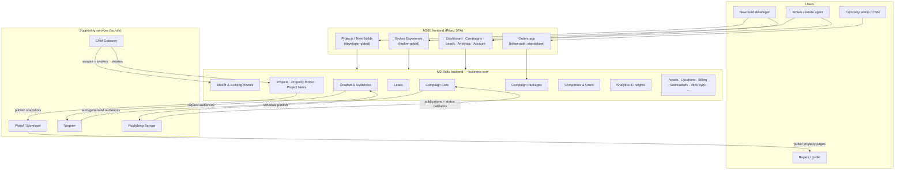

# 🗺️ Product & App Map

Source: https://app.notion.com/p/39614549bf5f8152a955e98fb5158d64?pvs=204
Path: Engineering / Product Knowledge
Last edited: 2026-09-04T05:46:12.909Z

---

<callout icon="✅" color="green_bg">
	**Status: ✅ Verified** (operator signed off the section-2 gate; independent verification + coordinator correction pass applied) · Last verified: <mention-date start="2026-07-08"/> · Owner: coordinator
	Every claim below is grounded in **code** (authoritative), triangulated with the M2 backend `docs/` folder, fresh 2026 Notion (Engineering hub + the **Fork** infrastructure playbook, fetched 2026-07-08), and a targeted live-Jira pass for product intent. **M2** = `marketer` Rails backend · **M360** = `marketer-frontend` (this repo). Code paths are `path:line`. Entries marked **⚠️** flag a doc-vs-code (or [doc-vs-CLAUDE.md](http://doc-vs-CLAUDE.md)) tension, resolved in the code's favour. Built to the same bar as the sibling <mention-page url="https://app.notion.com/p/39614549bf5f81cab399cee317278b03"/>; this page maps the **structure**, the glossary defines the **terms**. **Partial backfill 2026-07-23 (release sweep — pending operator gate, NOT part of the verified section):** added cited cross-ref clauses on the Dashboard row ([HK-210](https://linear.app/newbuilds/issue/HK-210) / [HK-211](https://linear.app/newbuilds/issue/HK-211)), the Analytics row ([HK-208](https://linear.app/newbuilds/issue/HK-208)) and the Admin-Panel row ([HK-221](https://linear.app/newbuilds/issue/HK-221)); these additions are not covered by the ✅ verification above. **Release sync 2026-07-28 (pending operator gate):** added a cited clause on the Broker Experience row for the estate-type-differentiated commercial property display ([HK-300](https://linear.app/newbuilds/issue/HK-300) · PR [#4334](https://github.com/marketertechnologies/marketer-frontend/pull/4334)); also outside the ✅ verification. **Release sync 2026-08-11 / FE v1.154.0 (pending operator gate):** added a cited clause in §1 recording that the single M360 bundle is now served under **two customer-facing hostnames** and resolves its brand at runtime ([HK-408](https://linear.app/newbuilds/issue/HK-408) · PR [#4354](https://github.com/marketertechnologies/marketer-frontend/pull/4354); term defined in the Glossary as *Brand*); also outside the ✅ verification. The release's other ticket, [HK-334](https://linear.app/newbuilds/issue/HK-334) (PR [#4352](https://github.com/marketertechnologies/marketer-frontend/pull/4352)), was build/deploy config only — no KB impact. **Release sync 2026-08-11 / BE v1.373.0 (pending operator gate):** added a cited clause on the *Portal / Storefront* service entry in §3 for the Storefront API's `api.homekey.ai` cutover + host-aware OpenAPI-doc rebrand ([HK-357](https://linear.app/newbuilds/issue/HK-357) · PR [#14160](https://github.com/marketertechnologies/marketer/pull/14160)); also outside the ✅ verification. **Corrective sync 2026-08-11 / FE v1.154.0 (pending operator gate):** two additions from the independent audit of the sync above — (1) audit finding **F2**: the §1 brand clause's “pre-boot frame” wording is corrected additively, because the standalone **Orders** app never mounts `BrandProvider` and is therefore HomeKey-branded **permanently on every host** ([HK-408](https://linear.app/newbuilds/issue/HK-408) · PR [#4354](https://github.com/marketertechnologies/marketer-frontend/pull/4354)); and (2) a **coverage hole**: v1.154.0 shipped 7 merged PRs but only 2 Linear tickets, so **Lead CSV import** (Jira [MT3-9315](https://marketer.atlassian.net/browse/MT3-9315) · PR [#4343](https://github.com/marketertechnologies/marketer-frontend/pull/4343), plus [MT3-9314](https://marketer.atlassian.net/browse/MT3-9314) · PR [#4342](https://github.com/marketertechnologies/marketer-frontend/pull/4342) in v1.153.0 — neither has a Linear issue) was invisible to both the sync and the audit; it is now recorded on the **Leads** row above and as the Glossary term *CSV Lead Import (bulk lead upload)*. Both also outside the ✅ verification. **Release sync 2026-08-13 / BE v1.374.0 (pending operator gate):** added a cited clause to the *Order Management* subsection in §1 — cancelling an order now propagates `CANCELLED` back to the CRM for fresh (non-replaced) orders too ([HK-429](https://linear.app/newbuilds/issue/HK-429) · PR [#14172](https://github.com/marketertechnologies/marketer/pull/14172)); the flow in full is on the [Broker-Experience flow deep-dive](https://app.notion.com/p/39714549bf5f81b2a269f5238817ae64). The release's other product-visible items are recorded in the Glossary (*Brand* — non-host-aware HomeKey email branding, [HK-409](https://linear.app/newbuilds/issue/HK-409); *Creative Set* — the rebuilt ad-video render pipeline, [HK-57](https://linear.app/newbuilds/issue/HK-57)); [HK-303](https://linear.app/newbuilds/issue/HK-303) / [HK-304](https://linear.app/newbuilds/issue/HK-304) were Redis / job-retry infrastructure only — no KB impact. Also outside the ✅ verification. **Release sync 2026-08-25 / FE v1.156.0 (pending operator gate):** extended the **Leads** row — the CSV lead import can now be **finished** (confirm → import → completion summary / error report / optional CRM export), closing the “stops at the preview” limitation recorded by the 2026-08-11 corrective sync (Jira [MT3-9316](https://marketer.atlassian.net/browse/MT3-9316) · PR [#4344](https://github.com/marketertechnologies/marketer-frontend/pull/4344) — again **Jira-only, no Linear ticket**, so again invisible to the Linear-driven release query). Full behaviour, the backend commit contract and five recorded limitations live in the Glossary term *CSV Lead Import (bulk lead upload)*; one code-vs-intent gap (the drawer's progress poll never starts after confirm) is flagged in the Glossary's *Gaps & uncertainties*. **✅ Post-audit repair 2026-08-25 (pending operator gate), two corrections to the sentence before this one.** *Count:* the Glossary records **four** limitations, enumerated (i)–(iv), not five; the "+ one gap" is the progress-poll defect, already named separately. *Substance, and the material one:* that sync recorded the release's Jira tickets as carrying **no descriptions and no acceptance criteria**, and that is **false** — epic [MT3-9246](https://marketer.atlassian.net/browse/MT3-9246) carries a **12-bullet Acceptance Criteria block** (present since 2026-04-20) and [MT3-9314](https://marketer.atlassian.net/browse/MT3-9314) / [MT3-9315](https://marketer.atlassian.net/browse/MT3-9315) / [MT3-9316](https://marketer.atlassian.net/browse/MT3-9316) each carry a *Scope* description (all three now ***Verified***; re-read live 2026-08-25, read-only). So **two of those four "limitations" are code-vs-ticket divergences**, not open questions: the error report omits validation-invalid rows (the epic's 10th AC bullet requires *“Invalid and failed rows…”*) and the preview hoists invalid rows instead of showing the file's first 50 (the epic's 7th AC bullet plus MT3-9315's scope line). The progress-poll gap is re-cited to MT3-9316's own scope line and the epic's 8th AC bullet. Full re-filing on the Glossary entry and its *Gaps & uncertainties*; the superseded wording is retained everywhere and nothing was deleted or filed. The release's five **Linear** tickets were all non-product — [HK-496](https://linear.app/newbuilds/issue/HK-496) (Sentry DSN cutover), [HK-440](https://linear.app/newbuilds/issue/HK-440) / [HK-442](https://linear.app/newbuilds/issue/HK-442) (CI sharding + release automation), [HK-458](https://linear.app/newbuilds/issue/HK-458) (Playwright coverage for the CSV import) and [HK-335](https://linear.app/newbuilds/issue/HK-335) (cross-listed; its product change shipped in v1.153.0, only the e2e port is new here). Also outside the ✅ verification. **Backend release sync 2026-08-25 / BE v1.375.0 (pending operator gate):** three additions below — a cited clause on the §1 **Auth & gating model** list recording that M2's dead `/m360_grant` token-handoff route was deleted ([HK-483](https://linear.app/newbuilds/issue/HK-483)); a cited clause on the §2 **Vitec & External Sync** row for the DNB projects-import swagger host rebrand ([HK-355](https://linear.app/newbuilds/issue/HK-355)); and a new bullet under §3 **Targeter** for the service's move onto its own HomeKey-managed hostname ([HK-375](https://linear.app/newbuilds/issue/HK-375)). This release's customer-visible behaviour changes are documented elsewhere: the zero-creative-set publish guard and the reverted Part-2 hardening on **User Flows** *Flow 3* and the Glossary *Publication / Publish*; the admin campaign show-page crash fix on **User Flows** *Flow 8*; the archived-channel deletion-age cut and the mailer sender/support-address cutover on the Glossary *Channel* and *Brand*. Also outside the ✅ verification. **Backend release sync 2026-08-26 / BE v1.376.0 (pending operator gate):** two additions — a new **feature deep-dive** child page, <mention-page url="https://app.notion.com/p/3c814549bf5f8199bc52e533b2512611">Order-Intake Observability (Admin Panel) — Orders Overview & Auto Order Attempts</mention-page>, documenting the release's ten-ticket admin-panel cluster ([HK-473](https://linear.app/newbuilds/issue/HK-473) / [HK-476](https://linear.app/newbuilds/issue/HK-476) / [HK-477](https://linear.app/newbuilds/issue/HK-477) / [HK-478](https://linear.app/newbuilds/issue/HK-478) / [HK-498](https://linear.app/newbuilds/issue/HK-498) / [HK-500](https://linear.app/newbuilds/issue/HK-500) / [HK-501](https://linear.app/newbuilds/issue/HK-501) / [HK-502](https://linear.app/newbuilds/issue/HK-502) / [HK-504](https://linear.app/newbuilds/issue/HK-504) / [HK-508](https://linear.app/newbuilds/issue/HK-508)); and a cited clause + deep-dive link on the **Admin Panel** row above. The release's only other product-intent item is Jira-only — [MT3-9345](https://marketer.atlassian.net/browse/MT3-9345) (per-creative Meta placement restrictions, PR [#14224](https://github.com/marketertechnologies/marketer/pull/14224), **no Linear ticket**) — recorded on the Glossary *Creative Set* entry, with the caveat that it has **no end-to-end effect yet**. Also outside the ✅ verification. **Frontend release sync 2026-08-26 / FE v1.157.0 (pending operator gate):** one addition — a cited clause on the §1 two-entry-points paragraph recording that the runtime host-aware brand resolver added by [HK-408](https://linear.app/newbuilds/issue/HK-408) has been **removed** and HomeKey hardcoded, so the main SPA and the standalone Orders app are now HomeKey-branded on every host ([HK-436](https://linear.app/newbuilds/issue/HK-436) · PR [#4373](https://github.com/marketertechnologies/marketer-frontend/pull/4373); term and its gaps updated on the Glossary *Brand* entry). Scope was enumerated from the `v1.156.0..v1.157.0` git diff — 9 commits / 5 merges. The release's only other Linear ticket, [HK-496](https://linear.app/newbuilds/issue/HK-496) (Sentry DSN swap to `sentry.homekey.ai`, PR [#4380](https://github.com/marketertechnologies/marketer-frontend/pull/4380)), is **non-product** — two GitHub Actions workflow env values — as are the version-bump PR [#4377](https://github.com/marketertechnologies/marketer-frontend/pull/4377) and the `master` back-merge PR [#4382](https://github.com/marketertechnologies/marketer-frontend/pull/4382), whose diff against its first parent is empty. ⚠️ **Added 2026-08-31 (independent FE v1.157.0 audit finding F3):** HK-496 also contributes **zero net change** to this release — `git diff v1.156.0 v1.157.0 -- .github/` is **empty**, because the byte-identical DSN change had already landed on `master` via PR [#4379](https://github.com/marketertechnologies/marketer-frontend/pull/4379), whose merge commit `62e02ea11` **is** the `v1.156.0` tag. #4379 (titled "Production", base `master`) and #4380 (titled "Staging", base `development`) are **branch twins split by deploy lane, not production/staging halves** — each flips both env values. So the Sentry cutover is not something v1.157.0 shipped. Also outside the ✅ verification. **Frontend release sync 2026-09-01 / FE v1.158.0 (pending operator gate):** one addition — a cited clause on the **Broker Experience** row recording that estate type is now surfaced as a tag on the property page and card, that the commercial layout treatment was generalised to newbuild aggregates (`project`/`stage`) across the detail page, card, campaign property summary and campaign property-selection table, and that the properties list table was slimmed from twelve columns to eight ([HK-450](https://linear.app/newbuilds/issue/HK-450) · PR [#4374](https://github.com/marketertechnologies/marketer-frontend/pull/4374); the vocabulary and per-surface rules live on the Glossary *Estate Type* / *Existing Home* entries). Scope was enumerated from the `v1.157.0..v1.158.0` git diff — 18 commits / 6 merged PRs / 37 files — **not** from the Linear release object, which reports only 2 of the release's 4 substantive tickets because two of them now live in a separate `homekeytechnologies` Linear organisation (flagged on the Glossary's *Gaps & uncertainties*). No route, surface, gate or module was added or removed by this release, so §1's tables are otherwise unchanged. The release's other items are non-product for this page: [HK-549](https://linear.app/homekeytechnologies/issue/HK-549) (PR [#4388](https://github.com/marketertechnologies/marketer-frontend/pull/4388)) is a copy/localisation change recorded on the Glossary *Showing* entry, [HK-513](https://linear.app/newbuilds/issue/HK-513)'s frontend slice (PR [#4389](https://github.com/marketertechnologies/marketer-frontend/pull/4389)) is a Playwright page-object fix with no `src/` change, [HK-537](https://linear.app/homekeytechnologies/issue/HK-537) (PR [#4384](https://github.com/marketertechnologies/marketer-frontend/pull/4384)) is CI-only, and PR [#4381](https://github.com/marketertechnologies/marketer-frontend/pull/4381) is a version bump. Also outside the ✅ verification. **Release sync 2026-09-03 / FE v1.159.0 (pending operator gate):** added a cited clause on the Broker Experience row — broker campaign details now surface a failed channel publication inline (warning icon + tooltip, and a banner with a **View error** action opening the existing publication-status drawer), mirroring the newbuilds campaign header per the PR's own description ([PR #4378](https://github.com/marketertechnologies/marketer-frontend/pull/4378); no Linear or Jira ticket found for this change despite searching — intent sourced from the PR description only, flagged as a process gap on the KB root tracker). Scope was enumerated from the `v1.158.0..v1.159.0` git diff — 80 commits / 199 files — of which only two `src/` files changed (`PageHeader.tsx` + its test), confirming this is the release's sole product-behaviour delta; the rest is test/CI-only (Playwright CRM-as-user harness [HK-404](https://linear.app/homekeytechnologies/issue/HK-404), new-builds CI-suite gating [HK-556](https://linear.app/homekeytechnologies/issue/HK-556)), a master→development back-merge, and a version bump. No route, surface, gate or module was added or removed. Also outside the ✅ verification.
</callout>
## Scope
**Deep focus:** M360 (incl. Broker Experience), New Builds, and the **M2 backend** — the business core where most domain objects, states, and business logic live — plus how these fit together and share data.
**Contextual (purpose & influence, not internals):** Targeter, Publishing Service, CRM Gateway, and Portal/Storefront — what each is for, how users/M2 interact with it, and how it influences states/objects in M2 / M360.
---
## The platform at a glance
Marketer is a marketing/real-estate SaaS platform with **one React frontend (M360)** talking to **one Rails backend (M2)** over REST + GraphQL, surrounded by a fleet of **supporting microservices** (publishing, targeting, CRM sync, portal, email, checkout, analytics, auth). The same M360 app + M2 backend serve **two product lines**, selected per company by an *experience type*:
- **New Builds** (`new_build_developer`) — property developers marketing new-build projects (Projects → Sales Stages → Buildings → Units).
- **Broker Experience** (`broker_agency`) — estate agencies marketing resale/existing-home listings and brokers.
M2 owns the domain model and business logic; the supporting services perform specialised work (actually publishing ads, generating audiences, syncing CRMs, hosting public property pages) and push state back into M2. For the object-level model (Company → Product → Promotable → Campaign → Channel → Audience → Ad) see the <mention-page url="https://app.notion.com/p/39614549bf5f81cab399cee317278b03"/> core-object map — this page sits one level up.

---
## 1. M360 frontend — product areas
The router lives at **M360 ****`src/components/App/App.tsx`** (⚠️ **not** `src/App.tsx` as [CLAUDE.md](http://CLAUDE.md)'s provider diagram implies — that file does not exist). Routes are code-split via `React.lazy`. There are **two separate SPA entry points** (M360 `vite.config.ts:23`): the main app (`index.html` → `src/index.tsx`) and a standalone **Orders** app (`orders.html` → `src/orders/index.tsx`). *(Release sync 2026-08-11 — pending operator gate: that one bundle is served under two customer-facing hostnames — **`m360.marketer.tech`** and **`m360.homekey.ai`** — from the same CloudFront distribution, so the app picks its brand at runtime from **`window.location.hostname`**: tab title, favicon / PWA manifest, sidebar and login logo, copyright holder, support email and the support / privacy links all differ per host, and any unknown host (staging, previews, **`localhost`**) defaults to HomeKey. Both static shells now ship the HomeKey defaults, so the pre-boot frame is HomeKey-branded on either host — see the Glossary's *Gaps & uncertainties*. *[*HK-408*](https://linear.app/newbuilds/issue/HK-408)* · PR *[*#4354*](https://github.com/marketertechnologies/marketer-frontend/pull/4354)*; term defined in *Brand*, Glossary.)* *(Corrective sync 2026-08-11 — pending operator gate, audit finding F2: the “pre-boot frame” statement above is true of **`index.html`** only. **`BrandProvider`** is mounted in exactly one place (**`src/components/App/App.tsx:174`**) and **`applyBrandToDocument`** is called only from inside it (**`src/brand/BrandContext.tsx`**), whereas the standalone Orders entry point **`src/orders/index.tsx`** mounts **`I18nProvider`** + **`QueryClientProvider`** and no brand provider — and nothing in the Orders source or page directories uses the brand hook or brand logo component. So the Orders static shell's hardcoded HomeKey favicon, apple-touch-icon, PWA manifest and its HomeKey document title are never corrected: the standalone package-order page is HomeKey-branded permanently on every host, including **`m360.marketer.tech`** — not merely for a pre-boot window. Confined to the browser-tab / PWA chrome; the Orders page's own visible logo is the customer's company logo (**`src/pages/Orders/components/OrderHeader.tsx:36`**). Re-verified at tag **`v1.154.0`**. *[*HK-408*](https://linear.app/newbuilds/issue/HK-408)* · PR *[*#4354*](https://github.com/marketertechnologies/marketer-frontend/pull/4354)*; recorded in the Glossary's *Gaps & uncertainties*.)* *(Release sync 2026-08-26 — FE v1.157.0, pending operator gate: both clauses above are now historical. The runtime brand resolver is deleted — with the domain migration complete and **`m360.homekey.ai`** the sole customer-facing host, *[*HK-436*](https://linear.app/newbuilds/issue/HK-436)* removed **`src/brand/`** in full, dropped **`BrandProvider`** from **`src/components/App/App.tsx`**, and moved the surviving values into one frozen constant, **`BRAND`** in **`src/constants/brand.ts`**. Both static shells now point at root-level **`/favicon.svg`**, **`/apple-touch-icon.png`** and **`/manifest.json`**, and all \`public/brands/\` assets are gone. So the two entry points no longer differ: the app is HomeKey-branded on every host it is served from, including **`m360.marketer.tech`** while that alias survives — retiring its DNS / CloudFront record is explicitly out of scope for HK-436. On the live customer host this is a no-visible-change cleanup: the ticket's *Deliverable* is that **`m360.homekey.ai`** "renders identically to today". *[*HK-436*](https://linear.app/newbuilds/issue/HK-436)* · PR *[*#4373*](https://github.com/marketertechnologies/marketer-frontend/pull/4373)*; code read at tag **`v1.157.0`** (**`963b6c3`**); *Brand* entry updated in the Glossary.)*
**Auth & gating model** (how areas are protected):
- No login route-guard wraps the tree; auth is enforced at the API layer — any `401` triggers `redirectToLogin()` (M360 `src/hooks/helpers/apiRequest.ts:127-139`, redirect at `:137`); token is **stored** by `storeToken` at `:24` (`:31` is `getToken`, a read).
- **Experience gating** via `PrivateExperienceRoute` (M360 `src/contexts/protectedRoutes/ProtectedExperienceRoute.tsx:13-24`) using `useCompanyExperiences()` (`src/hooks/useCompanyExperiences.ts:6,28-29`): `broker-experience/*` needs **broker** experience (redirect to `/`); `analytics`/`projects`/`campaigns`/`leads` need **developer** experience (redirect to `/broker-experience`). Refs App.tsx:102-144.
- **Feature-flag gating** is inside pages, not the router (e.g. `ai_chat`, `project_news_2_0` in `src/pages/Project/components/ProjectSidebar/ProjectSidebar.tsx:46-55`).
- **There is no M2→M360 "grant token" handoff — the route was dead and is now deleted (BE v1.375.0, pending operator gate).** M2's `config/routes.rb` still declared `get '/m360_grant' → GrantController#generate`, and the M2 README carried a *Passing the token to M360* section describing a full short-lived-grant redirect dance (M360 → `M2/m360_grant?returnPage=…` → `M360/grant-token?grant=…` → `POST /api/v1/tokens`). **None of it existed:** no `GrantController` was present anywhere in the app, the route 404'd on both `m2.dev` and `core.m360.homekey.ai`, and there were no non-spec, non-README references to `m360_grant` / `grant_token`. Both the route and the README section were removed, so the bullet above — API-layer `401` → `redirectToLogin()` — is the whole story. The adjacent README section *Redirection to M360 after logging in* describes **live** behaviour and was deliberately kept, as was the `packs/leads.js` CDN-redirect endpoint (still 302-ing on both hosts; only its README example host moved to `core.m360.homekey.ai`, because `m2.dev` stays live indefinitely for the leads.js embed contract per [HK-365](https://linear.app/newbuilds/issue/HK-365)). [HK-483](https://linear.app/newbuilds/issue/HK-483) · PR [#14197](https://github.com/marketertechnologies/marketer/pull/14197); confirmed at tag `v1.375.0` (no `app/controllers/**grant**` file; `m360_grant` absent from `config/` and `app/`).
<table fit-page-width="true" header-row="true">
<tr>
<td>Area</td>
<td>Route(s)</td>
<td>Purpose</td>
<td>Primary users</td>
<td>Code (M360)</td>
</tr>
<tr>
<td>**Login / Auth** (public)</td>
<td>`/login`, `/forgot-password`, `/reset-password`, `/after_oauth`, `/privacy-policy`</td>
<td>Email/password + Google & Microsoft SSO, password recovery, OAuth callback.</td>
<td>All users</td>
<td>`src/components/App/App.tsx:93-97`; `src/pages/Login/LoginPage.tsx:27-146`</td>
</tr>
<tr>
<td>**Dashboard** (default landing)</td>
<td>`/dashboard/*`</td>
<td>Cross-cutting KPI/analytics overview; tabs adapt to the company's experience(s), with date & currency filters. *(Partial backfill 2026-07-23 — pending operator gate: on the Existing homes tab, a campaign-package toolbar filter (*[*HK-210*](https://linear.app/newbuilds/issue/HK-210)*) and an estate-type drawer filter (*[*HK-211*](https://linear.app/newbuilds/issue/HK-211)*) narrow existing-home analytics — see *[*User Flows Flow 6*](https://app.notion.com/p/39614549bf5f811385daf5574ff4ca6c)*.)*</td>
<td>Both brokers & developers</td>
<td>`App.tsx:101`; `src/pages/Dashboard/Dashboard.tsx:39-60`</td>
</tr>
<tr>
<td>**Broker Experience** (broker-gated)</td>
<td>`/broker-experience/*` → `home`, `properties`, `brokers`, `campaigns/*`, `leads/*`</td>
<td>Workspace for **estate agencies** (`broker_agency`): existing-home listings, brokers/agents, their campaign packages & leads. *(Release sync 2026-07-28 — pending operator gate: commercial listings (**`estate_type == commercial`**) now render commercial-specific property fields — gross area + area range shown; rooms/beds/baths/balconies hidden — across the property detail page, card, edit drawer, and campaign property summary/table; residential display unchanged. *[*HK-300*](https://linear.app/newbuilds/issue/HK-300)* · PR *[*#4334*](https://github.com/marketertechnologies/marketer-frontend/pull/4334)*; see Glossary Existing Home / Estate Type.)* *(Release sync 2026-09-01 — FE v1.158.0, pending operator gate: the estate type is now displayed, not just branched on. An estate-type tag — "Newbuild project" / "Newbuild stage" / "Newbuild unit" / "Commercial", and nothing at all for a second-hand listing — renders on the property page header and the property card, and the commercial layout treatment was generalised to newbuild aggregates (**`project`**/**`stage`**): rooms/beds/baths and balconies hidden, area range shown, on the detail page, card, campaign property summary and campaign property-selection table. The properties list table was also slimmed to Address · City · Company · Status · Asking price · Size · Rooms — *Zip code*, *Country*, *Property type* and *Bathrooms* dropped, and *Livable area*  • *Gross area* folded into one estate-type-aware *Size* column; that slimming is the PR author's addition, not asked for by the ticket. *[*HK-450*](https://linear.app/newbuilds/issue/HK-450)* · PR *[*#4374*](https://github.com/marketertechnologies/marketer-frontend/pull/4374)*; per-surface rules and two localisation gaps on Glossary Estate Type / Existing Home.)* *(Release sync 2026-09-03 — FE v1.159.0, pending operator gate: broker campaign details (**`/broker-experience/campaigns/:uuid`**) now surface a failed channel publication inline — a warning icon beside the status badge (tooltip "Your campaign has one or more failed publications!") and a "Channel publication failed" banner with a View error action opening the existing channel-publication-status drawer, shown whenever **`publishFailedAt`** is set; no visual change otherwise. PR body states this brings parity with the newbuilds campaign header's existing indicator, not independently verified this run. *[*PR #4378*](https://github.com/marketertechnologies/marketer-frontend/pull/4378)* — no Linear or Jira ticket found despite searching Jira MT3 and GitHub; intent sourced from the PR description only.)*</td>
<td>Brokers / estate agents</td>
<td>`App.tsx:107`; `src/pages/BrokerExperience/BrokerExperience.tsx:24-42`</td>
</tr>
<tr>
<td>**Projects / New Builds** (developer-gated)</td>
<td>`/projects`, `/projects/:uuid/*`, `/projects/:organizationId/create/*`</td>
<td>Workspace for **new-build developers**: project list + a deep per-project sub-app (see below).</td>
<td>Property developers / new-build sales teams</td>
<td>`App.tsx:98,128-131`; `src/pages/Project/ProjectPage.tsx:104-233`</td>
</tr>
<tr>
<td>**Campaigns** (developer, top-level)</td>
<td>`/campaigns/*` → list, `/:id`, `/:id/:activeTab`, `/:campaignId/leads/:id`</td>
<td>Advertising campaign management (create/view/tabs, drill into a campaign's leads). Also embedded under Projects & Broker Experience.</td>
<td>Marketers / developers</td>
<td>`App.tsx:132-139`; `src/pages/Campaigns/CampaignsPage.tsx`</td>
</tr>
<tr>
<td>**Leads** (developer, top-level)</td>
<td>`/leads/*` → list, `/:id`</td>
<td>CRM-style lead management for inbound prospects. Brokers get their own copy under Broker Experience. *(Corrective sync 2026-08-11 — pending operator gate: a project's Leads page additionally offers Import leads (CSV) — bulk lead upload with a downloadable template (**`.csv`** only, max 10 MB), automatic matching of known column headers, manual remapping or skipping of unrecognised ones, a duplicate-handling choice (**`always_create`** / **`skip_existing`** / **`update_existing`**, matched by email or phone within the project) and a validation preview (“X valid · Y invalid · Z total” plus up to 50 rows with a reason per rejected row). The entry point is live and ungated but project-scoped: **`LeadsList.tsx:133`** and **`components/EmptyLeads.tsx:25`** render it only when the route carries a project **`:uuid`**, so it does not appear on this top-level **`/leads`** page or under Broker Experience. ⚠️ The flow stops at the preview — finalization (confirm, import progress, created / skipped / failed summary, error-report CSV, optional CRM export) is Jira *[*MT3-9316*](https://marketer.atlassian.net/browse/MT3-9316)*, still *Ready For Review* — so a customer can start and validate an import they cannot finish; staged delivery per the tickets, not a divergence. ⚠️ Jira-only work with no Linear ticket, hence absent from the Linear-driven release syncs: *[*MT3-9314*](https://marketer.atlassian.net/browse/MT3-9314)* · PR *[*#4342*](https://github.com/marketertechnologies/marketer-frontend/pull/4342)* (FE v1.153.0) and *[*MT3-9315*](https://marketer.atlassian.net/browse/MT3-9315)* · PR *[*#4343*](https://github.com/marketertechnologies/marketer-frontend/pull/4343)* (FE v1.154.0); code read at tag **`v1.154.0`**. Full detail in the Glossary term *CSV Lead Import (bulk lead upload)*.)* *(Release sync 2026-08-25 / FE v1.156.0 — pending operator gate: the ⚠️ limitation above is resolved. The preview now offers Confirm import plus an optional Export imported leads to CRM, and the drawer runs on to an importing step and a completion summary — created / skipped / updated / failed counts, an optional Download error report (CSV), and Done — or to a failed step carrying the backend's error message. An unfinished import is also resumed automatically: the drawer stores the in-flight import per project in **`localStorage`** and re-opens itself at the right step the next time the project's Leads page loads, so an import that was confirmed and then abandoned still finishes server-side and shows its summary on return. Jira *[*MT3-9316*](https://marketer.atlassian.net/browse/MT3-9316)* · PR *[*#4344*](https://github.com/marketertechnologies/marketer-frontend/pull/4344)*, code read at tag **`v1.156.0`**; ⚠️ still Jira-only with no Linear ticket. Full detail — including the backend commit contract, four duplicate-matching / error-report limitations and one flagged progress-poll defect — in the Glossary term *CSV Lead Import (bulk lead upload)* and its *Gaps & uncertainties*. ✅ Post-audit repair 2026-08-25: two of those four are now re-filed as code-vs-ticket divergences against epic *[*MT3-9246*](https://marketer.atlassian.net/browse/MT3-9246)*'s written acceptance criteria — the error report must carry invalid rows as well as failed ones (10th AC bullet) and the preview must show the file's first 50 rows rather than hoisting invalid rows (7th AC bullet, plus *[*MT3-9315*](https://marketer.atlassian.net/browse/MT3-9315)*'s scope line). The v1.156.0 sync recorded these tickets as having no acceptance criteria; that claim is false and is retracted on the Glossary entry. Both raised to the operator as bug drafts; nothing filed.)*</td>
<td>Sales / marketing teams</td>
<td>`App.tsx:140-143`; `src/pages/Leads/LeadsPage.tsx`</td>
</tr>
<tr>
<td>**Analytics / Insights** (developer-gated)</td>
<td>`/analytics/*` → `sales`, `marketing`</td>
<td>Sales & marketing performance analytics with date/currency filters. ⚠️ The Marketing tab is hard-disabled (`tabsVisible = false`) pending completion. *(Partial backfill 2026-07-23 — pending operator gate: the broker / existing-homes analytics path also accepts campaign-package filter args **`campaign_package_uuids`** / **`no_campaign_package`** — BE engine *[*HK-208*](https://linear.app/newbuilds/issue/HK-208)*; see Glossary *Campaign Package Instance*.)*</td>
<td>Developers / marketers</td>
<td>`App.tsx:120-127`; `src/pages/Analytics/Analytics.tsx:24-40`</td>
</tr>
<tr>
<td>**Account / Profile / Company admin**</td>
<td>`/account/*` → `my-profile`, `users/*`, `/checkout`</td>
<td>Personal profile, company **user management** (admin), and checkout/billing settings.</td>
<td>Admins / company managers (users) + all users (own profile)</td>
<td>`App.tsx:110`; `src/pages/Profile/ProfilePage.tsx:15-24`</td>
</tr>
<tr>
<td>**Orders** (separate token-auth app)</td>
<td>`/orders` — *logical URL*, **not** a registered App.tsx route: a separate `orders.html` Vite entry with its own React root + router (serves `path=*`)</td>
<td>Public, **token-authenticated** (`uuid`+`token` in URL, not the login token) page to view/manage a campaign-package order — activate, cancel, change package, view history — see *Order Management* below.</td>
<td>External order recipients + CSMs *(inferred from token-in-URL + "contact a M360 CSM" copy)*</td>
<td>`vite.config.ts:23`; `src/orders/index.tsx:23-51`; `src/pages/Orders/OrdersPage.tsx:15-74`</td>
</tr>
<tr>
<td>**Admin Panel** (internal back-office)</td>
<td>Separate Marketer-staff tool — **not** a route in the M360 SPA router</td>
<td>Internal back-office for company / campaign-package / role / feature-flag / template / credential config, plus ops like Property Explorer 3D-file upload and CRM re-sync. *(Partial backfill 2026-07-23 — pending operator gate: campaign-package admin also exposes the Vitec expense fields **`vitec_product_tag`** / **`vitec_client_price`** / **`vitec_expense_description`** (+ read-only **`vitec_expense_id`** on the instance) — *[*HK-221*](https://linear.app/newbuilds/issue/HK-221)*; see Glossary *Vitec Expense Posting*.)* *(Backend release sync 2026-08-26 / BE v1.376.0 — pending operator gate: the admin panel gained a whole new order-intake observability area — two Administrate-hosted panels, Orders Overview (**`/admin_panel/orders_overview`**, the inbound leg: every Vitec / Webtop / M360-portal order-intake attempt, its outcome and its rejection stage) and Auto Order Attempts (**`/admin_panel/auto_order_attempts`**, the outbound leg: our own auto-order pipeline stage-by-stage), each with filters, a single free-text identifier search, two Chartkick time-series charts and a drill-down, plus a show-only Checklist Push page. Both are sidebar-linked beside *Failed Campaigns*. ⚠️ At tag ****`v1.376.0`**** the three audit tables behind them have no production writers — the writer tickets *[*HK-474*](https://linear.app/newbuilds/issue/HK-474)* / *[*HK-475*](https://linear.app/newbuilds/issue/HK-475)* are still *In Review* — so the panels render empty in production; staged delivery per *[*HK-473*](https://linear.app/newbuilds/issue/HK-473)*, not a defect. Ten tickets *[*HK-473*](https://linear.app/newbuilds/issue/HK-473)* / *[*HK-476*](https://linear.app/newbuilds/issue/HK-476)* / *[*HK-477*](https://linear.app/newbuilds/issue/HK-477)* / *[*HK-478*](https://linear.app/newbuilds/issue/HK-478)* / *[*HK-498*](https://linear.app/newbuilds/issue/HK-498)* / *[*HK-500*](https://linear.app/newbuilds/issue/HK-500)* / *[*HK-501*](https://linear.app/newbuilds/issue/HK-501)* / *[*HK-502*](https://linear.app/newbuilds/issue/HK-502)* / *[*HK-504*](https://linear.app/newbuilds/issue/HK-504)* / *[*HK-508*](https://linear.app/newbuilds/issue/HK-508)*; PRs *[*#14188*](https://github.com/marketertechnologies/marketer/pull/14188)* · *[*#14200*](https://github.com/marketertechnologies/marketer/pull/14200)* · *[*#14203*](https://github.com/marketertechnologies/marketer/pull/14203)* · *[*#14206*](https://github.com/marketertechnologies/marketer/pull/14206)* · *[*#14213*](https://github.com/marketertechnologies/marketer/pull/14213)* · *[*#14215*](https://github.com/marketertechnologies/marketer/pull/14215)* · *[*#14216*](https://github.com/marketertechnologies/marketer/pull/14216)* · *[*#14218*](https://github.com/marketertechnologies/marketer/pull/14218)* · *[*#14220*](https://github.com/marketertechnologies/marketer/pull/14220)* · *[*#14221*](https://github.com/marketertechnologies/marketer/pull/14221)*. Full detail, all seven flagged code-vs-ticket gaps and the sources table are on the new feature deep-dive linked in the Sources column.)*</td>
<td>Marketer staff (CSMs / ops), not customer users</td>
<td>Ref §1 #2; surfaced in M360 via UI copy `src/components/PropertyExplorer/components/InfoMessage3dUploaded.tsx:17`  • the CRM re-sync trigger (see §2) • **feature deep-dive:** <mention-page url="https://app.notion.com/p/39d14549bf5f81729a9cec46b68a699a">Failed Campaigns Admin Dashboard</mention-page> (child page of this map — the failed-campaign triage/repair dashboard) • **feature deep-dive:** <mention-page url="https://app.notion.com/p/3c814549bf5f8199bc52e533b2512611">Order-Intake Observability (Admin Panel) — Orders Overview & Auto Order Attempts</mention-page> (child page of this map, added by the BE v1.376.0 sync 2026-08-26 — pending operator gate)</td>
</tr>
</table>
**Per-project sub-app** (nested router, relative to `/projects/:uuid`, M360 `src/pages/Project/ProjectPage.tsx:130-228`): `analytics`, `details`, `units/*`, `parking-units/*`, `leads/*`, `campaigns/*`, `offers/*`, `buyers/*`, `buildings`, `sales-stages`, `media-library`, **`property-explorer`** (+ `configurator`), **`project-news/*`** (feature-flagged `project_news_2_0`), `checkout`, `aichat` (feature-flagged `ai_chat`), `my-profile`.
> ⚠️ **Property Explorer** and **Project News / Engager** are **not** top-level routes — they are sub-areas of a Project (developer side). There is no route literally named "Insights" (that is *Analytics*) or "Engager" (in code it is *Project News*).
### New Builds vs Broker Experience — same app, gated by experience
These are not separate apps; they are two experiences of one M360 codebase, chosen by the company's `experience` type (M360 `src/hooks/useCompanyExperiences.ts:28-29`; M2 `app/models/company.rb` experience types `new_build_developer, broker_agency`). Key differences:
- **New Builds** centres on **Projects** (Project → Stage → Building → Unit), the **Property Explorer**, **Offers/Buyers/Checkout**, and **Project News** — a rich per-project workspace. Marketing runs through a project's Sales Stages.
- **Broker Experience** centres on **Existing Homes** and **Brokers** as promotables, driven by **Campaign Packages** / **Campaign Orders** and **Order Management** — a lighter, package-order-oriented flow for individual property transactions.
- *Product-intent (Jira, verified <mention-date start="2026-07-08"/>; re-checked <mention-date start="2026-07-23"/>):* Order-Management **async** work — **MT3-9090** (Released — package-change moved to async) is the primary citation; the **duplicate-active-order confirmation** flow (Epic **MT3-8963**, epic status TODO) in fact **shipped** via its children + the typed-confirmation **MT3-9173** (Released) — ⚠️ epic status is not a delivery signal in this tenant; the order portal itself is Epic **MT3-8698**. MT3-9083 is only an Order-Management *page-tests* task (weak feature evidence). The **BlikkFang Prosjekt** package *name* is confirmed by a mailer copy-bug fix (**MT3-9484** — `ExistingHomeMailer` had shown "BlikkFang" instead of the client's "BlikkFang Prosjekt"); this proves the name exists, **not** a distinct new-build branding feature.
#### Order Management (the campaign-package order portal)
The **Orders app** (above) is the standalone, login-less, token-authenticated portal where the recipient of a campaign-package order can **view, activate, change, or cancel** that order and see its change history — the self-service order portal for a CRM/broker campaign-package order ([epic MT3-8698](https://marketer.atlassian.net/browse/MT3-8698)). As of [MT3-8707](https://marketer.atlassian.net/browse/MT3-8707) the order-portal URL **replaced** the live-report URL as the primary post-webhook landing. Backed server-side by the **Campaign Package Instance** (`GET /api/v1/campaign_orders/campaign_package_instances/{uuid}?token=`; M2 `config/routes.rb:188-193`), **not** the minimal `Order` model. Actions: activate (`POST …/activate`), change package (`PUT …/{uuid}` → `ChangePackageJob`, async [MT3-9090](https://marketer.atlassian.net/browse/MT3-9090)), cancel (`DELETE …/{uuid}` → `CancelJob`, async MT3-9030); the header shows a **phase-aware disclaimer** (live vs scheduled/draft vs completed, [MT3-8792](https://marketer.atlassian.net/browse/MT3-8792)). *(Release sync 2026-08-13 — pending operator gate: the cancel action listed above now also reports the cancellation back to the originating CRM for every CRM-sourced order, not only for orders produced by a package-change flow — Vitec gets **`status: 5`**, Webtop **`state: 'Cancelled'`**, pushed by a separate retriable job after the local cancel commits, so ad delivery stops immediately even when the CRM is unavailable. Previously a directly-created order was cancelled in M360 while its CRM order silently stayed **`Completed`** / **`Active`**. *[*HK-429*](https://linear.app/newbuilds/issue/HK-429)* · PR *[*#14172*](https://github.com/marketertechnologies/marketer/pull/14172)*; full flow on the *[*Broker-Experience deep-dive*](https://app.notion.com/p/39714549bf5f81b2a269f5238817ae64)*, term detail under Glossary *Order Management*.)* A **duplicate-active-order confirmation guard** ([epic MT3-8963](https://marketer.atlassian.net/browse/MT3-8963); typed confirmation [MT3-9173](https://marketer.atlassian.net/browse/MT3-9173)) routes a second active order for the same assignment into InteractionRequired (Vitec)/MissingInfo (Webtop) with a Cancel/Proceed page. The login-less enter/change/cancel **journey** is in the [User-Flows deep-dive](https://app.notion.com/p/39714549bf5f81b2a269f5238817ae64).
---
## 2. M2 backend — the business core (subsystems)
M2 groups its domain into subsystems indexed by **M2 ****`docs/subsystems.yml`** with a doc per subsystem in **`docs/subsystems/`** (13 core + 6 general = 19). These docs are a strong source of truth but can lag code (see tensions). Grouped below; every model file cited was verified to exist.
### Core subsystems
<table fit-page-width="true" header-row="true">
<tr>
<td>Subsystem</td>
<td>Owns</td>
<td>Key models / tables</td>
<td>Sources (M2)</td>
</tr>
<tr>
<td>**Campaign Core**</td>
<td>The central campaign workflow — campaigns, orders, products, channels, lifecycle, landing pages, lead forms, assignments. `Product` bridges promotables to the channel/campaign system.</td>
<td>`campaigns`, `orders`, `products`, `channels`, `channel_publications`, `campaign_specifications`, `lead_forms`, `landing_pages`</td>
<td>`docs/subsystems/campaign_core.md`; `app/models/campaign.rb:3`, `order.rb:3`, `product.rb:3`, `channel.rb:3`</td>
</tr>
<tr>
<td>**Campaign Packages**</td>
<td>Reusable templates that automate multi-campaign sequences for a promotable; instances model a purchased package's activation/cancellation lifecycle.</td>
<td>`campaign_packages`, `campaign_package_campaigns`, `campaign_package_instances`, `company_campaign_packages`, `package_ad_templates`</td>
<td>`docs/subsystems/campaign_packages.md`; `app/models/campaign_package.rb:3` (⚠️ doc links the `campaign_packages.rb` namespace shim, not the model)</td>
</tr>
<tr>
<td>**Creative & Audiences**</td>
<td>Creative sets, ads, creatives, formats, and per-platform audience definitions (Facebook, Instagram, GMP, Snapchat, Google Search, Portal, Generic). Bridges campaigns to what is published per platform.</td>
<td>`creative_sets`, `creatives`, `ads`, `audiences`, `audiences_facebook/gmp/instagram/snapchat`, `formats`</td>
<td>`docs/subsystems/creative_and_audiences.md`; `app/models/creative_set.rb:3`, `audience.rb`  • `app/models/audiences/*.rb`</td>
</tr>
<tr>
<td>**Leads**</td>
<td>Campaign lead capture, qualification, activity logging, CRM sync records, and links to units/buildings/buyers.</td>
<td>`campaign_leads`, `campaign_lead_activity_log_records`, `campaign_lead_units`, `campaign_lead_crm_records`</td>
<td>⚠️ `docs/subsystems/leads.md` is an **empty stub** — the domain is fully implemented under `Campaigns::` (`app/models/campaigns/lead.rb:5`  • `campaigns/leads/*`). Code wins.</td>
</tr>
<tr>
<td>**Projects**</td>
<td>New-build projects and their hierarchy (projects → stages → buildings → units/floors/balconies), plus agents, showings, facilities, portal snapshots, buyers, and checkout offers.</td>
<td>`projects`, `stages`, `stage_units`, `buildings`, `floors`, `agents`, `showings`, `snapshots`, `buyers`, `checkout_offers`</td>
<td>`docs/subsystems/projects.md`; `app/models/project.rb:3`</td>
</tr>
<tr>
<td>**Broker & Existing Homes**</td>
<td>Resale (existing-home) listings and broker entities; broker assignments; agent-created promotion campaigns; existing-home SMS deliveries.</td>
<td>`existing_homes`, `brokers`, `broker_assignments`, `agent_promotions`, `sms_deliveries`</td>
<td>`docs/subsystems/broker_and_existing_homes.md`; `app/models/existing_home.rb:3`, `broker.rb:3`</td>
</tr>
<tr>
<td>**Companies & Users**</td>
<td>Organization hierarchy, user accounts/auth, roles & permissions, company-level config (ad-platform accounts, brand colours, custom domains, FB pages).</td>
<td>`companies`, `users`, `admins`, `user_companies`, `company_roles`, `user_roles`, `role_abilities`</td>
<td>`docs/subsystems/companies_and_users.md`; `app/models/company.rb:3`, `user.rb` (⚠️ doc links `companies.rb` namespace shim, not the model)</td>
</tr>
<tr>
<td>**Property Picker**</td>
<td>Interactive visual property selector on project pages; 2D (image/polygon) + 3D (Eve3D) renderers; scenes map view-images to units. `engager_settings` configures the per-project viewer variant.</td>
<td>`property_picker_configurations/scenes/settings`, `property_picker_eve3d_zip_files`, `engager_settings`</td>
<td>`docs/subsystems/property_picker.md`; `app/models/property_picker/configuration.rb:4`, `app/models/engager/setting.rb:4`</td>
</tr>
<tr>
<td>**Project News**</td>
<td>CMS-like per-project news feed: posts with rich media, reaction tracking, email distribution, anonymous visitor tracking.</td>
<td>`product_news_posts`, `product_news_post_media/reactions`, `product_news_events`, `product_news_visitors`</td>
<td>`docs/subsystems/project_news.md`; `app/models/products/news/post.rb`</td>
</tr>
<tr>
<td>**CRM Gateway**</td>
<td>RabbitMQ-based integration with external CRMs; per-CRM configs, company↔config links, and last-sync tracking.</td>
<td>`crm_configurations`, `companies_crm_configurations`, `crm_sync_history`</td>
<td>`docs/subsystems/crm_gateway.md`; `app/models/crm_configuration.rb`, `crm_sync_history.rb`</td>
</tr>
<tr>
<td>**Vitec & External Sync**</td>
<td>Integration with Vitec + other sources (DNB, scraping): raw inbound data, processed representations, HTTP logs, scrape tasks, external-platform markers. *(BE v1.375.0 release sync — pending operator gate: the DNB projects-import OpenAPI document that DNB's engineers integrate against now advertises **`host: core.m360.homekey.ai`** instead of the legacy **`m2.dev`** — **`docs/swagger/dnb.yml`**, **`basePath /api/v1`**. Doc-only: the served endpoints and their behaviour are unchanged, and the ticket's other legs — identifying and coordinating the DNB-side URL adoption — are out-of-repo and not confirmed by this diff. The ticket also explicitly leaves the dead **`DnbMailer`** SendGrid subaccount out of scope. *[*HK-355*](https://linear.app/newbuilds/issue/HK-355)* · PR *[*#14196*](https://github.com/marketertechnologies/marketer/pull/14196)*.)*</td>
<td>`vitec_documents`, `remote_data`, `remote_log_records`, `remote_represented_data`, `scraping_tasks`, `platforms`</td>
<td>`docs/subsystems/vitec_and_external_sync.md`; `app/models/vitec/document.rb`, `remote/datum.rb`, `platform.rb`</td>
</tr>
<tr>
<td>**Analytics & Insights**</td>
<td>Ad-platform performance metrics stored per channel/campaign/audience (polymorphic `insightable`), per-day breakdowns, and portal analytics per product.</td>
<td>`insights`, `daily_insights`, `products_insights`</td>
<td>`docs/subsystems/analytics_and_insights.md`; `app/models/insight.rb`, `daily_insight.rb`, `products/insight.rb`</td>
</tr>
<tr>
<td>**Billing**</td>
<td>Invoice generation/export for campaign-package instances; per-company/period line items with multi-currency support.</td>
<td>`invoice_bases`, `invoice_base_items`, `exchange_rates`</td>
<td>`docs/subsystems/billing.md`; `app/models/invoice_base.rb`, `invoice_base_item.rb`, `exchange_rate.rb`</td>
</tr>
</table>
### General (cross-cutting) subsystems
<table fit-page-width="true" header-row="true">
<tr>
<td>Subsystem</td>
<td>Owns</td>
<td>Sources (M2)</td>
</tr>
<tr>
<td>**Assets & Media**</td>
<td>Polymorphic media assets (image/video/document) attached to any assetable via `asset_assignments`; backed by Active Storage.</td>
<td>`docs/subsystems/assets_and_media.md`; `app/models/asset.rb:3`</td>
</tr>
<tr>
<td>**Locations**</td>
<td>Polymorphic geo data (address, coords, municipality, country) on campaigns/projects/existing-homes/brokers. Distinct from `audience_locations`/`channel_locations`.</td>
<td>`docs/subsystems/locations.md`; `app/models/location.rb:3`</td>
</tr>
<tr>
<td>**Notifications**</td>
<td>Outbound comms delivery records — every SendGrid email logged with payload + polymorphic `deliverable`.</td>
<td>`docs/subsystems/notifications.md`; `app/models/email_delivery.rb:3` (class `EmailDelivery` → table `emails_deliveries`)</td>
</tr>
<tr>
<td>**Tags & Notes**</td>
<td>General-purpose tagging (acts-as-taggable-on) and free-text notes on any polymorphic `notable`.</td>
<td>`docs/subsystems/tags_and_notes.md`; `app/models/note.rb:3`</td>
</tr>
<tr>
<td>**Audit & Versioning**</td>
<td>PaperTrail audit trail (`versions`), S3 export-batch tracking for data pipelines, and Wisper-broadcast changeset diffing.</td>
<td>`docs/subsystems/audit_and_versioning.md`; `app/models/version_export_batch.rb`, `changeset.rb`</td>
</tr>
<tr>
<td>**System & Infrastructure**</td>
<td>App system tables — maintenance-mode singleton, job-dedup locks, Flipper feature flags, webhook trail, PG query stats, inbound email routing.</td>
<td>`docs/subsystems/system_and_infrastructure.md`; `app/models/system_setting.rb`, `job_lock.rb`, `event_trail.rb`</td>
</tr>
</table>
---
## 3. Supporting external services (by role)
Documented by **role** per KB scope — purpose, touchpoint, and effect on M2/M360 state; not internals. All four follow a dedicated HTTP client under M2 `app/lib/api/*` (env-configured host + bearer token) — except CRM Gateway, which uses the `crm_gateway_client` gem over a **message broker**.
### Publishing Service
- **Role:** Performs the actual publishing of campaigns to ad platforms (Meta, Snapchat, DV360/Google) and reports per-object results back.
- **Touchpoint:** User triggers publish → `Campaigns::Publish` (M2 `app/services/campaigns/publish.rb:21`) schedules a task via `PublishingService::Tasks::Schedule` (`:84`) through `Api::Publishing::Client` (`app/lib/api/publishing/client.rb:45,49`, env `PUBLISHING_API_URL`/`PUBLISHING_AUTH_TOKEN`). The service posts results back to `POST /publishing_results` (`config/routes.rb:281`; `app/controllers/publishing_results_controller.rb:6-41`).
- **Effect on state:** Creates `Channels::Publication` records (`status: scheduled → in_progress → succeeded/failed`, one active per channel — `app/models/channels/publication.rb:10-30`). The async callback persists external ad IDs onto Channel/Audience/Ad/creatives and sets `channel.publishing_mechanism = :publishing_service` (`app/services/campaigns/publication/results/receive.rb:89-187`). Gated by `EnabledFeatures.publish_campaigns?`.
- **Facing:** User-facing trigger; callback is backend-only. *(Related glossary: Publication / Publish, Channel.)*
### Targeter
- **Role:** External engine that auto-generates recommended audiences (+ geo / custom-audience data) from a promotable's product/location characteristics.
- **Touchpoint:** `Mutations::Campaigns::CreateAutoTargetingAudiences` (M2 `app/graphql/mutations/campaigns/create_auto_targeting_audiences.rb:10,26`) → `Campaigns::Targeting::Save`; geo via `app/services/targeter/fetch_geo_targeting.rb:35-45`. Calls go through `Api::Targeter::Client` (`app/lib/api/targeter/client.rb:44-58`, env `TARGETER_HOST_URL`/`TARGETER_AUTH_TOKEN`).
- **Effect on state:** Creates `Audience` records and flags each `targeter: true` (`app/services/campaigns/targeting/save.rb:56-71`; scope at `app/models/audience.rb:107`). **Any manual edit clears the flag** — `Audiences::Update` merges `targeter: false` (`app/services/audiences/update.rb:8`), so a user edit "takes over" an auto-generated audience.
- **Facing:** User-facing trigger (auto-targeting button / geo suggestions). ⚠️ `EnabledFeatures.targeter?` ignores its `promotable` arg and is **env-gated only** (`ENABLE_TARGETER`, `app/services/enabled_features.rb:5-7`), not per-promotable. *(Related glossary: Auto-Targeting, Audience, Custom Audience.)*
- **Now reached at its own HomeKey-managed hostname (BE v1.375.0, pending operator gate):** Targeter used to live on the data-science `*.meglermatch.no` platform; per the [HK-326](https://linear.app/newbuilds/issue/HK-326) ownership ruling it is one of three apps getting a managed HomeKey domain, and M2's `TARGETER_HOST_URL` default was flipped from `https://targeter.staging.meglermatch.no` to `https://targeter-staging.homekey.ai` (`.env.development`, `.env.test`; the dead, referenced-nowhere `TARGETER_URL` entry was dropped from `.env.example`). Pure configuration — the Faraday client at `app/lib/api/targeter/client.rb` is untouched, so no request shape, auth model or behaviour changes. ⚠️ **In-repo defaults only:** the production and staging Heroku config vars are the values that actually decide which host M2 calls, and they are out-of-repo — this diff neither contains nor confirms that flip, nor whether `TARGETER_AUTH_TOKEN` was reissued for the new instance. Per HK-326 the old `targeter.*.meglermatch.no` hostnames stay live-but-unused rather than being retired. [HK-375](https://linear.app/newbuilds/issue/HK-375) · PR [#14187](https://github.com/marketertechnologies/marketer/pull/14187); code re-read at tag `v1.375.0`.
- **⚠️ Not the same as Metric Targeter (MTA):** this Targeter generates **audiences**; the separate **Metric Targeter / MTA** service produces automated **campaign suggestions** (prospecting / scaling / retargeting / seasonal). See *Sibling products* below (ref §1 #13; Jira MTA-10).
### CRM Gateway
- **Role:** External microservice syncing real-estate data (estates/projects/stages/units, brokers/employees, images, documents, leads/buyers) from external CRMs (Vitec, Webmegler, …) into M2. The authoritative origin set is **10 CRMs** (`vitec, webmegler, webtop, jm_norge, bsp_vision, odd_hansen, mgc, hubspot, scorimmo, obos`); tracked in Jira **MT3 "M360 Development"**. Deep-dive: <mention-page url="https://app.notion.com/p/3a614549bf5f81139695d139b299b350">CRM Gateway — external-CRM integration & how it fits M360 (multi-source deep-dive)</mention-page> (child page of this map).
- **Touchpoint:** Configured in `config/initializers/crm_gateway_client.rb:5-8` (env `CRM_GATEWAY_BROKER_URL`). A long-lived subscriber `CrmGateway::Subscribe` (`app/lib/crm_gateway/subscribe.rb:14-52`) enqueues `CrmGateway::ReceiveJob` → `ReceiveService` (`app/services/crm_gateway/receive_service.rb:16-39`). M2 can also pull via `CrmGateway::EstateSyncJob` (RPC `FetchEstate`), triggerable from the admin panel and the `triggerProductEstateSyncJob` mutation.
- **Effect on state:** Creates/updates Projects/Stages/Buildings/Units/ExistingHomes + brokers/employees (`app/services/crm_gateway/receivers/estate.rb:39-46`; `persisters/*`), and writes `CrmSyncHistory` rows via the `Synchronizable` concern (`app/models/concerns/synchronizable.rb:18-42`). Gated per company by `Company#crm_gw_enabled?` (Flipper `crm_configurations_sync` + a config present — `app/models/company.rb:350-352`).
- **Facing:** Primarily backend; has a user/admin manual re-sync trigger. *(Related glossary: CRM Configuration, Estate / Assignment, Broker.)*
### Portal / Storefront
- **Role:** The public-facing property-page platform. M2 **publishes** projects (with their Snapshots) *to* the Portal, which hosts public property pages + property picker. Separately, M2 **exposes** a read API (`StorefrontApi`) that the public Storefront/property-picker app consumes.
- **Touchpoint (publish, M2→Portal):** `Mutations::Projects::PublishToPortal` (`publishProjectToPortal`) → `Portal::V2::Projects::Publish` (M2 `app/services/portal/v2/projects/publish.rb:26`) via `Api::Portal::V2::Projects::Publish` (env `PORTAL_HOST`/`PORTAL_AUTH_TOKEN`). Auto-publish via `Portal::Notify` on model changes (`app/services/portal/notify.rb:15-37`). Async results return to `PATCH /api/v1/portal/projects/:uuid/process_publication_result` (`config/routes.rb:154-158`). **Read API (Storefront→M2):** `storefront_api` route namespace (`config/routes.rb:4-8`) served by `StorefrontApi::*` controllers/serializers.
- **Effect on state:** Sets `Project#portal_published_at`, `portal_url` (or `portal_publish_failed_at`/`failure_reason`) — `app/services/portal/v2/projects/publish.rb:28-42`; the `published` scope keys off `settings->>'storefront_api'` (`app/models/project.rb:219`). **Snapshots** are the content the Portal renders (per sale-state; `portal_auto_sync_enabled` — `app/models/snapshot.rb:13-48`).
- **Facing:** User-facing publish trigger; service-to-service publish + callback; `StorefrontApi` is indirectly user-facing (public property-page visitors). ⚠️ `Channels::Portal` is a near-empty channel type (`app/models/channels/portal.rb:4-6`) — **not** the real integration surface. *(Related glossary: Snapshot, Portal / Storefront API, Unit Set.)*
- **`api.homekey.ai`**** — the Storefront API's rebranded public hostname (BE v1.373.0, pending operator gate):** the public Storefront API (the Rails app running under `APP_ROLE=STOREFRONT_API`) is being published as **`api.homekey.ai`** as part of the rebrand. It is a **dual-live cutover, not a move** — the legacy hostname stays live and serves the same content until a later phase (Phase 7) retires it, so existing integrators are not broken ([HK-357](https://linear.app/newbuilds/issue/HK-357)). The slice **confirmed in this release's code** is the published **OpenAPI doc**: an `Rswag::Api` `swagger_filter` now inspects the request host and, **only when it ends with ****`homekey.ai`**, rewrites the served doc at serialization time — `Marketer`→`HomeKey` in `info.title` and `info.description`, the description's auth-service link, and the `AuthenticationService` client-credentials `tokenUrl` → `https://auth.homekey.ai/oauth/token`. Every other host (the legacy aliases still pointing at the same Heroku app) gets the doc **unchanged**, and the static `swagger/v1/swagger.yaml` on disk is untouched — so which branding an integrator sees depends purely on the hostname they read the docs from ([HK-357](https://linear.app/newbuilds/issue/HK-357) · PR [#14160](https://github.com/marketertechnologies/marketer/pull/14160), merge `bcca52be`). ⚠️ The ticket's other legs — the Heroku custom domain, the `homekey.ai` DNS record, and publishing updated integration documentation to consumers — are **infrastructure work outside this repo**; the PR attributes them to HK-329 / HK-333 as already delivered, which this release's diff neither contains nor confirms. ⚠️ Naming note: the ticket calls the legacy hostname `storefront-api.marketer.tech` while the shipped code and its specs treat `*.marketer-services.dev` as the legacy alias set — immaterial to behaviour, since the filter keys only on the `homekey.ai` suffix and leaves *every* other host untouched. Related: the wider `marketer.tech`→`homekey.ai` migration tracked under [HK-345](https://linear.app/newbuilds/issue/HK-345) / [HK-378](https://linear.app/newbuilds/issue/HK-378) / [HK-421](https://linear.app/newbuilds/issue/HK-421).
### Wider service fleet (fresh-Notion context)
The freshest inventory — the Engineering [**Fork**](https://app.notion.com/p/32114549bf5f8074a835d0973f8a9ec9) playbook (fetched <mention-date start="2026-07-08"/>) — lists the full production fleet: **publishing** (the Publishing Service in §3; repo `publishing` + Heroku `marketer-publishing-production` — a first-class forked service, and node `Pub` in the diagram above), **auth_service** (login/JWT), **mess** (Marketer Email Sending Service, AWS SES), **checkout** (offer/reservation flow), **content**, **analytics** (property-activity / event tracking via the `/track.js` script — the platform's BI dashboards are a separate **Metabase**, not this service), **property_report** (**= the Existing-Homes Live Report**: the public, no-login broker-performance report app; repo `property-report` at `report.marketer.tech`, driven by `LIVE_REPORT_URL` — a per-property/broker campaign-performance report (header, campaign-performance chart/table, best-performing-ads previews, Finn/Eiendomsmegler external stats), two variants `eh_`/`br_`, login-free but storefront-token-bearing, delivered by email/SMS from M2; data served by the M2 `storefront_api` `property_report` endpoints; deep-dive child page [🧾 Property Report (Live Report)](https://app.notion.com/p/3a614549bf5f81a18425e64e691e7739)), and **portal**. Two notable freshness facts: (1) **Storefront API is no longer a separate service/repo** — the old `storefront_api` repo is retired; the `storefront-api-production` Heroku app now runs the **same ****`marketer`**** codebase** with `APP_ROLE=STOREFRONT_API` (Fork §Open-Questions Q1 + §2 Heroku); (2) **Project News / Engager (v1)** is largely dormant (`nyheter.eiendom.no` SSL invalid; Fork Q10). The whole platform was **forked** `marketertechnologies` → `newbuildstechnologies` on 25.06.2026 to split the two product lines into independent environments (Fork §1 Repository Map; "newbuilds" is loose product-line shorthand for the `newbuildstechnologies` org).
**Sibling products** (adjacent to the fleet; named from ref §1 + Jira, not code-traced here): **Metric Targeter / MTA** — automated campaign *suggestions* (prospecting / scaling / retargeting / seasonal); distinct from §3's Targeter, which generates *audiences* (ref §1 #13; Jira MTA-10). **Plot** — market-intelligence / area-insights platform: map-based analytics on new builds & existing homes (demographics, population forecasts) (ref §1 #14; Jira PLT-49). **HomeKey** — AI-powered real-estate communication platform (context-aware, role-based AI chat) (ref §1 #15; Jira HK-42). Verified <mention-date start="2026-07-08"/>.
---
## Gaps & uncertainties
- **Staging not exercised** (no credentials attempted) — UI labels/route wording are grounded in code (`src/pages`, `src/entities`, router), not a live screen. Same posture as the Glossary.
- **Jira pass was targeted, not exhaustive.** Unlike the Glossary's 63-key sweep, this map cites a handful of product-intent keys (MT3-9090/9083/8963 Order Management; MT3-9484 the "BlikkFang Prosjekt" package name; PRODM-117/145 Property Explorer; PRODM-28 news iFrame) surfaced by text search. Of the 7, **6 are shipped** (Released or Idea-marked-Done); only **MT3-8963** (Epic, status TODO — duplicate-active-order confirmation flow) is genuinely not started. Remaining caveat: the three **PRODM** keys (117/145/28) are "Done" **Ideas with empty descriptions**, so "shipped" rests only on the Idea being marked Done — no in-ticket delivery detail.
- **⚠️ **[**CLAUDE.md**](http://CLAUDE.md)** router path is stale:** [CLAUDE.md](http://CLAUDE.md)'s provider-hierarchy references `src/App.tsx`, which does not exist — the real router is `src/components/App/App.tsx`. The provider *order* in [CLAUDE.md](http://CLAUDE.md) matches the code; it only elides some providers (e.g. `ModalsContextProvider`) under "…". So the sole staleness is the path. Code wins; not corrected here (read-only on repo files).
- **M2 ****`docs/`**** tensions (code wins):** `leads.md` is an empty stub while the Leads domain is fully implemented under `Campaigns::`; `notifications.md` **also** carries an empty `mermaid`/`erDiagram` block; `companies_and_users.md` and `campaign_packages.md` link `table_name_prefix` namespace shims instead of the real model files; `notifications`/`billing` doc rows omit `[Model]` links, and `property_picker.md` omits them **broadly** (only the `engager/setting.rb` row carries a `[Model]` link — the configurations/scenes/settings rows do not) despite all those models existing; `subsystems.yml` has minor YAML defects (duplicate `core_tables:` under leads; stray `hidden_tables:` under vitec). None change the subsystem boundaries.
- **Fork page partially read:** only the Repository Map + Heroku Apps + Open-Questions sections (≈first 16 KB of 104 KB) were read; deeper infra sections (DNS, S3, env-var matrices) were not — not needed for this map but not fully surveyed.
- **Wider-fleet services** (auth, mess, checkout, content, analytics, property_report) are named from the Fork inventory but **not** code-traced here — only the four in-scope services (Publishing, Targeter, CRM Gateway, Portal/Storefront) are grounded in M2 code. Their internal behaviour is out of KB scope.
- **Inferred audiences:** "admin" for Account/Users and "external recipient/CSM" for the Orders app are inferred from code patterns (Fallback admin redirect; token-in-URL + CSM copy), not an explicit role check. Company-level broker/developer gating IS code-evidenced.
- **Reconciliation:** this page's system diagram is deliberately higher-altitude than — and consistent with — the Glossary's core-object map; no contradictions found between them during this pass.
<page url="https://app.notion.com/p/39d14549bf5f81729a9cec46b68a699a">Failed Campaigns Admin Dashboard</page>
<page url="https://app.notion.com/p/3a614549bf5f81139695d139b299b350">CRM Gateway — external-CRM integration & how it fits M360 (multi-source deep-dive)</page>
<page url="https://app.notion.com/p/3a614549bf5f81a18425e64e691e7739">Property Report (Live Report) — the shareable per-property/broker campaign-performance report (multi-source deep-dive)</page>
<page url="https://app.notion.com/p/3c814549bf5f8199bc52e533b2512611">Order-Intake Observability (Admin Panel) — Orders Overview & Auto Order Attempts</page>