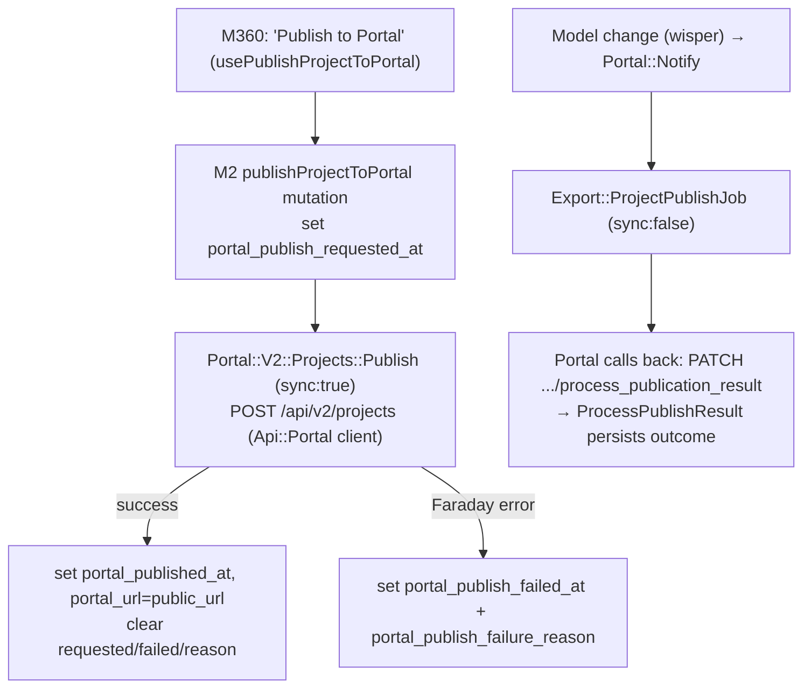

# 🧭 User Flows & Journeys

Source: https://app.notion.com/p/39614549bf5f811385daf5574ff4ca6c?pvs=204
Path: Engineering / Product Knowledge
Last edited: 2026-09-01T14:01:44.891Z

---

<callout icon="✅" color="green_bg">
	**Status: 🔵 Populated** · Last verified: <mention-date start="2026-07-08"/> · Owner: coordinator (build worker: user-flows). **Partial backfill 2026-07-23 (release sweep, pending operator gate):** Flow 6 existing-homes dashboard filters ([HK-210](https://linear.app/newbuilds/issue/HK-210) / [HK-211](https://linear.app/newbuilds/issue/HK-211)) and Flow 3 republication entry-point unification ([HK-229](https://linear.app/newbuilds/issue/HK-229)) added additively below; not re-verified / re-gated. Built to the same bar as the sibling <mention-page url="https://app.notion.com/p/39614549bf5f8152a955e98fb5158d64"/> and <mention-page url="https://app.notion.com/p/39614549bf5f81cab399cee317278b03"/>. Every claim is grounded in **code** (authoritative) — **M2** = `marketer` Rails backend (branch `development`, read-only) · **M360** = `marketer-frontend` (this repo). Paths are `path:line`. Entries marked **⚠️** flag a doc-vs-code (or doc-vs-Jira) tension, resolved in the **code's** favour. Product-intent triangulated with the hub's reference attachment `marketer-platform-product-reference.txt` **§4** (a July 2026 Jira/Confluence export) and a targeted live-Jira pass (2026-07-08). Object/state vocabulary follows the Glossary; the flows traverse the areas mapped in the App Map. **Release sync 2026-08-25 / FE v1.156.0 (pending operator gate):** **Flow 9 — Bulk-import leads from a CSV** added below (index row + section), because that journey became completable end-to-end for the first time in this release ([MT3-9316](https://marketer.atlassian.net/browse/MT3-9316) · PR [#4344](https://github.com/marketertechnologies/marketer-frontend/pull/4344)); term detail lives in the Glossary entry *CSV Lead Import (bulk lead upload)*. Additive; not re-verified / re-gated.
	**Release sync 2026-08-25 / BE v1.375.0 (pending operator gate):** two additions below — **Flow 3** gains the new zero-creative-set publish guard ([HK-471](https://linear.app/newbuilds/issue/HK-471)) together with the record that its Part-2 hardening ([HK-481](https://linear.app/newbuilds/issue/HK-481)) shipped and was **reverted inside the same release**, and **Flow 8** gains the admin campaign show page's channel-link crash fix (un-ticketed hotfix PR [#14183](https://github.com/marketertechnologies/marketer/pull/14183)). Term detail for both publish items lives in the Glossary entry *Publication / Publish*. Additive; not re-verified / re-gated.
	**Release sync 2026-09-01 / BE v1.377.0 (commit ****`ac0c0f1`****, pending operator gate):** two additions below — **Flow 3** gains the forward re-land of the reverted HK-481 work, which classifies a zero-content publish as *content incomplete* rather than *publish failed* ([HK-509](https://linear.app/newbuilds/issue/HK-509) · PR [#14222](https://github.com/marketertechnologies/marketer/pull/14222)) and records what that re-land deliberately left out; and **Flow 8** gains the publish circuit breaker, the now-universal park flag and the new operator **Unpark** action ([HK-503](https://linear.app/newbuilds/issue/HK-503) · PR [#14219](https://github.com/marketertechnologies/marketer/pull/14219)), plus the second population the triage dashboard now carries. Term detail lives in the Glossary entries *Publication / Publish*, *Failed Campaign / Requires Manual Repair* and *Campaign Repair Actions*; the full feature write-up and three new code-vs-intent gaps are on <mention-page url="https://app.notion.com/p/39d14549bf5f81729a9cec46b68a699a"/>. Additive; not re-verified / re-gated.
</callout>
## Scope
Key end-to-end journeys as users (and the automated system) experience them. For **each flow**: *who · trigger · steps · outcome · which M2 / M360 objects & states change · sources*. Deep for **Broker Experience** and **New Builds**; supporting services (Publishing Service, Targeter, CRM Gateway, Portal) appear by **how they participate**, not their internals. Larger flows have their own sub-page (linked inline + listed at the end).
## How the flows fit together
Every flow moves objects through the core model **Company → Product → Promotable → Order/Campaign Package Instance → Campaign → Channel → Audience/Creative Set → Ad**, and (for New Builds) **Project → Sales Stage → Building → Unit → Snapshot**. The two lifecycles that recur across flows:
- **`Campaign#phase`** (M2 `app/models/campaign.rb:107-116`): `assembly · review · scheduled · live · paused · finished · cancelled · archived`. UI calls `assembly` **"Draft"** (M360 `src/components/Campaigns/helpers/campaignStates.ts:3`).
- **`Channels::Publication#status`** (M2 `app/models/channels/publication.rb:10-15`): `scheduled → in_progress → succeeded / failed`, one active per channel.
## Flow index
<table fit-page-width="true" header-row="true">
<tr>
<td>Flow</td>
<td>Who</td>
<td>Depth</td>
</tr>
<tr>
<td>1 · Onboard a company / customer org</td>
<td>Marketer CSM/ops (Admin Panel) + CRM Gateway</td>
<td>On this page</td>
</tr>
<tr>
<td>2 · Create &amp; launch a campaign (manual, New Build)</td>
<td>Marketing Manager / CSM</td>
<td><mention-page url="https://app.notion.com/p/39714549bf5f8163883ee97cb90e971a">Flow deep-dive: Create & Launch a Campaign (Manual — New Build)</mention-page></td>
</tr>
<tr>
<td>3 · Publish a campaign to a channel (Facebook)</td>
<td>System (on publish)</td>
<td>On this page</td>
</tr>
<tr>
<td>4 · Broker Experience — CRM order → live → sale</td>
<td>Broker (from CRM) + system</td>
<td><mention-page url="https://app.notion.com/p/39714549bf5f81b2a269f5238817ae64">Flow deep-dive: Broker Experience — CRM Order → Live Ads → Completion on Sale</mention-page></td>
</tr>
<tr>
<td>5 · Manage a project's listings / units</td>
<td>Property developer / CSM</td>
<td>On this page</td>
</tr>
<tr>
<td>6 · Review the analytics dashboard</td>
<td>Manager / broker / MD</td>
<td>On this page</td>
</tr>
<tr>
<td>7 · Publish a project to the Portal (Snapshot)</td>
<td>Developer / system</td>
<td>On this page</td>
</tr>
<tr>
<td>8 · Triage &amp; repair a failed campaign publication</td>
<td>Marketer CSM / support (Admin Panel) + system</td>
<td>On this page</td>
</tr>
<tr>
<td>9 · Bulk-import leads from a CSV *(added FE v1.156.0)*</td>
<td>Project sales / marketing user</td>
<td>On this page</td>
</tr>
<tr>
<td>  • · Automated / background flows</td>
<td>System</td>
<td>Appendix</td>
</tr>
</table>
---
## Flow 1 — Onboard a company / customer org
- **Who:** Marketer CSM / ops. **Trigger:** a new customer signs a contract.
- **Outcome:** a `Company` exists with CRM config, ad accounts, roles and packages; users can log in and (for broker orgs) CRM data syncs in.
> ⚠️ **Most onboarding happens in the internal Admin Panel, which is a server-rendered M2 tool — *not* part of the M360 SPA router** (M2 `Companies::AdminPanelExtensions`, `app/models/company.rb:10`). So the *screens* are out of this repo; the **data model** each step writes is fully code-grounded below.
<table fit-page-width="true" header-row="true">
<tr>
<td>Step</td>
<td>Object / state effect</td>
<td>Source (M2)</td>
</tr>
<tr>
<td>Create the Company (name, currency, locale, parent)</td>
<td>`Company` row. `experience_type` enum `new_build_developer` / `broker_agency` (default `new_build_developer`); self-referential `parent`/`children` hierarchy (recursive CTE). ⚠️ **`locale`**** is a key in the ****`settings`**** jsonb** (hierarchy-inherited, default `nb`), not a column; `currency` default `NOK`.</td>
<td>`company.rb:37-43,51-55,79-89,201,252`; `concerns/companies/hierarchy.rb:26-50`; `concerns/companies/localeble.rb:7,26-30`; `db/schema.rb:1305,1328`</td>
</tr>
<tr>
<td>Configure CRM integration</td>
<td>`CrmConfiguration` with `source` enum (**9 sources**: `vitec, webtop, webmegler, jm_norge, odd_hansen, mgc, hubspot, scorimmo, obos`) + `credentials` jsonb (installation/client id). Linked to the company via `companies_crm_configurations`. ⚠️ `department_id` lives in the **company's** `settings[source]`, not on the config.</td>
<td>`crm_configuration.rb:6-14,38-39,50-54`; `company.rb:129-130,218-224`; `db/schema.rb:1360`</td>
</tr>
<tr>
<td>Set up ad accounts</td>
<td>⚠️ Spread across **three** tables: `companies.facebook_ad_account_id` / `snapchat_ad_account_id` / `google_ads_account_id`; **FB Page + Instagram Actor** on `company_facebook_pages`; **DV360 advertiser** (`display_video_360_id`) on `company_gmp_configurations`.</td>
<td>`db/schema.rb:1296,1324,1329,1422,1427,1451`; `company.rb:127,132`; `campaign.rb:310-311`</td>
</tr>
<tr>
<td>Define default user role + enabled roles</td>
<td>`company.default_new_user_role` (a `Users::Role`); enabled roles via `company_roles`. 15 role names incl. `Start, Project, Developer, Enterprise, Manager, Existing Homes Manager, EmVest Agent, ERA Agent, Organization Admin`.</td>
<td>`company.rb:57,178-179`; `app/models/users/role.rb:7-21,24-40`</td>
</tr>
<tr>
<td>CRM-driven user provisioning</td>
<td>Automated (not UI): a CRM `employee` payload → `Receivers::Employee` → `Persisters::User` **auto-creates** the `User` (default_language `nb`), matches companies by **department id**, assigns the company **default role** across the company + descendants, and **locks** users with no company links. Reference §4 / Jira `MT3-8228`.</td>
<td>`app/services/crm_gateway/receive_service.rb:20`; `receivers/employee.rb:16-26`; `persisters/user.rb:22-29,45-47,57-69,76-78`; `persisters/companies_for_user.rb:32-43,55-57`</td>
</tr>
<tr>
<td>Configure Campaign Packages</td>
<td>Company-scoped via `company_campaign_packages`. ⚠️ Default packages are auto-seeded on `after_create` **only for ****`broker_agency`** companies; new-build developers get none by default.</td>
<td>`company.rb:184-185,255,389-395`; `app/models/companies/campaign_package.rb:4-21`; `campaign_package.rb:57`</td>
</tr>
<tr>
<td>Welcome email to new users</td>
<td>⚠️ **The branded EM1 "Velkommen til Blikkfang" welcome email is NOT shipped** — Jira `MT3-8906` is **TODO** (verified live 2026-07-08). Code instead sends the **Devise confirmation** email; the Norwegian subject is literally **"Velkommen til M360"**.</td>
<td>`app/mailers/devise_mailer.rb:12-19`; `config/locales/devise.nb.yml:5`; `crm_gateway/persisters/user.rb:81`</td>
</tr>
</table>
**Feature/experience gating that makes areas available:** `experience_type` predicates (`broker_agency?` / `new_build_developer?`) + Flipper flags (`snapshots_enabled?`, `crm_gw_enabled?`, `dynamic_creatives_enabled?`, `publish_page_post?`, `mailers_disabled?`) + boolean columns (`portal_enabled`, `properties_enabled`, `publishing_service_enabled`, `with_user_roles`). Sources: `company.rb:201,319-352,377-381`; `db/schema.rb:1303,1307,1312,1323`. Experience gating in M360: `PrivateExperienceRoute` + `useCompanyExperiences` (see App Map §1).
*Sources:* code above; reference §4 *Journey 1*; Jira `MT3-8228`, `MT3-8906` (TODO). Verified <mention-date start="2026-07-08"/>.
---
## Flow 3 — Publish a campaign to a channel (Facebook example)
- **Who:** the system, on campaign publish (triggered by a user finalizing — see Flow 2). **Trigger:** a campaign is finalized / republished.
- **Outcome:** ads exist on the ad platform; external IDs are stored back on M2 objects; the channel's publication is `succeeded`.
```mermaid
sequenceDiagram
  participant M360
  participant PUB_SVC as Campaigns::Publish (M2)
  participant PS as Publishing Service
  participant CB as publishing_results_controller (M2)
  M360->>PUB_SVC: finalize → PublicationJob
  PUB_SVC->>PUB_SVC: validate setup + no active publication
  PUB_SVC->>PS: create Publication (scheduled) → Tasks::Schedule (Api::Publishing::Client)
  PS->>PS: create Campaign→AdSet(per audience)→Creative→Ad, upload assets
  PS->>CB: POST /publishing_results (per object)
  CB->>CB: ReceiveJob → persist external_id on Channel/Audience/Ad/creatives
  CB->>CB: publication.finish! (succeeded); channel.publishing_mechanism=:publishing_service
```
### Steps & state
<table fit-page-width="true" header-row="true">
<tr>
<td>Step</td>
<td>What happens</td>
<td>Source (M2)</td>
</tr>
<tr>
<td>1 · Trigger + validate</td>
<td>`Campaigns::Publish` runs (via `PublicationJob`). Returns early unless `EnabledFeatures.publish_campaigns?`; raises if campaign setup is in progress or any channel already has an **active** publication.</td>
<td>`app/services/campaigns/publish.rb:21,31,32,34-35,50-61`</td>
</tr>
<tr>
<td>2 · Schedule per channel</td>
<td>Clears `campaign.publish_failed_at`; for each publishable channel (`enabled?`/`sent?`) creates a `Channels::Publication` (`status: scheduled`) and dispatches it to `PublishingService::Tasks::Schedule` via `Api::Publishing::Client` (env `PUBLISHING_API_URL` / `PUBLISHING_AUTH_TOKEN`).</td>
<td>`publish.rb:46-48,63-84,104-106`; `app/services/publishing_service/tasks/schedule.rb:14-30`; `app/lib/api/publishing/client.rb:34-49`</td>
</tr>
<tr>
<td>3 · Publishing Service does the work</td>
<td>Creates platform objects (Campaign → Ad Set per audience → Creative → Ad), uploads assets, sets targeting/budget/schedule. *(Service internals — out of KB scope; per reference §4.)*</td>
<td>reference §4 *Journey 4*</td>
</tr>
<tr>
<td>4 · Async callback</td>
<td>`POST /publishing_results` (per object) → `PublishingResultsController` enqueues `Campaigns::Publication::Results::ReceiveJob`.</td>
<td>`config/routes.rb:281` (`resource :publishing_results`, singular); `app/controllers/publishing_results_controller.rb:6-19,30-41`</td>
</tr>
<tr>
<td>5 · Persist results</td>
<td>On success: writes `external_id` onto **Channel / Audience / Ad / creatives** (and `ad_external_id` on creative-set-audiences), sets **`channel.publishing_mechanism = :publishing_service`**, and `publication.finish!` (→ `succeeded`). When the last channel succeeds, the campaign is marked published and `publish_started_at`/`publish_failed_at` are cleared. On failure: `publication.fail!`  • `campaign.publish_failed_at`.</td>
<td>`app/services/campaigns/publication/results/receive.rb:62-65,78-89,150-186`; `.../results/finalize.rb:22-49`; `.../persist_ad_on_creative_set_audiences.rb:22-23`; `channels/publication.rb:32-44`</td>
</tr>
</table>
**Republication (data/images changed):** a **Clockwork** job every 5 min (`campaign_packages.workflow`, behind `FeatureFlag.clockwork_campaign_packages_workflow_enabled?`) cascades `CheckRunningCampaignsJob → ProgressRunningCampaignsJob → ProgressRunningCampaigns`, which republishes when `promotable_data_changed?` (`data_changed`) or `asset_assignments_changed?` (`images_changed`) and no publish is in flight. Sources: `clockwork.rb:54-58`; `app/services/campaign_packages/check_running_campaigns.rb:13-18`; `app/services/campaign_packages/progress_running_campaigns.rb:132-142,182-193`; `app/models/concerns/campaigns/package_workflow_concern.rb:21-24`.
> ⚠️ **The reference §4 claims a fixed retry ladder "2h / 6h / 12h / 24h / 48h" — this does not exist in code.** Retries are (a) **Sidekiq default exponential backoff** for whitelisted transient errors (`app/jobs/concerns/campaigns/publication_rescuable.rb:7-25`), (b) the 5-min package re-sweep above, and (c) short in-request FB retries (10s / 2min, `app/services/campaigns/publication/facebook_publisher/request_attempt.rb:7-29`). The cited Jira `MT3-9437` (Meta auto-retry) is itself **TODO / unshipped** (verified live 2026-07-08).
**Republication entry-point unification (partial backfill 2026-07-23 — pending operator gate).** Separately from the Clockwork data/image re-sweep above, [HK-229](https://linear.app/newbuilds/issue/HK-229) re-routed **two** republish entry points onto the shared `ExistingHomes::Campaigns::PublishAdapter` so a republish runs the same preparation a first publish does: (1) the M360-UI republish action for a backend campaign (promotable `ExistingHome` / `Broker`) now calls `publishExistingHomeCampaign` → `PublishAdapter` instead of the old `finalizeCampaign` → `Campaigns::Finalize` path; (2) the Admin-Panel `force_republish` of a broker-experience / auto campaign now calls `PublishAdapter` instead of enqueuing `PublicationJob` directly. `PublishAdapter` runs `EnsureGoals` → `EnforceCardsLandingPages` → `Finalize` (and clears `setup_in_progress`) — the goal / landing-page steps the legacy `Finalize`-only path skipped. Legacy campaigns are unchanged. Source: [HK-229](https://linear.app/newbuilds/issue/HK-229); FE [#4323](https://github.com/marketertechnologies/marketer-frontend/pull/4323) + BE [#14093](https://github.com/marketertechnologies/marketer/pull/14093).
> ⚠️ **Scope flag (code-confirmed 2026-07-23):** the ticket's broad AC — "unify **all** republication entry points" and "every BE/auto job waits for creatives" — is **not** fully realized by these diffs. Only the two entry points above were re-routed; per-channel republish (`Campaigns::RepublishChannel`), failed-channel republish, and the automated `RepublishFailedCampaignsJob` still invoke `Campaigns::PublicationJob` directly, and **no creative-set wait exists in the changed pipeline** (the "wait for creatives" behaviour described in the ticket is absent from the merged code). There is no single common republication service that all entry points funnel through.
**Front-door guard: a campaign with zero creative sets is now refused at step 1 (BE v1.375.0 release sync — pending operator gate).** Step 1's validation list gained `validate_publishable_content!`, which raises the new `Campaigns::Publish::NoPublishableContentError` when the campaign has no creative sets. It runs **after** the setup-in-progress and active-publication checks and **before** `prepare_campaign`, so the flow stops at step 1: no `Channels::Publication` rows are created, step 2 never runs, and the campaign lands as a visible publish failure (`publish_failed_at` set by the existing `PublicationJob` rescue) that Flow 8 can then triage. Before this, a content-less campaign traversed the whole flow to `phase=live` with every channel `published` — some with a `succeeded` publication, some with **no** publication row — and never spent: step 2's `publish?(channel)` is only `enabled? || sent?`; `Finalize#last_successful_publication?` drops publication-less channels through `filter_map`, so "all succeeded" is vacuously true off the few that ran; and `MarkAsPublished` then flips every channel with `update_all(phase: 'published')`. \~20 campaigns were found in that state, all BlikkFang programmatic listings. [HK-471](https://linear.app/newbuilds/issue/HK-471) · PR [#14192](https://github.com/marketertechnologies/marketer/pull/14192); code re-read at tag `v1.375.0` (`app/services/campaigns/publish.rb:16,37,65-69`).
> ⚠️ **The three vacuous-finalize holes above are still open — the fix for them shipped and was reverted inside this same release (BE v1.375.0, pending operator gate).** [HK-481](https://linear.app/newbuilds/issue/HK-481) ("HK-471 Part 2") closed the `filter_map` drop, the vacuous `.all?` checks and the blind `update_all`, and added a `Channel#requires_creative_set?` predicate, a `Campaigns::ContentReadiness` service, a `publish_failed_at` stamp on creative-wait timeout and an `EmptyOrUnrenderedContent` repair matcher (PR [#14202](https://github.com/marketertechnologies/marketer/pull/14202), merged 2026-08-20). It was reverted as an incident hotfix three days later (PR [#14211](https://github.com/marketertechnologies/marketer/pull/14211), merged 2026-08-21): `requires_creative_set?` defaults to `true`, but the pipeline never generates `instagram` or `google_search` creative sets (Instagram rides the Facebook set, GoogleSearch the GMP/`Predefined` one) and the override map lacked both entries — so every campaign carrying an Instagram or GoogleSearch channel became structurally unsatisfiable and looped `WaitForCreativesJob` timeout → repair → regenerate → timeout indefinitely; \~26 phase-0 campaigns failed and same-day campaigns could not launch. **At tag ****`v1.375.0`**** none of HK-481 is in the code** — only the HK-471 guard above is live — even though the ticket reads *Done* in Linear. The revert PR states the intent to re-land it forward with the missing overrides plus a repair retry cap.
**The forward re-land shipped in BE v1.377.0 — but only its classification half: a zero-content publish is now "content incomplete", not "publish failed" (pending operator gate).** Step 1's `validate_publishable_content!` guard is unchanged, but the way its `NoPublishableContentError` is *recorded* changed. `Campaigns::PublicationJob` and `Campaigns::RepairPublicationJob` now rescue that error into a new marker column `campaigns.content_incomplete_at` (migration `20260824120000`, indexed), leave a `campaign content incomplete` monitoring breadcrumb, and **do not re-raise** — so the 5-minute re-sweep above keeps re-driving regeneration. Every other `Publish::Error` still stamps `publish_failed_at` and re-raises exactly as before. Step 2's `prepare_campaign` now clears **both** markers on a successful publish, and `content_incomplete_at` is exposed on the GraphQL `CampaignType`. **Why:** an incomplete campaign never attempted to publish, so stamping the failure column is *"a category error that pollutes the failed-campaigns signal and the repair scope"*; separating them means retry is never gated on a failure marker. Flow 8's triage dashboard consequently now carries **two** populations, distinguished by a Status column. [HK-509](https://linear.app/newbuilds/issue/HK-509) · PR [#14222](https://github.com/marketertechnologies/marketer/pull/14222) (merge `cb5143ea`); code read at tag `v1.377.0`.
> ⚠️ **The vacuous-finalize holes above are STILL open at tag ****`v1.377.0`**** — the re-land was deliberately narrowed.** [HK-509](https://linear.app/newbuilds/issue/HK-509)'s own *Scope* section lists re-introducing `Campaigns::ContentReadiness`, the `EmptyOrUnrenderedContent` repair matcher, `Channel#requires_creative_set?`, the two missing channel overrides (`instagram → facebook`, `google_search → gmp`) and the six publish/finalize guards. **PR **[**#14222**](https://github.com/marketertechnologies/marketer/pull/14222)** states it does not re-land them** — "deliberately does not re-land `ContentReadiness` / `EmptyOrUnrenderedContent` (the loop-prone components)" — on the reasoning that [HK-471](https://linear.app/newbuilds/issue/HK-471)'s existence guard already catches the always-zero-sets case and that [HK-503](https://linear.app/newbuilds/issue/HK-503) (same release) bounds the loop that forced the original revert. So the `filter_map` drop, the vacuous `.all?` checks and the blind `update_all` remain exactly as described above, and [HK-509](https://linear.app/newbuilds/issue/HK-509) reads *Done* against a scope its merged PR openly narrowed. Flagged as a ticket-vs-code scope divergence — the KB records the ticket's scope and what actually shipped, and reconciles neither silently. [HK-509](https://linear.app/newbuilds/issue/HK-509) · PR [#14222](https://github.com/marketertechnologies/marketer/pull/14222); code read at tag `v1.377.0`.
*Sources:* code above; reference §4 *Journey 4*; Jira `MT3-9439` (republication, *Ready for Review*), `MT3-9437` (*TODO*); **partial backfill 2026-07-23 (pending operator gate):** republication entry-point unification [HK-229](https://linear.app/newbuilds/issue/HK-229) — FE PR [#4323](https://github.com/marketertechnologies/marketer-frontend/pull/4323) + BE PR [#14093](https://github.com/marketertechnologies/marketer/pull/14093). Verified <mention-date start="2026-07-08"/>.
---
## Flow 5 — Manage a project's listings / units (New Builds)
- **Who:** property developer / CSM. **Trigger:** new project setup or ongoing management.
- **Outcome:** a fully managed project — hierarchy, units, media, Property Explorer, checkout, leads.
**Per-project sub-app routes** (M360 `src/pages/Project/ProjectPage.tsx:130-228`): `analytics` (→ `sales`/`marketing`), `details`, `units/*`, `parking-units/*`, `leads/*`, `campaigns/*`, `offers/*`, `buyers/*`, `buildings`, `sales-stages`, `media-library`, `property-explorer` (+ `configurator`), `project-news/*`, `checkout`, `aichat`, `my-profile`. Index redirects to `analytics/sales`.
<table fit-page-width="true" header-row="true">
<tr>
<td>Step</td>
<td>What happens (M360 unless noted)</td>
<td>Source</td>
</tr>
<tr>
<td>Create Project</td>
<td>`createProject` GraphQL mutation (`{ name }`  • companies + stakeholders); optional `project_logo` asset upload.</td>
<td>`src/hooks/useCreateProject.ts:40-61`</td>
</tr>
<tr>
<td>Add Building</td>
<td>`createBuilding` mutation. M2 `Building.state` enum: `draft / complete / archived`.</td>
<td>M360 `src/hooks/useCreateBuilding.tsx:22-46`; M2 `app/models/building.rb:23-25`</td>
</tr>
<tr>
<td>Create Sales Stage</td>
<td>Two-step: `createStage` then `updateSalesStage` (name, saleState, prices…). M2 `Stage.state`: `draft/complete/archived/virtual`; sale-state (`SaleStateable`): `for_sale/coming_for_sale/under_development/sold_out`. ⚠️ **`under_development`**** exists** (reference §4 lists only 3 sale-states).</td>
<td>M360 `src/hooks/useCreateSalesStage.ts:26-83`; M2 `app/models/stage.rb:36-39`; `concerns/sale_stateable.rb:11-16`</td>
</tr>
<tr>
<td>Add / edit Units</td>
<td>`addStageUnit` / `updateStageUnit`; **bulk edit** via `batchUpdateStageUnits` (returns `{updated, errors}`). M2 `Stages::Unit` state (`Stateable`): `for_sale/reserved/sold/coming_for_sale/archived/for_rent/rented`.</td>
<td>M360 `src/hooks/useCreateUnit.tsx:6-20`, `useUpdateStageUnit.ts:25-52`, `useBatchUpdateStageUnits.ts:68-89`; M2 `concerns/stateable.rb:6-12`</td>
</tr>
<tr>
<td>Upload assets (media library)</td>
<td>`useAssetUploader` auto-detects media type, creates each `Asset`, assigns via `AssetAssignment` (polymorphic `assetable`; one `sales_prospectus` per parent). Media types incl. `image, video, floorplan, sales_prospectus, project_logo, map_image`.</td>
<td>M360 `src/hooks/useAssetUploader.ts:43-83`; M2 `app/models/asset.rb:82-107`, `asset_assignment.rb:36,74-76`</td>
</tr>
<tr>
<td>Configure Property Explorer</td>
<td>Pick 2D/3D; define scenes from image assets (`propertyPickerScenesDefine`); draw polygons; set per-state status colours; persist settings (`propertyPickerSettingsUpdate`); publish (`storefrontApi`/`newbuildsApi`).</td>
<td>M360 `src/components/PropertyExplorer/` — `Onboarding.tsx:46-73`, `hooks/useSaveViews.ts:18-49`, `Workarea/Polygons/Draw/Draw.tsx:51-59`, `drawers/SettingsDrawer/PolygonColourPropertiesFields.tsx:21-45`, `hooks/useSaveSettings.ts:9`, `Header/OverviewActions.tsx:90-103`</td>
</tr>
<tr>
<td>Checkout / Offers / Leads</td>
<td>Enable reservations/checkout per unit; manage incoming `Offer`s (accept/reject); monitor `Campaigns::Lead`s (source/progress pipeline). See Glossary *Offer*, *Lead*, *Checkout*.</td>
<td>reference §4 *Journey 6*; Glossary</td>
</tr>
</table>
> ⚠️ **3D ZIP upload is done in the M2 Admin Panel, not the M360 configurator** — the M360 tree only tweaks 3D *display* settings (`src/components/PropertyExplorer/components/InfoMessage3dUploaded.tsx:16-17`). ⚠️ **`#shareUnitId`**** / ****`#shareBuildingId`**** deep-links are not in this frontend** — M360 "Copy preview link" points at the external property-picker wrapper (`OverviewActions.tsx:62-79`); the hash deep-linking lives in that wrapper app. ⚠️ Project/Building/Stage/Unit CRUD is all **GraphQL**, not the REST `/api/m360/v1` path [CLAUDE.md](http://CLAUDE.md) calls "primary".
*Sources:* code above; reference §4 *Journey 6*; Jira per reference `PRODM-167`, `MT3-9320`, `PRODM-388`, `PRODM-457`. Verified <mention-date start="2026-07-08"/>.
---
## Flow 6 — Review the analytics dashboard
- **Who:** marketing manager, office manager, MD, broker. **Trigger:** ongoing performance review.
- **Outcome:** stakeholders see marketing/sales performance; sellers get a shareable Live Report.
<table fit-page-width="true" header-row="true">
<tr>
<td>Surface</td>
<td>What it shows</td>
<td>Source</td>
</tr>
<tr>
<td>Company Dashboard</td>
<td>Landing overview; the "New builds" / "Existing homes" tab switcher shows only when the user has **both** experiences **and** no single company is selected (`shouldShowTabs = !isSingleCompanySelected && hasBrokerExperience && hasDeveloperExperience`); date + currency filters.</td>
<td>M360 `src/pages/Dashboard/Dashboard.tsx:68,70,187-206`</td>
</tr>
<tr>
<td>Company Analytics</td>
<td>`sales`  • `marketing` routes. ⚠️ **The Marketing tab switcher is hard-disabled** (`const tabsVisible = false`) — routes exist but only Sales renders.</td>
<td>M360 `src/pages/Analytics/Analytics.tsx:25,62-72`</td>
</tr>
<tr>
<td>Project analytics</td>
<td>**Sales** dashboard (inventory/sales history, sold units, buyers) + **Marketing** dashboard (channel performance, leads-by-source, storefront) aggregated across the project's campaigns.</td>
<td>M360 `src/pages/Project/Analytics/components/Sales/*`, `.../Marketing/*`</td>
</tr>
<tr>
<td>Campaign analytics</td>
<td>Campaign Performance tab: impressions / reach / clicks / spend / leads per channel & per ad; ad previews; date filter.</td>
<td>M360 `src/components/Campaigns/components/CampaignAnalytics/CampaignAnalytics.tsx:13-56`; the exported hook is `useChannelAnalytics` (`src/components/Analytics/ChannelPerformanceChart/hooks/useCampaignChannelAnalytics.ts:92` — the filename is the query name, not the hook). FB/IG platform metrics use a separate `campaignPlatformAnalytics` query in that same file.</td>
</tr>
<tr>
<td>Live Report</td>
<td>Tokenised, login-free performance URL for a property/broker, shareable with sellers (see Glossary *Live Report*).</td>
<td>Glossary; M2 `existing_home.rb:122-124`</td>
</tr>
</table>
**Data source (M2):** metrics live on `insights` / `daily_insights` (columns `impressions, clicks, reach, spend, cpc, ctr`); `products_insights` (jsonb) holds portal/Finn analytics. ⚠️ **Lead counts are NOT an insight column** — `leadsCount` is derived from the Leads association (`leads_scope: campaign.leads`). M360 reads via GraphQL analytics queries (`marketing_analytics` types; `campaigns/channel_analytics`, `projects/analytics`, `dashboard_analytics/*`). Sources: M2 `db/schema.rb:1859-1876`; `app/models/concerns/insight_concern.rb:9`; `app/graphql/queries/campaigns/channel_analytics.rb:24`; `app/graphql/types/marketing_analytics/channel_data_result_type.rb:11-16`.
**Existing-homes dashboard filters (partial backfill 2026-07-23 — pending operator gate).** On the Company Dashboard's **Existing homes** tab, two filters narrow analytics beyond the shared date/currency controls; both affect only existing-home views (new-build dashboards are unchanged):
- **Campaign-package filter (toolbar).** A multiselect in the dashboard **toolbar**, rendered left of the date-range control on the existing-homes tab only. Options come from the `campaignPackages` GraphQL query scoped to `promotableType: ExistingHome`, each labelled by the package **title** (no count suffix). Default **"All packages"** sends no filter; unchecking the master reaches a **no-package** state (`noCampaignPackage`); individual packages can be selected. The control is **hidden when the company has no packages**. State round-trips through the URL via `useAnalyticsFilters` (params `campaignPackage` / `noCampaignPackage`) and maps to backend analytics args `campaignPackageUuids` / `noCampaignPackage`; it is deliberately **excluded from the drawer "Filters" badge count**. The backend engine that consumes these args is [HK-208](https://linear.app/newbuilds/issue/HK-208) (see Glossary *Campaign Package Instance*). Source: [HK-210](https://linear.app/newbuilds/issue/HK-210) + [#4306](https://github.com/marketertechnologies/marketer-frontend/pull/4306) (M360 `src/pages/Dashboard/Dashboard.tsx`, `src/molecules/CampaignPackagesFilter/`).
- **Estate-type filter (drawer).** A multi-select **Estate type** filter inside the dashboard **filter drawer** (existing-homes tab only), rendered at the **top** of the existing-homes filter section (above Properties / Brokers / Channel). UI labels **"Project master" / "Newbuild unit" / "Second hand property"** (values `project_master` / `newbuild_units` / `second_hand`). No selection = all; state round-trips via `useAnalyticsFilters` (param `estateType`) and is sent only on the existing-homes tab. The category→estate-type mapping and OR-combining are applied **backend-side** (analytics-filter engine [HK-209](https://linear.app/newbuilds/issue/HK-209) / PR #14050 — see Glossary *Estate Type*); this FE change only sends the selected categories. Source: [HK-211](https://linear.app/newbuilds/issue/HK-211) + [#4309](https://github.com/marketertechnologies/marketer-frontend/pull/4309).
*Sources:* code above; reference §4 *Journey 5*; Jira per reference `MT3-8798`, `PRODM-415`, `PRODM-177`, `MT3-8246`; **partial backfill 2026-07-23 (pending operator gate):** existing-homes dashboard filters [HK-210](https://linear.app/newbuilds/issue/HK-210) / [HK-211](https://linear.app/newbuilds/issue/HK-211) — FE PRs [#4306](https://github.com/marketertechnologies/marketer-frontend/pull/4306) / [#4309](https://github.com/marketertechnologies/marketer-frontend/pull/4309). Verified <mention-date start="2026-07-08"/>.
---
## Flow 7 — Publish a project to the Portal (Snapshot lifecycle)
- **Who:** developer (manual publish) or the system (auto-publish on model changes). **Trigger:** "Publish changes" or a wisper-detected project change.
- **Outcome:** the project is live on the public Portal ([Eiendom.no](http://Eiendom.no) / [Newbuilds.com](http://Newbuilds.com)); `Project.portal_published_at` + `portal_url` are set.

<table fit-page-width="true" header-row="true">
<tr>
<td>Step</td>
<td>What happens</td>
<td>Source (M2 unless noted)</td>
</tr>
<tr>
<td>Manual publish</td>
<td>M360 `usePublishProjectToPortal` → mutation `publishProjectToPortal(uuid)` sets `portal_publish_requested_at` and calls `Portal::V2::Projects::Publish` synchronously (`force: true, sync: true`). Button labelled **"**[**Eiendom.no**](http://Eiendom.no)**"** (NO) or **"**[**Newbuilds.com**](http://Newbuilds.com)**"** otherwise.</td>
<td>M360 `src/hooks/usePublishProjectToPortal.ts`, `src/pages/Project/components/PublishToPortal/PublishToPortal.tsx:16-17`; M2 `app/graphql/mutations/projects/publish_to_portal.rb:6,12-28`</td>
</tr>
<tr>
<td>Publish service</td>
<td>POSTs to the Portal (`Api::Portal::V2` client, env `PORTAL_HOST` / `PORTAL_AUTH_TOKEN`, path `/api/v2/projects`). On sync success writes `portal_published_at`, `portal_url = public_url` and clears the failed/requested/unpublished/updated markers; on failure sets `portal_publish_failed_at`  • `portal_publish_failure_reason`.</td>
<td>`app/services/portal/v2/projects/publish.rb:15-42`; `app/lib/api/portal/v2/base_client.rb:19-29`</td>
</tr>
<tr>
<td>Auto-publish + async callback</td>
<td>Model changes → `Portal::Notify` enqueues `Export::ProjectPublishJob` (`sync: false`); the Portal returns results via `PATCH /api/v1/portal/projects/:uuid/process_publication_result` → `ProcessPublishResult` persists the outcome (idempotent, skips stale callbacks).</td>
<td>`app/services/portal/notify.rb:15-37`; `config/routes.rb:154-159`; `app/controllers/api/v1/portal/projects_controller.rb:21-35`</td>
</tr>
<tr>
<td>Snapshot lifecycle</td>
<td>A `Snapshot` is a per-sale-state published representation of a Project/Stage (facilities, portal titles/descriptions, unit-set aggregates). The **current** snapshot is the one whose `sale_state` matches its parent's; `portal_auto_sync_enabled` governs auto-sync (per-snapshot, rolled up at project level).</td>
<td>`app/models/snapshot.rb:13-26,46-48`; `concerns/sale_stateable.rb:11-16`; `app/models/project.rb:278-282`</td>
</tr>
</table>
> ⚠️ The state field is **`portal_publish_failure_reason`** (not `failure_reason`). ⚠️ Minor M360 bug: the mutation hook returns `result?.publisProjectToPortal?…` (typo, missing `h`) so its return value is always `undefined` — the publish + cache invalidation still work. ⚠️ `Channels::Portal` (a near-empty channel type) is **not** the real Portal integration surface (see App Map §3).
*Sources:* code above; reference §4 *Journey 6* step 9; Jira per reference `PRODM-404`, `DSGN-96`; Glossary *Snapshot*, *Portal / Storefront API*. Verified <mention-date start="2026-07-08"/>.
---
## Flow 8 — Triage & repair a failed campaign publication (Admin Panel)
- **Who:** Marketer staff (CSM / support / ops). **Trigger:** a channel publication **fails** (`publish_failed_at` set — see Flow 3 step 5) and the automatic repair job cannot recover it.
- **Outcome:** the failed campaign is surfaced, diagnosed, and either auto-repaired, manually repaired / republished, or marked terminally *Requires Manual Repair* for a human.
> Like onboarding (Flow 1), this happens in the **server-rendered M2 Admin Panel** at `/admin_panel/failed_campaigns` (+ the admin campaign show page), **not** the M360 SPA. Full feature doc: <mention-page url="https://app.notion.com/p/39d14549bf5f81729a9cec46b68a699a"/>. Below is the journey and the M2 state it moves.
<table fit-page-width="true" header-row="true">
<tr>
<td>Step</td>
<td>What happens · state effect</td>
<td>Source</td>
</tr>
<tr>
<td>Publication fails</td>
<td>`Channels::Publication` → `failed`; `campaign.publish_failed_at` is set (Flow 3 step 5).</td>
<td>M2 `app/models/channels/publication.rb:32-44`; `app/services/campaigns/publication/results/receive.rb`</td>
</tr>
<tr>
<td>Auto-repair retries (\~30 min)</td>
<td>A periodic job retries known-recoverable failures **per campaign**, extending the earlier Meta-only auto-retry across all channels for a whitelist of errors.</td>
<td>M2 `app/jobs/campaigns/repair_failed_campaigns_job.rb`; Jira MT3-9418 (**Released**); PRs #13830 + #13980</td>
</tr>
<tr>
<td>Retries exhausted → terminal state</td>
<td>After retries fail, the campaign is marked **`requires_manual_repair_at`** (write-once) — excluded from further auto-repair (`RepairFailedCampaignsJob` scopes to `requires_manual_repair_at: nil`) — and `NotifyManualRepairRequired` fires.</td>
<td>M2 `app/services/campaigns/repair_failed_campaign.rb`; PR #13980 (terminal state) + #14069 (write-once hotfix)</td>
</tr>
<tr>
<td>Staff triage on the dashboard</td>
<td>`/admin_panel/failed_campaigns` lists failing campaigns with company / campaign-type filters, per-channel red-border failure markers + provider links, M360 / Broker-Experience deep-links, inline **assignment**, a **last-comment** preview, and the *Requires Manual Repair* indicator. Prefilter demoed as "last 24 h". Full errors are on the campaign **show** page (not preloaded in the table).</td>
<td>M2 `app/services/admin_panel/failed_campaigns/list.rb`; `app/views/admin_panel/failed_campaigns/{_campaign_row,_channel_links,_filters}.html.erb`; Jira MT3-9353 (full errors for admins); Linear HK-196</td>
</tr>
<tr>
<td>Manual repair / republish</td>
<td>Per-campaign (show page) or **bulk** (dashboard global actions): **Try Repair**, **Regenerate**, **Republish Failed Channels / Publications**, **Republish by Channel**, **Republish All** (discouraged, confirmation-gated). Bulk jobs act **only on last-24 h** failures; per-channel republish = MT3-9417.</td>
<td>M2 `app/views/admin_panel/failed_campaigns/_global_actions.html.erb`; `app/services/campaigns/repair_failed_campaign.rb`, `app/services/campaigns/republish_channel.rb`; Jira MT3-9417 (PR #13815)</td>
</tr>
<tr>
<td>Resolution</td>
<td>A successful (re)publication clears `publish_failed_at` (Flow 3 step 5) → the campaign **drops off the list**. `requires_manual_repair_at` is intentionally **NOT** cleared (kept as an audit marker — deliberate per the 2026-07-08 demo + hotfix #14069).</td>
<td>M2 `app/services/campaigns/publication/results/finalize.rb`; 2026-07-08 demo</td>
</tr>
</table>
> ⚠️ **Known code-vs-intent gaps (see the feature page's *Known gaps*):** the *Requires Manual Repair* **label** is gated on `requires_manual_repair_at` alone, so it can persist after a repair — PO-acknowledged on the 2026-07-08 demo; agreed fix = show only when a failed-publication timestamp **AND** requires-manual are both present. Also: the date-range filter is on `publish_failed_at` ("Failed At"), not `requires_manual_repair_at` as HK-196 wrote (G1); and clear-on-success of `requires_manual_repair_at` is undocumented (G5, permanent auto-repair exclusion). These are PO questions, not settled contracts.
*Sources:* code above; Jira MT3-9417/9418/9467/9486/9487/9353; PRs #13815/#13830/#13980/#14063/#14069; the 2026-07-08 demo; the feature page. Verified <mention-date start="2026-07-14"/> (code @ `6d643aaa`; read-only). ⚠️ This engine + dashboard shipped **after** this page's 2026-07-08 pass — it extends Flow 3's retry story (the cross-channel auto-retry MT3-9418 is now **Released**; Flow 3's still-TODO MT3-9437 is a *different* Meta-specific error).
**The admin campaign show page no longer 500s on campaigns with a Google Search (or Generic / Predefined / Facebook Lead Ad) channel (BE v1.375.0 release sync — pending operator gate).** The show page reached from this triage journey builds each channel's link by interpolating the channel type into a route helper name, `admin_panel_channels_<type_name>_path`. Only five channel types have a dedicated admin route — `facebook`, `instagram`, `portal`, `gmp`, `snapchat` — so a campaign carrying any of the other four (`google_search`, `generic`, `predefined`, `facebook_lead_ad`) raised `NoMethodError` and the whole page failed to render, taking the staff member's only per-campaign diagnostic view with it. The page now checks `respond_to?` for the type-specific helper and falls back to the generic `admin_panel_channel_path`. **⚠️ No ticket:** this shipped as an un-ticketed hotfix, so its intent statement is the merged PR's own description plus the production Sentry issue it cites; the closest ticketed source is [NEW-295](https://linear.app/newbuilds/issue/NEW-295), which diagnoses the **same** defect but is a Newbuilds-team ticket fixed in the `newbuilds/newbuilds` fork, **not** by this PR. PR [#14183](https://github.com/marketertechnologies/marketer/pull/14183); code re-read at tag `v1.375.0` (`app/views/admin_panel/campaigns/show.html.erb:288-290`).
**This journey gained a second entry population, a bounded stop, and a new recovery step in BE v1.377.0 (pending operator gate).** Three changes to the table above:
- **A second way in.** The trigger is no longer only "a publication failed". A campaign with **nothing to publish** now lands here too, stamped `content_incomplete_at` instead of `publish_failed_at` (see Flow 3). The dashboard scope became `failed_auto_campaigns.or(content_incomplete_campaigns)` and a new **Status** column tells the two apart — red *Publish failed* vs amber *Content incomplete*. [HK-509](https://linear.app/newbuilds/issue/HK-509) · PR [#14222](https://github.com/marketertechnologies/marketer/pull/14222).
- **"Retries exhausted → terminal state" now has a second, broader route.** Previously only `RepairFailedCampaignJob` wrote `requires_manual_repair_at`, and — critically — only *it* honoured the flag, so the two 5-minute drivers in `ProgressRunningCampaigns` (autopublish and republish) ignored the park and re-attempted publish forever. Now `can_be_autopublished?` and `can_be_republished?` both bail when the flag is set, **and** a circuit breaker in `ProgressRunningCampaigns` parks the campaign itself after **5 consecutive failed** publish transitions (`autopublish` / `republish` / `autopublish_complete` / `republish_complete`, streak broken by any success or by a gap over 24 h), notifying `RepeatedPublishFailure`. Under the threshold the campaign keeps self-healing on the 5-minute cadence. [HK-503](https://linear.app/newbuilds/issue/HK-503) · PR [#14219](https://github.com/marketertechnologies/marketer/pull/14219).
- **A new "Resolution" route — operator unpark.** The table's Resolution row says `requires_manual_repair_at` is intentionally never cleared. That is still true of every *automatic* path, but staff now have an explicit **Unpark** button on a parked row (`POST /admin_panel/failed_campaigns/:id/unpark`) that clears the flag **and** writes a synthetic successful sequence transition so the breaker's streak restarts at zero — without which the campaign would be re-parked on the next tick. This additively answers the *recovery* half of the long-standing G5 gap; whether a successful publication should clear the flag automatically is still undocumented. [HK-503](https://linear.app/newbuilds/issue/HK-503) · PR [#14219](https://github.com/marketertechnologies/marketer/pull/14219).
> ⚠️ **Three new code-vs-intent gaps came with this, recorded on the feature page rather than repeated here** (<mention-page url="https://app.notion.com/p/39d14549bf5f81729a9cec46b68a699a"/> *Known gaps* #11–#13), plus additive notes compounding its existing gaps #1, #2 and #8. The one with the widest blast radius: nothing clears a **pre-existing** `publish_failed_at` when a campaign is re-classified as content-incomplete, so the entire pre-v1.377.0 backlog of zero-content campaigns keeps behaving — and displaying — as publish failures. Also note the *visible scope ≠ action scope* trap repeats: **Try Repair** still targets `failed_auto_campaigns` only, so it silently does nothing for a *Content incomplete* row it is offered on. Code read at tag `v1.377.0`.
---
## Flow 9 — Bulk-import leads from a CSV
*(Added by the FE v1.156.0 release sync 2026-08-25 — additive, cited, pending operator gate; not covered by this page's 2026-07-08 verification.)*
- **Who:** a sales / marketing user on a **project's** Leads page (new-build side). **Trigger:** the customer has a list of leads — typically from a source with no live integration (no Vitec / CRM Gateway feed, no lead form) — and wants them in M360 in bulk.
- **Outcome:** `Campaigns::Lead` rows exist on the project with `source = csv_import`, duplicates handled per the chosen strategy, and the user is shown a created / skipped / updated / failed summary plus a downloadable error report for rows that failed during the import.
- **Why it is a flow only now:** the entry point shipped in FE v1.153.0 ([MT3-9314](https://marketer.atlassian.net/browse/MT3-9314)) and mapping + validation in v1.154.0 ([MT3-9315](https://marketer.atlassian.net/browse/MT3-9315)), but the journey **stopped at the preview** and could not create a lead. FE **v1.156.0** ([MT3-9316](https://marketer.atlassian.net/browse/MT3-9316) · PR [#4344](https://github.com/marketertechnologies/marketer-frontend/pull/4344)) added the commit half. ⚠️ All three tickets are **Jira-only — none has a Linear issue**, and all three have **empty descriptions and no acceptance criteria**, so the steps below are grounded in **code**, with the PR body's flow line as the only written intent. **✅ CORRECTION (post-audit repair 2026-08-25, pending operator gate):** the "empty descriptions and no acceptance criteria" half of the sentence before this one is **false and is retracted**; the wording is retained for history, and the "Jira-only, no Linear issue" half stands. Epic [MT3-9246](https://marketer.atlassian.net/browse/MT3-9246) *CSV Lead Import* carries a Description, Background, User Story, a **12-bullet Acceptance Criteria block** and Technical Notes — present since the epic was created on 2026-04-20, with zero description-change events since — and [MT3-9314](https://marketer.atlassian.net/browse/MT3-9314) / [MT3-9315](https://marketer.atlassian.net/browse/MT3-9315) / [MT3-9316](https://marketer.atlassian.net/browse/MT3-9316) each carry a *Scope* description (all three now ***Verified***; re-read live 2026-08-25, read-only). The steps below therefore have written intent to be checked against, and two of the deviations recorded on this flow are **code-vs-ticket divergences**, not open questions — see the two ⚠️ blocks below and the full re-filing on the Glossary entry *CSV Lead Import (bulk lead upload)*.
- **Object & state machine:** `Campaigns::Leads::CsvImport#status` — `pending → validating → awaiting_confirmation → importing → completed | failed` (M360 `src/entities/leadCsvImport.ts`). The drawer's own step is derived from that status, so the journey survives a reload (see step 6).
<table fit-page-width="true" header-row="true">
<tr>
<td>Step</td>
<td>What happens · state effect</td>
<td>Source</td>
</tr>
<tr>
<td>1 · Open the importer</td>
<td>**Import leads (CSV)** in the leads command bar or the “No leads found” empty state. **Project-scoped**: rendered only when the route carries a project `:uuid`, so it is absent from the top-level `/leads` page and from Broker Experience. No feature flag.</td>
<td>M360 `src/components/Leads/LeadsList/LeadsList.tsx:133`, `components/EmptyLeads.tsx:25`, `ImportLeadsCsvButton.tsx`</td>
</tr>
<tr>
<td>2 · Upload</td>
<td>Optionally download the template (headers `email, phone, first_name, last_name, full_name, address, message, phone_code`), choose the **duplicate strategy** (`always_create` / `skip_existing` / `update_existing`) **before** picking the file, then upload. Client-side guards: `.csv` only, max **10 MB**, headers must be readable, and — new in v1.156.0 — **header names must be unique**. Creates the `CsvImport` (`pending`) and stores the flow slot.</td>
<td>M360 `ImportLeadsCsvDrawer.tsx`, `src/utils/leadCsvImportTemplate.ts`, `src/utils/leadCsvImportMapping.ts` (`hasDuplicateCsvHeaders`)</td>
</tr>
<tr>
<td>3 · Map columns</td>
<td>Known headers auto-match (case-insensitive, whitespace→underscore); anything else is remapped or left as *Skip column*. The UI refuses to continue unless **at least one of Email or Phone** is mapped and **no lead field is mapped twice**.</td>
<td>M360 `importLeadsCsv/MappingStep.tsx`; `src/utils/leadCsvImportMapping.ts`</td>
</tr>
<tr>
<td>4 · Validate</td>
<td>*Validate & preview* → status `validating`; the drawer polls every **2.5 s** and gives up after **60 s** with an error toast, returning to mapping. Backend `ValidateJob` writes `results.invalid_rows` and moves the record to `awaiting_confirmation`.</td>
<td>M360 `src/hooks/leadCsvImportPoll.ts`, `useLeadCsvImport.ts`; M2 `app/services/campaigns/leads/csv_imports/validate.rb`</td>
</tr>
<tr>
<td>5 · Preview & confirm *(new in v1.156.0)*</td>
<td>Summary “X valid · Y invalid · Z total” + up to **50** rows (invalid first, in red, each with a reason). The user may go **Back**, tick **Export imported leads to CRM** (default off), or press **Confirm import** — disabled while the valid count is `0`. Confirm calls `confirmLeadCsvImport(uuid, exportToCrm)`, which authorises, refuses anything not in `awaiting_confirmation`, and enqueues `ImportJob`; the drawer moves to **importing**.</td>
<td>M360 `importLeadsCsv/PreviewStep.tsx`, `src/hooks/useConfirmLeadCsvImport.ts`; M2 `app/graphql/mutations/campaigns/leads/csv_imports/confirm.rb`</td>
</tr>
<tr>
<td>6 · Import *(new in v1.156.0)*</td>
<td>`ImportJob` flips the record to `importing` and processes **only the rows that passed validation**. Per row: duplicate lookup within the project — **by email if the row has one, otherwise by phone number + phone code** — then `always_create` creates, `skip_existing` skips a match, `update_existing` updates it with the CSV's **non-blank** cells only. Created leads get `source = csv_import` and default `phone_code = 47`. Counts are stored on `results`; rows that raise are collected into an error-report CSV. If *Export to CRM* was ticked, a notify job is enqueued for each affected lead **without an ****`external_id`** (created **and** updated, not skipped). Terminal: `completed`, or `failed` if the job raises.</td>
<td>M2 `app/services/campaigns/leads/csv_imports/import.rb`, `build_error_report.rb`; `app/jobs/campaigns/leads/csv_imports/import_job.rb`</td>
</tr>
<tr>
<td>7 · Finish · resume *(new in v1.156.0)*</td>
<td>**completed** shows *“Import finished.”*, the created / skipped / updated / failed counts, an optional **Download error report (CSV)** and **Done**; **failed** shows the backend's error message and Close. Either terminal state invalidates the `['leads']` query so the list refreshes. The in-flight import is kept in `localStorage` per project (`lead-csv-import-flow:<projectUuid>`), and the button resolves it **on mount** — so an abandoned import **re-opens itself at the right step** on the next visit; the slot is cleared on Done, on close from *completed* / *failed* / *upload*, and on validation failure or timeout.</td>
<td>M360 `importLeadsCsv/CompletionStep.tsx`, `FailedStep.tsx`, `src/utils/leadCsvImportFlowState.ts`, `leadCsvImportCompletion.ts`, `ImportLeadsCsvButton.tsx`</td>
</tr>
</table>
> ⚠️ **The journey does not complete unaided in one sitting (code-confirmed at tag ****`v1.156.0`****; raised to the operator as a bug draft, nothing filed).** After *Confirm import* the drawer's progress poll **never starts**, so it sits on *“Importing leads…”* indefinitely: `refetchInterval` is derived only from the status already cached, this release replaced the confirm mutation's cache **invalidation** with a `setQueryData` of the mutation payload, and the backend returns the record **unreloaded** — still `awaiting_confirmation`, because only `ImportJob` flips it to `importing`. **The import itself completes normally server-side**; only the drawer fails to notice, and because the `['leads']` refresh hangs off the *completed* transition, the imported leads also do not appear until the list is reloaded. Re-focusing the browser window (React Query's default `refetchOnWindowFocus`, left on in `src/helpers/initQueryClient.ts`) or re-opening the drawer via the resume path recovers it. Known at merge: the Playwright suite added in the same release asserts around it with a reload and marks the direct assertion `test.fixme` ([HK-458](https://linear.app/newbuilds/issue/HK-458) · PR [#4370](https://github.com/marketertechnologies/marketer-frontend/pull/4370)). **✅ Intent re-cited, and two precisions (post-audit repair 2026-08-25, pending operator gate):** the intended behaviour is stated in the **tickets**, not only in the PR body — [MT3-9316](https://marketer.atlassian.net/browse/MT3-9316)'s description carries *"Poll-driven progress on leadCsvImport(uuid) (status: importing -\> completed/failed)"* and epic [MT3-9246](https://marketer.atlassian.net/browse/MT3-9246)'s 8th Acceptance Criteria bullet reads *"User confirms the import; processing runs asynchronously with a progress indicator"*, so this is a **code-vs-ticket divergence**. Precision 1: the status flip is done by `Campaigns::Leads::CsvImports::Import#call` (`csv_import.importing!`); `ImportJob` merely invokes it. Precision 2: replacing the confirm mutation's cache invalidation with `setQueryData` **did not regress working behaviour** — at tag `v1.155.0` `useConfirmLeadCsvImport` had **zero consumers** (`git grep useConfirmLeadCsvImport v1.155.0 -- src/` returns only its own definition), so the defect ships with the feature rather than breaking something that previously worked. **Fix note:** having `onSuccess` invalidate instead of `setQueryData` is **not** a reliable fix — `Confirm` only `perform_later`s `ImportJob`, so an immediate refetch will often still read `awaiting_confirmation` and wedge identically; the robust fix is to add `awaiting_confirmation` to the **existing** `pollPending` escape hatch in `src/hooks/leadCsvImportPoll.ts`, which already special-cases `pending` while the drawer is mid-flow.
> ⚠️ **Rows rejected at step 4 never reach step 6**, so they are counted in neither the completion summary nor the error report — the preview is the only place the user ever sees them. Three further duplicate-matching / preview limitations are recorded on the Glossary entry rather than repeated here. **✅ Re-filed as a code-vs-ticket divergence (post-audit repair 2026-08-25, pending operator gate):** this is not merely a limitation. Epic [MT3-9246](https://marketer.atlassian.net/browse/MT3-9246)'s 10th Acceptance Criteria bullet requires *"Invalid and failed rows are downloadable as an error report CSV (columns: row number, email, phone, reason)"* — **invalid** rows included. M2 `build_error_report.rb` declares `HEADERS = %w[row_number email phone reason]`, the AC's four columns verbatim, but `Import#call` feeds it only `failed_rows`, and guards it with `if failed_rows.any?` — so a file whose bad rows were all caught at step 4 produces **no error report at all**. The data is already persisted: `Validate#build_invalid_entry` writes `{'row_number', 'email', 'phone', 'reason'}` into `results['invalid_rows']` (M2 @ `39478929`). The preview-ordering item on the Glossary is likewise a divergence, from the epic's 7th AC bullet (*"Preview screen shows first 50 rows…"*) and [MT3-9315](https://marketer.atlassian.net/browse/MT3-9315)'s scope line — and it is **not** frontend-fixable alone, because `Validate#store_results` sends `preview_rows: valid_rows.first(PREVIEW_LIMIT)`, valid rows only and carrying no row number. ⚠️ **CORRECTION 2026-08-25 (independent re-verification; pending operator gate) — the "not frontend-fixable alone" clause is retracted. The ****`preview_rows`**** fact before it stands; the conclusion drawn from it does not.** M360 is sent enough to place the preview rows in file order: `results.total`, the **complete, uncapped** `results.invalid_rows` with each entry's `row_number` (`index + 2`), and `preview_rows` = `valid_rows.first(PREVIEW_LIMIT)` in file order — both exposed as raw `GraphQL::Types::JSON` and both requested wholesale by the M360 fragment. Each valid row's number is the ascending complement of the invalid set over `2..total+1`, and the file's first 50 rows contain at most 50 valid rows, so the data is always sufficient. **A frontend-only fix is implementable**; the payload merely makes M360 *derive* the row numbers instead of reading them. **Which repo should carry the fix is an open routing question, not settled here.** Full derivation and its source caveat are on the Domain Glossary *CSV Lead Import* entry. Raised to the operator as bug drafts; nothing filed.
*Sources:* code above, read at tag `v1.156.0` (`62e02ea`) for M360 and at `39478929` for M2; Jira epic [MT3-9246](https://marketer.atlassian.net/browse/MT3-9246) → [MT3-9314](https://marketer.atlassian.net/browse/MT3-9314) (FE v1.153.0, PR [#4342](https://github.com/marketertechnologies/marketer-frontend/pull/4342)) · [MT3-9315](https://marketer.atlassian.net/browse/MT3-9315) (FE v1.154.0, PR [#4343](https://github.com/marketertechnologies/marketer-frontend/pull/4343)) · [MT3-9316](https://marketer.atlassian.net/browse/MT3-9316) (FE v1.156.0, PR [#4344](https://github.com/marketertechnologies/marketer-frontend/pull/4344)); Glossary *CSV Lead Import (bulk lead upload)*, *Lead*; App Map **Leads** row. Added <mention-date start="2026-08-25"/> — **pending operator gate**, not re-verified.
---
## Appendix — Automated / background flows (candidates, code-touched)
Grounded enough to name; documented briefly because they are system-to-system, not user journeys.
<table fit-page-width="true" header-row="true">
<tr>
<td>Flow</td>
<td>What it does · state effects</td>
<td>Source</td>
</tr>
<tr>
<td>**CRM data synchronisation**</td>
<td>CRM webhook/push → `CrmGateway::Subscribe` → `ReceiveJob` → `ReceiveService` routes by type (`estate`, `employee`, …) → receivers/persisters update `Project/Stage/Unit/ExistingHome`  • brokers/users, writing `CrmSyncHistory`. Per-company gated by `crm_gw_enabled?`. Running campaigns may auto-republish on data/image change.</td>
<td>M2 `app/lib/crm_gateway/subscribe.rb`; `app/services/crm_gateway/receive_service.rb:16-39`; `app/models/company.rb:350-352`; reference §4 *Journey 8*</td>
</tr>
<tr>
<td>**AI-assisted ad creation**</td>
<td>In a creative set, "AI Adgen" calls the Content Service with promotable data → returns carousel copy/assets → M360 builds FBSC cards; per-field regeneration via a texts endpoint. *(Content Service internals out of scope; reference §4 *Journey 7*, Jira **`MT3-7787`**, **`MT3-7958`**.)*</td>
<td>reference §4 *Journey 7*</td>
</tr>
<tr>
<td>**GMP / DV360 pacing → ASAP**</td>
<td>A daily job flips a GMP/DV360 campaign's insertion-order pacing to `PACING_TYPE_ASAP` on its **last day** so the full budget is spent (important for second-hand campaigns, always invoiced in full). Jira `MT-5026` — **Released** (verified live 2026-07-08).</td>
<td>M2 `app/services/campaigns/publication/gmp_publisher/campaigns/update_pacing_type_to_asap.rb` (+ job `.../update_pacing_type_to_asap_job.rb`), scheduled in `clockwork.rb:234-236` (flag `clockwork_gmp_pacing_type_asap_on_last_24h_enabled?`); reference §4 *Journey 10*; Jira `MT-5026` (**Released**)</td>
</tr>
<tr>
<td>**Visma Core marketing integrator** ⚠️ NOT BUILT</td>
<td>⚠️ **Not shipped — ticket declined.** Jira `MT3-8235` ("EM1 - Implement Visma Core Marketing Integrator Integration in M360") is **Rejected / Declined**, and there is **no** Marketing-Integrator / OAuth "New Order" code in either repo (coordinator-verified live 2026-07-08). The only Visma code is a **different** thing — HTTP Basic-auth lead-forwarding (`RegisterInterest`), which does **not** overlap Flow 4 as shipped behaviour.</td>
<td>reference §4 *Journey 9* (product intent only); Jira `MT3-8235` (**Rejected**); real Visma code = M2 `app/lib/api/visma/client.rb`, `app/services/campaigns/leads/notification/visma/notify_service.rb`</td>
</tr>
</table>
---
## Gaps & uncertainties
- **Staging not exercised** (no credentials attempted) — every claim is grounded in **code** and the reference export, not a live screen. A staging pass would confirm exact end-user wording (esp. localised campaign-phase / package-status strings and the "Draft" label). Same posture as the Glossary & Map.
- **⚠️ Reference §4 vs code — resolved in code's favour (each flagged inline):** (1) campaign phase "Draft" = enum `assembly` (no `Draft` state; `review` exists but is unused in the manual flow); (2) publish retry "2h/6h/12h/24h/48h" ladder **does not exist** (Sidekiq backoff + 5-min re-sweep + short FB retries); the cited `MT3-9437` is **TODO**; (3) EM1 "Velkommen til Blikkfang" welcome email **not shipped** (`MT3-8906` TODO; code sends Devise "Velkommen til M360"); (4) CRM-order param is `campaign_package_uuid` not `_id`; (5) order-flow audience/creative/LP generation is **deferred to ****`Campaign::Prepare`**, not done at order time; (6) `broker_promotion` is a campaign *type*, not a trigger; (7) 3D ZIP upload + `#shareUnitId` deep-links live outside M360 (Admin Panel / PP wrapper); (8) Stage sale-state has 4 values incl. `under_development`; (9) Portal field is `portal_publish_failure_reason`; minor M360 typo in `usePublishProjectToPortal`.
- **Admin Panel out of repo.** Onboarding (Flow 1) screens are the server-rendered M2 Admin Panel, not the M360 SPA — only the *data model* each step writes is code-grounded here; the exact admin UI/validation was not traced.
- **Supporting-service internals out of scope** (Publishing Service, Targeter, CRM Gateway, Content Service, Portal). Documented by role/effect only; their external contracts weren't traced. The Facebook object-creation detail in Flow 3 step 3 is from reference §4, not code (it runs inside the Publishing Service).
- **Jira pass was targeted**, keyed off reference §4's citations; flow-critical keys re-checked live 2026-07-08: `MT3-8906` TODO, `MT3-9437` TODO, `MT-5026` Released, `MT3-9439` Ready-for-Review, and (via the coordinator apply-pass) three **Rejected** tickets that the reference had cited as if live — `MT3-8235` (Visma Core integrator), `MT3-9202` (order stale-broker-data race), `DSGN-96`. Rejected tickets are product-intent history only; the corresponding behaviour is cited to **code** where it actually exists. The broader 63-key sweep lives in the Glossary. Linear was not separately mined for flow docs (no flow-specific Linear doc surfaced; the platform's product tracking is in Jira).
- **Analytics Marketing tab** (company-level) is hard-disabled in code (`tabsVisible = false`); project-level Marketing analytics *does* render. The reference's richer analytics narrative (role-based dashboards, website-behaviour cross-channel) is product-intent (`MT3-8246`, `PRODM-163`) not fully re-traced to code here.
- **`review`**** phase, ****`Order`**** model, News 2.0** are single-source / lightly-verified (enum-present but unused; minimal model; partly-future) — see the Glossary's matching gaps.
- **Failed-campaigns repair (Flow 8), added 2026-07-14 (coordinator):** the auto-retry → manual-repair engine + the Admin Panel Failed Campaigns dashboard shipped *after* this page's 2026-07-08 pass, so they extend Flow 3's retry story (cross-channel auto-retry MT3-9418 is **Released**; Flow 3's still-TODO MT3-9437 is a *different* Meta-specific error). Full doc + code-vs-intent gaps on the feature page. Not yet re-gated by the operator.
- **CSV lead import (Flow 9), added 2026-08-25 (FE v1.156.0 release sync):** the flow shipped in three Jira-only slices across v1.153.0 / v1.154.0 / v1.156.0 and became completable only in the last of them, so it postdates this page's 2026-07-08 pass and is **pending operator gate**. Two caveats specific to it: (i) **there is no written intent to verify against** — [MT3-9246](https://marketer.atlassian.net/browse/MT3-9246) and all three child tickets have **empty descriptions and no acceptance criteria**, so every step is grounded in code with the PR body's flow line as the only stated intent, and findings are recorded as limitations or open questions rather than bug verdicts; and (ii) the journey's terminal step is **not reliable in the UI** — the drawer's progress poll never starts after confirm (flagged inline on the flow and in the Glossary's *Gaps & uncertainties*, raised to the operator as a bug draft). **Not staging-verified** — same posture as the rest of this page. **✅ CORRECTION to caveat (i) (post-audit repair 2026-08-25, pending operator gate):** caveat (i) above is **false and is retracted**; its wording is retained for history. There *is* written intent — epic [MT3-9246](https://marketer.atlassian.net/browse/MT3-9246) carries a **12-bullet Acceptance Criteria block** and each of the three children carries a *Scope* description, none of it recently added. Consequently the findings on this flow are **not** all "limitations or open questions": the drawer's dead progress poll is a divergence from the epic's 8th AC bullet (*"User confirms the import; processing runs asynchronously with a progress indicator"*) and from [MT3-9316](https://marketer.atlassian.net/browse/MT3-9316)'s own scope line, and the missing invalid rows are a divergence from its 10th (*"Invalid and failed rows are downloadable as an error report CSV (columns: row number, email, phone, reason)"*). *(The AC block is an unnumbered bullet list; ordinals are positional and each criterion is quoted verbatim.)* The full re-filing, including the preview-ordering divergence against the 7th AC bullet, is on the Glossary entry *CSV Lead Import (bulk lead upload)*. Caveat (ii) stands unchanged. Bug drafts raised to the operator; nothing filed.
## Sub-pages
- [Flow deep-dive: Create & Launch a Campaign (Manual — New Build)](user-flows-and-journeys/flow-create-and-launch-a-campaign.md)
- [Flow deep-dive: Broker Experience — CRM Order → Live Ads → Completion on Sale](user-flows-and-journeys/flow-broker-experience-crm-order.md)