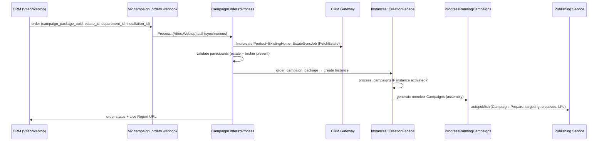

# 🏘️ Flow deep-dive: Broker Experience — CRM Order → Live Ads → Completion on Sale

Source: https://app.notion.com/p/39714549bf5f81b2a269f5238817ae64?pvs=204
Path: Engineering / Product Knowledge / User Flows & Journeys
Last edited: 2026-08-14T07:24:24.439Z

---

<callout icon="✅" color="green_bg">
	**Status: 🔵 Populated** · Last verified: <mention-date start="2026-07-08"/> · Owner: coordinator (build worker: user-flows). **Partial backfill 2026-07-23 (release sweep, pending operator gate):** added the Webtop success-redirect estate-type branch ([HK-258](https://linear.app/newbuilds/issue/HK-258)) at step 6 below. **Release sync 2026-07-30 (v1.370.0, pending operator gate):** added the *CFS order gate on landing-page publish* section below — [HK-385](https://linear.app/newbuilds/issue/HK-385) (proactive CRM-sync trigger) + [HK-389](https://linear.app/newbuilds/issue/HK-389) (reactive order validator). **Release sync 2026-08-07 (v1.372.0, pending operator gate):** narrowed the reactive validator to CFS phases that route to `existing_home_url` ([HK-420](https://linear.app/newbuilds/issue/HK-420)) — see the new bullet in the *CFS order gate* section. **Release sync 2026-08-13 (v1.374.0, pending operator gate):** added the *CRM cancellation propagation on order cancel* section below ([HK-429](https://linear.app/newbuilds/issue/HK-429)). Sub-page of [User Flows & Journeys](../user-flows-and-journeys.md). Grounded in **code** (authoritative) — **M2** = `marketer`, **M360** = `marketer-frontend`; `path:line`. ⚠️ = doc-vs-code tension resolved in code's favour. Vocabulary per the [Domain Glossary](../domain-glossary.md).
</callout>

## At a glance
- **Who:** Real-estate broker (initiating from their CRM) + the platform (automated).
- **Trigger:** Broker orders marketing for an estate/assignment in the CRM (Vitec Next / Webtop-Visma Core).
- **Outcome:** A `CampaignPackages::Instance` is created; its member `Campaign`s are generated, auto-published, and progress through the sale (coming-for-sale → for-sale → broker-promotion); a Live Report URL is returned to the CRM for the broker to share.
- **Product intent:** reference attachment §4 *Journey 3* (+ *Journey 8/9* for CRM sync / Visma Core).

## Step-by-step (code-grounded)
<table fit-page-width="true" header-row="true">
<tr><td>#</td><td>Step</td><td>What happens</td><td>Source (M2 unless noted)</td></tr>
<tr><td>1</td><td>CRM webhook</td><td>Broker orders in the CRM; a webhook hits the campaign-orders endpoint. **Params: `campaign_package_uuid`, `installation_id`, `estate_id`, `order_id`, `department_id`** (Vitec) / `campaign_package_uuid`, `token`, `customerName`, `caseId`, `flowUrl`, `orderId` (Webtop). Processing is **synchronous** (`.call`, not a job).</td><td>`app/controllers/api/v1/webhooks/campaign_orders_controller.rb:9-30,32-58,40-45`; routes `config/routes.rb:96-101`</td></tr>
<tr><td>2a</td><td>Find/create property + estate sync</td><td>Look up `Product` by `external_id`  • `promotable_type='ExistingHome'`; if absent and exactly one CRM config, auto-import a blank `ExistingHome` product, then run `CrmGateway::EstateSyncJob` **`perform_now`** (RPC `FetchEstate`) to pull latest property + broker data.</td><td>`app/services/campaign_orders/process/base.rb:82-86,106-111,135-143`; `app/jobs/crm_gateway/estate_sync_job.rb:8-17`</td></tr>
<tr><td>2b</td><td>Validate participants</td><td>Errors ("data is being synchronized") if the `ExistingHome` or the assigned `broker` (highest-role) is still missing — the async-import fallback.</td><td>`base.rb:34-54,99`</td></tr>
<tr><td>3</td><td>Create Campaign Package Instance</td><td>`order_campaign_package` → `CampaignPackages::Instances::CreationFacade.call` with package, company, existing_home, broker, dates, `external_order_id`, `external_source`.</td><td>`base.rb:115-129`; `app/services/campaign_packages/instances/creation_facade.rb:45-49`</td></tr>
<tr><td>4</td><td>Generate campaigns (gated on activation)</td><td>In a transaction: create the instance, then **`process_campaigns` only `if instance.activated?`**. `Instances::ProcessCampaigns` → `Instances::Campaigns::Create` iterates `campaign_package_campaigns`, creating campaign shells in `assembly`.</td><td>`creation_facade.rb:47`; `app/services/campaign_packages/instances/process_campaigns.rb:20-27`; `app/services/campaign_packages/instances/campaigns/create.rb:34-50`</td></tr>
<tr><td>5</td><td>Prepare + auto-publish</td><td>⚠️ Audiences (Targeter), creative sets (from templates), and landing pages are **NOT** built at order time — they're deferred to `Campaign::Prepare` at autopublish/republish time (`save_targeting`, `manage_audience_templates`, `upsert_landing_pages`, `upsert_creative_sets`; Targeter steps gated by `EnabledFeatures.targeter?`). Auto-publish is trigger-driven via `ProgressRunningCampaigns#check_for_autopublish?` → `AutopublishCampaignJob`.</td><td>`app/services/campaign_packages/instances/campaign/prepare.rb:51-66,127,144`; `app/services/campaign_packages/autopublish_campaign.rb:11,34`; `app/services/campaign_packages/progress_running_campaigns.rb:125-130,168-180`</td></tr>
<tr><td>6</td><td>Order status + Live Report → CRM</td><td>**Vitec:** if activated → status `DELIVERED`(6), else `INTERACTION_REQUIRED`(3) + order-management URL. **Webtop:** state update (`COMPLETED`/`ERROR`/`MISSING_INFO`) **and** pushes the **Live Report URL** as order metadata. URL = `{LIVE_REPORT_URL}/{company.uuid}/{report_id}`.</td><td>`process/vitec.rb:51-68`; `process/webtop.rb:90-98,100-109`; `app/models/existing_home.rb:122-124`</td></tr>
<tr><td>7</td><td>Sequence progresses on sale</td><td>The `campaign_sequence` package's members (`coming_for_sale`, `sale`, `broker_promotion`) advance via triggers `property_on_sale` / `property_sold` (fired when `existing_home.for_sale?`/`sold?`). On progress the current campaign is terminated (end trigger) and the next is autopublished — gated by `can_be_autopublished?` which requires the previous campaign is **no longer live**. Each action logs a `SequenceTransition`.</td><td>`app/models/campaign_package.rb:36-46`; `app/models/campaign_packages/campaign.rb:8-17`; `app/models/concerns/campaigns/package_workflow_concern.rb:11-15,40-53,61-68`; `progress_running_campaigns.rb:111-130`; `phase_concern.rb:57-62` (the "previous not live" gate is line 61); `app/models/campaign_packages/sequence_transition.rb:18-20`</td></tr>
</table>

**Webtop success redirect (step 6) — partial backfill 2026-07-23, pending operator gate.** On a successful Webtop order the success-redirect `webtop_url` = `{flow_base_url}/stream/#/index/{type}/{case_id}/services`, where `{type}` is **`project`** for a newbuild `project` / `stage` estate_type and **`sale`** otherwise. This fixed project orders previously landing on an unresolvable `/sale/{project_id}/` path (per the ticket, the EM1 Nord-Norge incident). Source: [HK-258](https://linear.app/newbuilds/issue/HK-258), PR [#14095](https://github.com/marketertechnologies/marketer/pull/14095) (M2 `app/services/campaign_orders/process/webtop.rb`).

## CFS order gate on landing-page publish (v1.370.0 — pending operator gate)
A coming-for-sale (CFS) campaign order for a **Vitec** existing_home is now gated on the property's landing page having a scheduled publish start, closing the incident where a CFS campaign started running against a landing-page URL that was not yet accessible (404). Two mirror gates were added:
- **Proactive trigger — auto-order from CRM sync.** The CRM-Gateway receive path that auto-enqueues the CFS checklist job (`MarkChecklistJob(:coming_for_sale)`) no longer fires on a single `signed_at` edge. It now fires only when **both** `signed_at` **and** `landing_page_publish_start_at` are present, and is **one-shot per estate** via a new `cfs_order_enqueued_at` idempotency marker (`return if cfs_order_enqueued_at.present?`). The trigger is **order-insensitive** — it fires on whichever sync first satisfies both conditions, whether `signed_at` or the publish start arrives first — and does not re-fire once the marker is set (re-fire semantics for re-listings are explicitly out of scope). A migration adds three nullable columns to `existing_homes` (`landing_page_publish_start_at`, `landing_page_publish_end_at`, `cfs_order_enqueued_at`); the Vitec adapter parses `landing_page_publish_start` / `landing_page_publish_end` off the estate payload into the two `_at` columns. `landing_page_publish_end_at` is stored for future scheduling use, not consumed here. Source: [HK-385](https://linear.app/newbuilds/issue/HK-385) · PR [#14142](https://github.com/marketertechnologies/marketer/pull/14142) (M2 `app/services/crm_gateway/receive/existing_home.rb`, `app/services/crm_gateway/adapters/vitec/existing_home.rb`, migration `20260727142536`). The CRM-Gateway side that exposes the `landing_page_publish_start` / `_end` keys on the Vitec estate representer is **separately tracked** under [HK-384](https://linear.app/newbuilds/issue/HK-384) (crm-gateway repo, not this pipeline).
- **Reactive validator — manually-placed orders.** A new `CampaignPackages::Instances::PromotableValidators::LandingPagePublishState` in the `ValidatePromotables` chain rejects any order whose promotable is a **Vitec** existing_home in **`coming_for_sale`** state with a nil `landing_page_publish_start_at`. Because all three order entry points — the GraphQL client-UI mutation (`Mutations::CampaignPackages::Instances::Create`), the Vitec webhook, and the Webtop webhook — converge on `Instances::CreationFacade` → `ValidatePromotables` (step 3 above), the single validator covers all three at once. It is scoped to Vitec via `synced_from_vitec?`: non-Vitec homes (Webtop, obos, …) **bypass** it because they carry no analogous signal (a documented gap — Webtop CFS orders can still slip through). It no-ops on non-existing_home promotables (projects, brokers, stages) and on any state other than `coming_for_sale`. The rejection message points the client at scheduling the landing page in the CRM before ordering. Source: [HK-389](https://linear.app/newbuilds/issue/HK-389) · PR [#14143](https://github.com/marketertechnologies/marketer/pull/14143) (M2 `app/services/campaign_packages/instances/promotable_validators/landing_page_publish_state.rb`, `.../validate_promotables.rb`). ⚠️ Implementation note: the merged validator's `call` signature is the simplified `call(existing_home:)`, not the `call(campaign_package:, existing_home:, broker:)` shape the ticket sketched — behavioural outcome is unchanged.
- **CFS-destination narrowing (v1.372.0 — pending operator gate).** The reactive validator above was over-firing in production: **Emera** brokers hit the rejection on legitimate CFS orders because Emera's CFS-phase campaigns route to `broker_profile_url` (Emera's own domain), not to a Marketer-managed landing page. The validator now fires **only when at least one CFS-phase channel on the campaign package uses `destination_type: existing_home_url`** — a new `cfs_phase_requires_landing_page?(campaign_package)` gate (`campaign_package.campaign_package_campaigns.coming_for_sale.joins(:campaign_channels).merge(CampaignChannel.destination_type_existing_home_url).exists?`). CFS phases routing to `broker_profile_url` or `custom_url` now **no-op (accept)** — the validator's job is to protect Marketer-managed landing pages, and those destinations are the broker's own domain / an ops-typed URL; a package with **mixed** CFS destinations where any channel uses `existing_home_url` still **rejects** (safe default); a package with no CFS phase, or a nil `campaign_package`, **skips**. Notar packages (72/73, CFS→`existing_home_url`) are unchanged and still reject when `landing_page_publish_start_at` is nil. Previously-rejected Emera orders are re-driven by the clients themselves — no marketer-side backfill or replay. The validator signature became `call(campaign_package:, existing_home:)` and the `ValidatePromotables` caller now passes `campaign_package:` — this is the shape the HK-389 ticket originally sketched, so the ⚠️ signature-mismatch note on the *Reactive validator* bullet above is now resolved. Cosmetic: the rejection message falls back to `"Landing page - the landing page - …"` when `existing_home.product` is nil (was `"Landing page -  - …"`). Source: [HK-420](https://linear.app/newbuilds/issue/HK-420) · PR [#14159](https://github.com/marketertechnologies/marketer/pull/14159) (M2 `app/services/campaign_packages/instances/promotable_validators/landing_page_publish_state.rb`, `.../validate_promotables.rb`).

## Activation & duplicate detection
`CampaignPackages::Instance` is "activated" by an `activated_at` timestamp (+ `activated_by`); campaign generation and autopublish are gated on `activated?`.
- **Activation timestamp:** `force_activation` → now; else if the `campaign_package_instance_activation` feature flag is on **and** a duplicate active instance exists (same company / external_source / existing_home / broker), the instance is created **inactive** (`activated_at = nil`, awaiting manual activation); otherwise now. A hard guard also rejects a duplicate `external_order_id` + `external_source`.
- **Manual activation:** sets `activated_at`/`activated_by`, runs `process_campaigns`, then updates CRM status.
- *Sources:* `app/services/campaign_packages/instances/create.rb:77-87,125-133,150-168`; `app/services/campaign_packages/instances/activate.rb:20-32,51-57`.

**Computed instance status** (runtime, not stored — `app/models/campaign_packages/instance.rb:7-13,131-149`): `Cancelled` / `Canceling` / `Changing` short-circuit first, then by member-campaign phases → `Scheduled`, `Live`, `Paused`, `Finished`.

## Order Management (M360, login-less)
- **Enter Order Management:** the campaign popup menu's "Order Management" item (shown when `campaign.canEditCampaign && campaignPackageInstanceUuid`) mints a short-TTL **preview token** and navigates to the token-authed Orders app (`?uuid=…&token=…`).
- **Change package:** `PUT /api/v1/campaign_orders/campaign_package_instances/{uuid}` → `Instances::ChangePackage` validates then sets `changing_package_at` (status → `Changing`) and enqueues `ChangePackageJob`.
- **Cancel:** `Instances::Cancel` sets `canceling_at` (status → `Canceling`) and enqueues `CancelJob`.
- *Sources:* M360 `src/pages/BrokerExperience/Campaigns/hooks/useGenerateOrderManagementPreviewToken.ts:41-44`; `src/components/Campaigns/components/CampaignHeader/CampaignPopupMenu.tsx:50-64,88-95`; `src/hooks/orders/useChangePackage.ts:16-45`; M2 `app/graphql/mutations/campaign_packages/instances/generate_order_management_preview_token.rb:13-26`; `app/services/campaign_packages/instances/change_package.rb:28-45`; `app/services/campaign_packages/instances/cancel.rb:23-33`.

## CRM cancellation propagation on order cancel (v1.374.0 — pending operator gate)
Cancelling a campaign-package order now tells the CRM for **every** CRM-sourced order, not only for orders produced by a package-change flow. Before this release the cancel-notification sink `Instances::UpdateCrm` returned early unless the instance had a `replaced` predecessor — which a **fresh** (directly-created) order never has — and no other path pushed a `CANCELLED` state to Vitec/Webtop. The result was a silent desync: M360 showed the instance `Cancelled` while the CRM order stayed in its prior state (typically `Completed` / `Active`). That desync framing is specific to orders that do cancel locally; where every member campaign has already reached a terminal phase, cancel is a no-op for a fully-terminal order — M360 does not set `cancelled_at` there either — so the two sides do not diverge and there is nothing to propagate (see the boundary bullet at the end of this section). Per the ticket, that is what produced the Miriam / Helleborg 3 duplicate-order incident on 2026-08-06, which the operator had to clear by hand on the instance row ([HK-429](https://linear.app/newbuilds/issue/HK-429)).
- **Shipped flow.** `DELETE /api/v1/campaign_orders/campaign_package_instances/:uuid` → `Instances::Cancel` (sets `canceling_at`) → `CancelJob`. `CancelJob` still runs the local cancel transaction (cancel member campaigns + set `cancelled_at`) and now, **after** it commits, enqueues a new `Instances::NotifyCrmCancellationJob`; it no longer calls CRM code itself. That job calls the new `Instances::UpdateCrmOnCancellation` interactor, which mirrors `UpdateCrmOnActivation` and carries **no** predecessor requirement — it validates only that `external_source` is one of `vitec` / `webtop`, that `external_order_id` is present, and that the promotable's `CrmConfiguration` holds credentials for that CRM. Vitec is sent `status: 5` (`Api::Vitec::Client::UpdateOrderStatus::CANCELLED`), Webtop `state: 'Cancelled'`; both carry the static Norwegian cancel message ("Denne pakken har blitt kansellert.", `config/locales/nb.yml`). No new CRM enum values, no migration. Source: [HK-429](https://linear.app/newbuilds/issue/HK-429) · PR [#14172](https://github.com/marketertechnologies/marketer/pull/14172) (M2 `app/jobs/campaign_packages/instances/cancel_job.rb`, `.../notify_crm_cancellation_job.rb`, `app/services/campaign_packages/instances/update_crm_on_cancellation.rb`), code re-read at tag `v1.374.0`.
- **Why the CRM call is decoupled from the local cancel** (the ticket's stated product reasoning): the broker-visible effect of cancelling is *ads stop*. Blocking the local cancel on CRM availability would keep ads — and real ad spend on the broker's dime — running while the CRM is down. So the local cancel commits immediately and CRM consistency is **eventual**: transient CRM failures (network / 5xx) propagate out of the job so Sidekiq retries with exponential backoff (`sidekiq_options retry: 10`, roughly one business day), while permanent conditions (unsupported source, missing credentials, missing order id) return interactor failure, leave a Sentry breadcrumb and do **not** retry. An exhausted retry budget lands the job in the Sidekiq dead-set where ops can see it. Net effect: a CRM cancel failure is now always either eventually retried or ops-visible — never silently swallowed, as the old `CancelJob#update_crm_order_status` rescue did. Source: [HK-429](https://linear.app/newbuilds/issue/HK-429) · PR [#14172](https://github.com/marketertechnologies/marketer/pull/14172).
- **Internal orders stay a clean no-op.** An instance with a blank `external_source` (created inside M360, no CRM behind it) instantiates no CRM client and the job completes successfully — per the ticket's acceptance criterion, confirmed in the merged interactor's `return if crm_name.blank?` guard.
- **Change-package notification is unchanged.** `Instances::UpdateCrm` remains the change-package (`:updated`) sink. Its `action:` parameter and its `:canceled` branches were deleted in the same PR because `CancelJob` was their only caller; at tag `v1.374.0` its one remaining caller is `Instances::Update`. Note the ticket's implementation notes said `UpdateCrm` would **not** be modified — the shipped PR did modify it, but only to remove the branches this change made unreachable (dead-code removal in the safe direction). Recorded here rather than flagged as a behavioural divergence. Source: [HK-429](https://linear.app/newbuilds/issue/HK-429) · PR [#14172](https://github.com/marketertechnologies/marketer/pull/14172).
- ⚠️ **Boundary this change does not cover (code-observed at tag `v1.374.0`, pre-existing):** `CancelJob` returns *before* the notify step in two cases — when `cancelled_at` is already set, and when every member campaign is already in a terminal phase (`finished` / `archived` / `cancelled`), where it merely clears `canceling_at` and does **not** set `cancelled_at`. So cancelling an order whose campaigns have all already run out still leaves the CRM order in its prior state. [HK-429](https://linear.app/newbuilds/issue/HK-429)'s acceptance criteria do not speak to this case and PR [#14172](https://github.com/marketertechnologies/marketer/pull/14172) does not change it — recorded as an open question for the operator, **not** a bug verdict. Source: M2 `app/jobs/campaign_packages/instances/cancel_job.rb` @ tag `v1.374.0`.

## Doc-vs-code tensions
- ⚠️ Webhook param is **`campaign_package_uuid`**, not `campaign_package_id` (reference §4). (`campaign_orders_controller.rb:40`)
- ⚠️ Order processing is **synchronous**; estate sync uses `perform_now`. "Try again in a few minutes" messages are the async-import fallback when CRM data hasn't landed. (`base.rb:50-53,110`)
- ⚠️ Audience/creative/landing-page generation is **deferred to `Campaign::Prepare`** at autopublish time — order creation only builds `assembly` shells. (reference §4 step 3e implies it happens at order time)
- ⚠️ `broker_promotion` is a campaign **type**, not a trigger; the sold→next-campaign behaviour is `property_sold` start-trigger + the "previous not live" gate.
- ⚠️ **Candidate gap (code-confirmed, v1.370.0):** [HK-385](https://linear.app/newbuilds/issue/HK-385)'s acceptance criteria require a **backfill** — every existing CFS `CampaignPackages::Instance` must have `cfs_order_enqueued_at` populated on its ExistingHome *before* the trigger change deploys, otherwise the next Vitec sync sees `signed_at` + `landing_page_publish_start_at` + `cfs_order_enqueued_at.nil?` and fires a **duplicate** CFS order. PR [#14142](https://github.com/marketertechnologies/marketer/pull/14142) ships the schema migration + trigger but **no** backfill rake task or data migration (the AC asked for one *in the same PR*). Whether the backfill was applied operationally (production console) is **unverified from code**. Raised as a bug-report draft in the release run report (operator to confirm). Source: intent [HK-385](https://linear.app/newbuilds/issue/HK-385) AC / code PR [#14142](https://github.com/marketertechnologies/marketer/pull/14142).
- Note: the minimal `Order` model (`order_type: auto/premium`, `app/models/order.rb:18`) is **distinct** from this CRM package "order" — the package flow keys off `Instance.external_order_id`/`external_source`, not an `Order` row.

## Sources
Code paths above. Product intent: reference §4 *Journey 3/8/9*; Jira per reference: `MT3-8440` (order webhook), `MT3-8964` (instance activation), `MT3-8707` (status back to CRM), `MT3-8320` (extended packages — *TODO*, per Glossary live-Jira); **partial backfill 2026-07-23 (pending operator gate):** Webtop success-redirect estate-type branch [HK-258](https://linear.app/newbuilds/issue/HK-258) — PR [#14095](https://github.com/marketertechnologies/marketer/pull/14095). ⚠️ `MT3-9202` ("campaign package orders use stale broker data due to race with async estate sync") is a **Rejected** bug ticket, **not** the source of estate-sync-on-order — that behaviour is **code** (`EstateSyncJob.perform_now`; step 2a). ⚠️ `MT3-8235` (Visma Core Marketing Integrator) is **Rejected / not built** — see the parent-page appendix. Verified <mention-date start="2026-07-08"/>.
