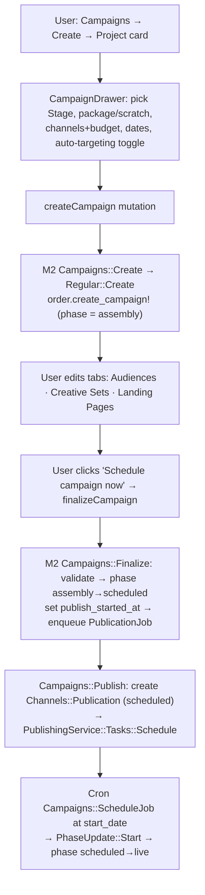

# 🚀 Flow deep-dive: Create & Launch a Campaign (Manual — New Build)

Source: https://app.notion.com/p/39714549bf5f8163883ee97cb90e971a?pvs=204
Path: Engineering / Product Knowledge / User Flows & Journeys
Last edited: 2026-07-23T14:30:59.809Z

---

<callout icon="✅" color="green_bg">
	**Status: 🔵 Populated** · Last verified: <mention-date start="2026-07-08"/> · Owner: coordinator (build worker: user-flows). **Partial backfill 2026-07-23 (release sweep, pending operator gate):** added the auto-finish-at-end-date cron half ([HK-265](https://linear.app/newbuilds/issue/HK-265)) additively below; not re-verified / re-gated. Sub-page of [User Flows & Journeys](../user-flows-and-journeys.md). Every claim is grounded in **code** (authoritative) — **M2** = `marketer` Rails backend, **M360** = `marketer-frontend`. Paths are `path:line`. ⚠️ marks a doc-vs-code tension, resolved in the code's favour. Object/state vocabulary follows the [Domain Glossary](../domain-glossary.md).
</callout>

## At a glance
- **Who:** Marketing Manager / CSM (developer-side).
- **Trigger:** Need to promote a new-build **Sales Stage**.
- **Outcome:** A `Campaign` goes `assembly → scheduled → live` across the selected channels, with per-channel `Channels::Publication` records dispatched to the Publishing Service.
- **Product intent:** reference attachment §4 *Journey 2* (`marketer-platform-product-reference.txt`, hangs off the hub).



## Step-by-step (code-grounded)
<table fit-page-width="true" header-row="true">
<tr><td>#</td><td>Step</td><td>What happens</td><td>Source (code)</td></tr>
<tr><td>1</td><td>Open create drawer</td><td>Campaigns → "Create new campaign" type picker; the **Project** card opens the project campaign drawer.</td><td>M360 `src/components/Campaigns/CampaignTypesDrawer/CampaignTypesDrawer.tsx:159-165` (`handleProjectCampaignClick` `:63-67`)</td></tr>
<tr><td>2</td><td>Pick promotable = Project → Sales Stage</td><td>Single-select of the project's sales stages; archived stages disabled. The chosen stage becomes `attributes.stageUuid`.</td><td>M360 `SelectCampaignStage.tsx:30-34`; `ProjectPromotablesSelector.tsx:38-63` (`useDeepSalesStages` `:25-28`); `CampaignDrawer.tsx:132`</td></tr>
<tr><td>3</td><td>Package vs from-scratch</td><td>"Combination campaign" (predefined **package**) card shows only when the company has packages with `strategy: campaign_sequence`; the Project/Property cards are from-scratch.</td><td>M360 `CampaignTypesDrawer.tsx:100-115` (fetch `:89-92`)</td></tr>
<tr><td>4</td><td>Channels + budget</td><td>Per-channel rows with a `Spending` field (FieldArray); channels sanitized before submit; default channel `gmp`.</td><td>M360 `CampaignChannels.tsx:24-33`; `CampaignDrawer.tsx:44,125`</td></tr>
<tr><td>5</td><td>Dates</td><td>`CampaignDuration`; default `predefinedEndDate: twoWeeks`.</td><td>M360 `CampaignDrawer.tsx:261-265,45`</td></tr>
<tr><td>6</td><td>Audiences: auto vs manual</td><td>Create-time **auto-targeting** toggle (shown only when creating; default `autoTargeting: true`) is passed to the create mutation → Targeter generates audiences. Post-create the Audiences tab adds manual / from-existing / **Auto audiences** (`useCreateAutoTargetingAudiences`).</td><td>M360 `CampaignDrawer.tsx:269,47`; `CampaignAudiences.tsx:122,126,130-136`</td></tr>
<tr><td>7</td><td>Creative Sets tab</td><td>Per-channel creative sets via `CreativeSets`  • `CreativeSetDrawer`.</td><td>M360 `CampaignDetails.tsx:219-227`</td></tr>
<tr><td>8</td><td>Landing Pages tab</td><td>Destination URLs per channel via `CampaignLandingPages`.</td><td>M360 `CampaignDetails.tsx:213-215`</td></tr>
<tr><td>9</td><td>Create the campaign</td><td>`createCampaign` GraphQL mutation (forces `skipAutoFacebookPageAssignment: true`) → M2 resolver → `Campaigns::Create` → `Regular::Create` does `order.create_campaign!(attributes)`. **No phase is set on create → DB default `assembly` applies.** Also creates the `Order` (`order_type: premium`), `Channel`(s), `Campaigns::Specification`, and optionally auto-targeting audiences.</td><td>M360 `src/hooks/campaigns/useCreateCampaign.ts:7-27,64,80-83`; M2 `app/graphql/mutations/campaigns/create.rb:22`; `app/services/campaigns/regular/create.rb:42-46`; default `db/schema.rb:1120`</td></tr>
<tr><td>10</td><td>Finalize / "schedule now"</td><td>`finalizeCampaign` → `Campaigns::Finalize`: validates (setup not in progress; end date ≥ 1h out; every creative set has a landing page; FB carousels ≥ 2 cards; for a Project promotable, start ≥ 1h out), sets `publish_started_at`, flips **`assembly → scheduled`**, then enqueues `PublicationJob`.</td><td>M360 `CampaignPublish.tsx:15,33`; M2 `app/graphql/mutations/campaigns/finalize_campaign.rb:17`; `app/services/campaigns/finalize.rb:39-41,50-62,64-65,71,74`</td></tr>
<tr><td>11</td><td>Publish to channels</td><td>`Campaigns::Publish` clears `publish_failed_at`, creates one `Channels::Publication` per publishable channel (`status: scheduled`), and dispatches each to `PublishingService::Tasks::Schedule`. Gated by `EnabledFeatures.publish_campaigns?`. (Full publish detail on the parent page's *Publish to a channel* flow.)</td><td>M2 `app/services/campaigns/publish.rb:32,34,35,46-48,63-84`</td></tr>
<tr><td>12</td><td>Go live at start date</td><td>Cron `Campaigns::ScheduleJob` picks `scheduled` campaigns whose start time has passed → `PhaseUpdate::Start` → `campaign.live!`.</td><td>M2 `app/jobs/campaigns/schedule_job.rb:11`; `app/services/campaigns/schedule/start_service.rb:8-21`; `app/services/campaigns/phase_update/start.rb:19`</td></tr>
</table>

## Campaign lifecycle — the `phase` enum
The `Campaign#phase` enum (M2 `app/models/campaign.rb:107-116`) has **eight** states:
```javascript
assembly(0) · review(1) · scheduled(2) · live(3) · paused(4) · finished(5) · cancelled(6) · archived(7)
```
Groupings (M2 `app/models/concerns/campaigns/phase_concern.rb:7-9`): `PAUSABLE_PHASES = [scheduled, live]`; `SEND_START_TIME_PHASES = [assembly, review, scheduled]`; `INACTIVE_PHASES = [finished, archived, cancelled]`. Transitions are enum bang-setters driven by services under M2 `app/services/campaigns/phase_update/` (`start`, `pause`, `resume`, `finish`, `cancel`, `archive`, `unarchive`).

> ⚠️ **"Draft → Scheduled → Live" is a naming mismatch, not a behavioural one.** The reference §4 calls the initial state "Draft", but there is **no `Draft` phase** in code. "Draft" is a UI label for the `assembly` enum value — `isDraft = (phase) => phase === 'assembly'` (M360 `src/components/Campaigns/helpers/campaignStates.ts:3`). A `review` state also exists in the enum but is **not used** in this manual New-Build path (Finalize goes `assembly → scheduled` directly). Real happy path: **`assembly` (UI "Draft") → `scheduled` → `live`.**

## Auto-finish at end date (cron) — the finish half of the schedule cron
<callout icon="🕒" color="blue_bg">
	*Partial backfill 2026-07-23 — pending operator gate.*
</callout>

The same per-minute `Campaigns::ScheduleJob` that starts scheduled campaigns (step 12) also runs a **finish half**: `Schedule::FinishService` selects campaigns whose `end_date` (or `end_date_published`) has passed and enqueues a per-campaign `FinishJob` → `PhaseUpdate::Finish`, which flips the campaign to `finished` and fires the same side-effects a live finish does — `NotificationHandler(phase: :finished)` + `Publication::ArchiveJob`. [HK-265](https://linear.app/newbuilds/issue/HK-265) widened the `PhaseUpdate::Finish` guard from `live?` to `live? || paused?` so a **paused** campaign that has passed its end date now also auto-finishes; previously such a campaign was stuck in limbo — not finishable (the guard rejected non-live campaigns) and not resumable either (`can_be_resumed?` requires `end_date` to be in the future). Source: [HK-265](https://linear.app/newbuilds/issue/HK-265); PR [#14105](https://github.com/marketertechnologies/marketer/pull/14105) (M2 `app/services/campaigns/phase_update/finish.rb`, `app/services/campaigns/schedule/finish_service.rb`).

> ⚠️ **Revert / re-apply history (linked, not re-narrated):** #14105 was reverted ([#14117](https://github.com/marketertechnologies/marketer/pull/14117)) after a pre-2023 DSA-constraint edge case triggered a FinishJob retry storm / Redis-OOM incident, then re-applied ([#14119](https://github.com/marketertechnologies/marketer/pull/14119)) together with a `dsa_beneficiary` / `dsa_payor` backfill migration (data-repair infra, not product intent). Full narrative: the incident post-mortem page (Notion, not part of this KB export — see the original page for the link).

## M2 objects & states changed
<table fit-page-width="true" header-row="true">
<tr><td>When</td><td>Objects / state effects</td></tr>
<tr><td>On create</td><td>New `Order` (`order_type: premium`), `Campaign` (`phase: assembly`), `Channel`(s), `Campaigns::Specification`; optional FB page assignment; optional auto-targeting `Audience`s (flagged `targeter: true`).</td></tr>
<tr><td>On finalize</td><td>`campaign.publish_started_at` set; landing pages + lead forms published (jobs); `campaign.phase` → `scheduled`; `PublicationJob` enqueued.</td></tr>
<tr><td>On publish</td><td>`campaign.publish_failed_at` cleared; one `Channels::Publication` per channel created with `status: scheduled`.</td></tr>
<tr><td>On start (cron)</td><td>`campaign.phase` → `live`.</td></tr>
<tr><td>On publish callback</td><td>External ad IDs persisted onto `Channel`/`Audience`/`Ad`/creatives; `channel.publishing_mechanism = :publishing_service` (see parent *Publish to a channel* flow).</td></tr>
</table>

## Sources
Code paths above (M2 `marketer` @ branch `development`; M360 this worktree). Product intent: reference attachment §4 *Journey 2*; Jira `PRODM-548` (auto-targeting), `MT3-7762` (AI Adgen) per the reference; **partial backfill 2026-07-23 (pending operator gate):** auto-finish-at-end-date cron half [HK-265](https://linear.app/newbuilds/issue/HK-265) — PRs [#14105](https://github.com/marketertechnologies/marketer/pull/14105) / [#14117](https://github.com/marketertechnologies/marketer/pull/14117) / [#14119](https://github.com/marketertechnologies/marketer/pull/14119). Verified <mention-date start="2026-07-08"/>.
